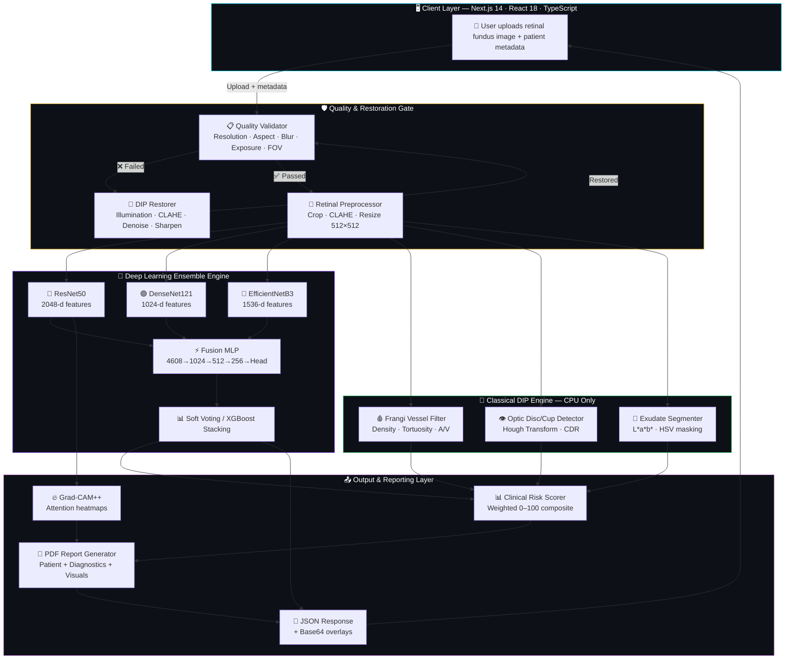
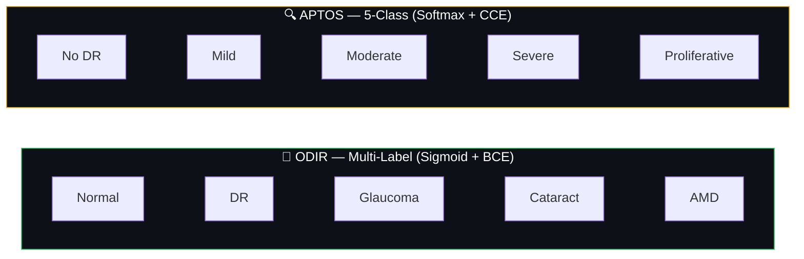

<div align="center">

<!-- ╔══════════════════════════════════════════════════════════════════════╗
     ║              ANIMATED HERO BANNER WITH SCANNING EYE                ║
     ╚══════════════════════════════════════════════════════════════════════╝ -->

<svg xmlns="http://www.w3.org/2000/svg" width="850" height="280" viewBox="0 0 850 280">
  <defs>
    <linearGradient id="bg" x1="0%" y1="0%" x2="100%" y2="100%">
      <stop offset="0%" style="stop-color:#0a0a1a"/>
      <stop offset="50%" style="stop-color:#1a1040"/>
      <stop offset="100%" style="stop-color:#0a0a1a"/>
    </linearGradient>
    <linearGradient id="glow1" x1="0%" y1="0%" x2="100%" y2="0%">
      <stop offset="0%" style="stop-color:#00d2ff"/>
      <stop offset="50%" style="stop-color:#7b2ff7"/>
      <stop offset="100%" style="stop-color:#00d2ff"/>
      <animate attributeName="x1" values="0%;100%;0%" dur="4s" repeatCount="indefinite"/>
      <animate attributeName="x2" values="100%;200%;100%" dur="4s" repeatCount="indefinite"/>
    </linearGradient>
    <linearGradient id="iris" cx="50%" cy="50%" r="50%" fx="50%" fy="50%">
      <stop offset="0%" style="stop-color:#00d2ff"/>
      <stop offset="70%" style="stop-color:#7b2ff7"/>
      <stop offset="100%" style="stop-color:#1a1040"/>
    </linearGradient>
    <filter id="glow"><feGaussianBlur stdDeviation="4" result="b"/><feMerge><feMergeNode in="b"/><feMergeNode in="SourceGraphic"/></feMerge></filter>
    <filter id="glow2"><feGaussianBlur stdDeviation="2" result="b"/><feMerge><feMergeNode in="b"/><feMergeNode in="SourceGraphic"/></feMerge></filter>
    <!-- Grid pattern -->
    <pattern id="grid" width="40" height="40" patternUnits="userSpaceOnUse">
      <path d="M 40 0 L 0 0 0 40" fill="none" stroke="#1a1a3a" stroke-width="0.5"/>
    </pattern>
  </defs>
  
  <!-- Background -->
  <rect width="850" height="280" fill="url(#bg)"/>
  <rect width="850" height="280" fill="url(#grid)" opacity="0.3"/>
  
  <!-- Animated horizontal scan lines -->
  <rect width="850" height="1" fill="#00d2ff" opacity="0.08" y="0">
    <animate attributeName="y" values="0;280;0" dur="8s" repeatCount="indefinite"/>
  </rect>
  <rect width="850" height="1" fill="#7b2ff7" opacity="0.08" y="280">
    <animate attributeName="y" values="280;0;280" dur="6s" repeatCount="indefinite"/>
  </rect>
  
  <!-- Animated particles -->
  <circle r="1.5" fill="#00d2ff" opacity="0.6"><animate attributeName="cx" values="0;850" dur="12s" repeatCount="indefinite"/><animate attributeName="cy" values="50;230" dur="12s" repeatCount="indefinite"/></circle>
  <circle r="1" fill="#7b2ff7" opacity="0.5"><animate attributeName="cx" values="850;0" dur="10s" repeatCount="indefinite"/><animate attributeName="cy" values="200;30" dur="10s" repeatCount="indefinite"/></circle>
  <circle r="1.5" fill="#f5576c" opacity="0.4"><animate attributeName="cx" values="100;750" dur="14s" repeatCount="indefinite"/><animate attributeName="cy" values="270;10" dur="14s" repeatCount="indefinite"/></circle>
  <circle r="1" fill="#00d2ff" opacity="0.3"><animate attributeName="cx" values="400;100" dur="9s" repeatCount="indefinite"/><animate attributeName="cy" values="10;260" dur="9s" repeatCount="indefinite"/></circle>
  <circle r="2" fill="#7b2ff7" opacity="0.3"><animate attributeName="cx" values="700;200" dur="11s" repeatCount="indefinite"/><animate attributeName="cy" values="100;250" dur="11s" repeatCount="indefinite"/></circle>
  
  <!-- Animated Eye — outer ring -->
  <g transform="translate(425,100)" filter="url(#glow)">
    <!-- Outer scanning ring -->
    <circle r="48" fill="none" stroke="#00d2ff" stroke-width="1" opacity="0.3" stroke-dasharray="8 4">
      <animateTransform attributeName="transform" type="rotate" values="0;360" dur="20s" repeatCount="indefinite"/>
    </circle>
    <circle r="55" fill="none" stroke="#7b2ff7" stroke-width="0.5" opacity="0.2" stroke-dasharray="4 8">
      <animateTransform attributeName="transform" type="rotate" values="360;0" dur="15s" repeatCount="indefinite"/>
    </circle>
    <!-- Eye shape -->
    <ellipse rx="42" ry="28" fill="none" stroke="url(#glow1)" stroke-width="2.5">
      <animate attributeName="ry" values="28;30;28" dur="3s" repeatCount="indefinite"/>
    </ellipse>
    <!-- Iris -->
    <circle r="20" fill="url(#iris)" opacity="0.9">
      <animate attributeName="r" values="20;22;20" dur="3s" repeatCount="indefinite"/>
    </circle>
    <!-- Pupil -->
    <circle r="8" fill="#0a0a1a">
      <animate attributeName="r" values="8;6;8" dur="3s" repeatCount="indefinite"/>
    </circle>
    <!-- Light reflection -->
    <circle r="3" fill="#fff" cx="-5" cy="-5" opacity="0.8">
      <animate attributeName="opacity" values="0.8;0.4;0.8" dur="2s" repeatCount="indefinite"/>
    </circle>
    <circle r="1.5" fill="#fff" cx="4" cy="-8" opacity="0.5"/>
    <!-- Scan beam from eye -->
    <line x1="0" y1="30" x2="-60" y2="80" stroke="#00d2ff" stroke-width="0.5" opacity="0">
      <animate attributeName="opacity" values="0;0.4;0" dur="4s" repeatCount="indefinite"/>
    </line>
    <line x1="0" y1="30" x2="60" y2="80" stroke="#00d2ff" stroke-width="0.5" opacity="0">
      <animate attributeName="opacity" values="0;0.4;0" dur="4s" begin="2s" repeatCount="indefinite"/>
    </line>
  </g>
  
  <!-- Title -->
  <text x="425" y="185" text-anchor="middle" font-family="'Segoe UI','Helvetica Neue',sans-serif" font-size="46" font-weight="800" fill="url(#glow1)" filter="url(#glow)">RetinaGuard</text>
  
  <!-- Subtitle with animated typing cursor -->
  <text x="425" y="215" text-anchor="middle" font-family="'Segoe UI',sans-serif" font-size="13" fill="#8888bb" letter-spacing="4">ENSEMBLE DEEP LEARNING  ×  DIGITAL IMAGE PROCESSING</text>
  <rect x="660" y="203" width="2" height="14" fill="#00d2ff">
    <animate attributeName="opacity" values="1;0;1" dur="1s" repeatCount="indefinite"/>
  </rect>
  
  <!-- Animated bottom stats bar -->
  <g transform="translate(0,240)">
    <rect width="850" height="40" fill="#0a0a1a" opacity="0.8"/>
    <line x1="0" y1="0" x2="850" y2="0" stroke="#00d2ff" stroke-width="0.5" opacity="0.3"/>
    
    <!-- Stat items with animated counters -->
    <g font-family="monospace" font-size="10" fill="#00d2ff">
      <text x="60" y="16" text-anchor="middle" fill="#555">MODELS</text>
      <text x="60" y="32" text-anchor="middle" font-size="16" font-weight="bold">3</text>
    </g>
    <line x1="130" y1="8" x2="130" y2="35" stroke="#222" stroke-width="1"/>
    <g font-family="monospace" font-size="10" fill="#7b2ff7">
      <text x="210" y="16" text-anchor="middle" fill="#555">FEATURES</text>
      <text x="210" y="32" text-anchor="middle" font-size="16" font-weight="bold">4608-d</text>
    </g>
    <line x1="300" y1="8" x2="300" y2="35" stroke="#222" stroke-width="1"/>
    <g font-family="monospace" font-size="10" fill="#f093fb">
      <text x="380" y="16" text-anchor="middle" fill="#555">ENDPOINTS</text>
      <text x="380" y="32" text-anchor="middle" font-size="16" font-weight="bold">8</text>
    </g>
    <line x1="450" y1="8" x2="450" y2="35" stroke="#222" stroke-width="1"/>
    <g font-family="monospace" font-size="10" fill="#f5576c">
      <text x="540" y="16" text-anchor="middle" fill="#555">DIP METRICS</text>
      <text x="540" y="32" text-anchor="middle" font-size="16" font-weight="bold">6</text>
    </g>
    <line x1="620" y1="8" x2="620" y2="35" stroke="#222" stroke-width="1"/>
    <g font-family="monospace" font-size="10" fill="#22c55e">
      <text x="720" y="16" text-anchor="middle" fill="#555">DISEASES</text>
      <text x="720" y="32" text-anchor="middle" font-size="16" font-weight="bold">5</text>
    </g>
  </g>
  
  <!-- Corner decorations -->
  <polyline points="15,40 15,15 40,15" fill="none" stroke="#00d2ff" stroke-width="1.5" opacity="0.5"><animate attributeName="opacity" values="0.5;1;0.5" dur="3s" repeatCount="indefinite"/></polyline>
  <polyline points="835,40 835,15 810,15" fill="none" stroke="#7b2ff7" stroke-width="1.5" opacity="0.5"><animate attributeName="opacity" values="0.5;1;0.5" dur="3s" begin="1.5s" repeatCount="indefinite"/></polyline>
  <polyline points="15,230 15,238 40,238" fill="none" stroke="#f5576c" stroke-width="1.5" opacity="0.5"><animate attributeName="opacity" values="0.5;1;0.5" dur="3s" begin="0.75s" repeatCount="indefinite"/></polyline>
  <polyline points="835,230 835,238 810,238" fill="none" stroke="#f093fb" stroke-width="1.5" opacity="0.5"><animate attributeName="opacity" values="0.5;1;0.5" dur="3s" begin="2.25s" repeatCount="indefinite"/></polyline>
</svg>

<br/>

<!-- BADGE RIBBON -->
[](https://python.org)
[](https://pytorch.org)
[](https://fastapi.tiangolo.com)
[](https://nextjs.org)
[](https://opencv.org)
[](LICENSE)

<br/>

<!-- Animated typing subtitle -->
<svg xmlns="http://www.w3.org/2000/svg" width="750" height="30" viewBox="0 0 750 30">
  <rect width="750" height="30" rx="6" fill="#0d1117"/>
  <text x="375" y="20" text-anchor="middle" font-family="monospace" font-size="12" fill="#8888bb">
    An end-to-end AI-powered retinal fundus image screening research system
    <animate attributeName="opacity" values="0;1" dur="1s" fill="freeze"/>
  </text>
</svg>

<br/>

> ⚠️ **Non-Clinical Research & Educational System** — Not FDA/CE-cleared. All predictions require validation by a certified ophthalmologist.

</div>

<!-- ╔══════════════════════════════════════════════════════════════════════╗
     ║                    ANIMATED SECTION DIVIDER                        ║
     ╚══════════════════════════════════════════════════════════════════════╝ -->

<div align="center">
<svg xmlns="http://www.w3.org/2000/svg" width="800" height="20" viewBox="0 0 800 20">
  <defs>
    <linearGradient id="divLine" x1="0%" y1="0%" x2="100%" y2="0%">
      <stop offset="0%" style="stop-color:transparent"/>
      <stop offset="20%" style="stop-color:#00d2ff"/>
      <stop offset="50%" style="stop-color:#7b2ff7"/>
      <stop offset="80%" style="stop-color:#f5576c"/>
      <stop offset="100%" style="stop-color:transparent"/>
    </linearGradient>
  </defs>
  <line x1="0" y1="10" x2="800" y2="10" stroke="url(#divLine)" stroke-width="1" opacity="0.5"/>
  <circle r="3" fill="#00d2ff" cy="10"><animate attributeName="cx" values="0;800" dur="4s" repeatCount="indefinite"/></circle>
  <circle r="3" fill="#f5576c" cy="10"><animate attributeName="cx" values="800;0" dur="4s" repeatCount="indefinite"/></circle>
</svg>
</div>

---

## 📑 Table of Contents

<div align="center">

<!-- Animated TOC Navigator -->
<svg xmlns="http://www.w3.org/2000/svg" width="780" height="70" viewBox="0 0 780 70">
  <rect width="780" height="70" rx="10" fill="#0d1117" stroke="#1a1a3a" stroke-width="1"/>
  <!-- Navigation dots -->
  <g transform="translate(40,35)">
    <circle r="8" fill="#0d1117" stroke="#00d2ff" stroke-width="1.5"><animate attributeName="fill" values="#0d1117;#00d2ff;#0d1117" dur="8s" repeatCount="indefinite"/></circle>
    <text x="0" y="25" text-anchor="middle" font-family="monospace" font-size="7" fill="#666">Arch</text>
  </g>
  <line x1="55" y1="35" x2="105" y2="35" stroke="#1a1a3a" stroke-width="1" stroke-dasharray="3 3"/>
  <g transform="translate(120,35)">
    <circle r="8" fill="#0d1117" stroke="#7b2ff7" stroke-width="1.5"><animate attributeName="fill" values="#0d1117;#7b2ff7;#0d1117" dur="8s" begin="1s" repeatCount="indefinite"/></circle>
    <text x="0" y="25" text-anchor="middle" font-family="monospace" font-size="7" fill="#666">DL</text>
  </g>
  <line x1="135" y1="35" x2="185" y2="35" stroke="#1a1a3a" stroke-width="1" stroke-dasharray="3 3"/>
  <g transform="translate(200,35)">
    <circle r="8" fill="#0d1117" stroke="#22c55e" stroke-width="1.5"><animate attributeName="fill" values="#0d1117;#22c55e;#0d1117" dur="8s" begin="2s" repeatCount="indefinite"/></circle>
    <text x="0" y="25" text-anchor="middle" font-family="monospace" font-size="7" fill="#666">F1:DIP</text>
  </g>
  <line x1="215" y1="35" x2="265" y2="35" stroke="#1a1a3a" stroke-width="1" stroke-dasharray="3 3"/>
  <g transform="translate(280,35)">
    <circle r="8" fill="#0d1117" stroke="#eab308" stroke-width="1.5"><animate attributeName="fill" values="#0d1117;#eab308;#0d1117" dur="8s" begin="3s" repeatCount="indefinite"/></circle>
    <text x="0" y="25" text-anchor="middle" font-family="monospace" font-size="7" fill="#666">F2:QG</text>
  </g>
  <line x1="295" y1="35" x2="345" y2="35" stroke="#1a1a3a" stroke-width="1" stroke-dasharray="3 3"/>
  <g transform="translate(360,35)">
    <circle r="8" fill="#0d1117" stroke="#f5576c" stroke-width="1.5"><animate attributeName="fill" values="#0d1117;#f5576c;#0d1117" dur="8s" begin="4s" repeatCount="indefinite"/></circle>
    <text x="0" y="25" text-anchor="middle" font-family="monospace" font-size="7" fill="#666">F3:Risk</text>
  </g>
  <line x1="375" y1="35" x2="425" y2="35" stroke="#1a1a3a" stroke-width="1" stroke-dasharray="3 3"/>
  <g transform="translate(440,35)">
    <circle r="8" fill="#0d1117" stroke="#f093fb" stroke-width="1.5"><animate attributeName="fill" values="#0d1117;#f093fb;#0d1117" dur="8s" begin="5s" repeatCount="indefinite"/></circle>
    <text x="0" y="25" text-anchor="middle" font-family="monospace" font-size="7" fill="#666">F4:UI</text>
  </g>
  <line x1="455" y1="35" x2="505" y2="35" stroke="#1a1a3a" stroke-width="1" stroke-dasharray="3 3"/>
  <g transform="translate(520,35)">
    <circle r="8" fill="#0d1117" stroke="#00d2ff" stroke-width="1.5"><animate attributeName="fill" values="#0d1117;#00d2ff;#0d1117" dur="8s" begin="6s" repeatCount="indefinite"/></circle>
    <text x="0" y="25" text-anchor="middle" font-family="monospace" font-size="7" fill="#666">CAM</text>
  </g>
  <line x1="535" y1="35" x2="585" y2="35" stroke="#1a1a3a" stroke-width="1" stroke-dasharray="3 3"/>
  <g transform="translate(600,35)">
    <circle r="8" fill="#0d1117" stroke="#22c55e" stroke-width="1.5"><animate attributeName="fill" values="#0d1117;#22c55e;#0d1117" dur="8s" begin="7s" repeatCount="indefinite"/></circle>
    <text x="0" y="25" text-anchor="middle" font-family="monospace" font-size="7" fill="#666">API</text>
  </g>
  <line x1="615" y1="35" x2="665" y2="35" stroke="#1a1a3a" stroke-width="1" stroke-dasharray="3 3"/>
  <g transform="translate(680,35)">
    <circle r="8" fill="#0d1117" stroke="#7b2ff7" stroke-width="1.5"><animate attributeName="fill" values="#0d1117;#7b2ff7;#0d1117" dur="8s" begin="8s" repeatCount="indefinite"/></circle>
    <text x="0" y="25" text-anchor="middle" font-family="monospace" font-size="7" fill="#666">Setup</text>
  </g>
  <!-- Traveling highlight -->
  <rect width="70" height="3" rx="1.5" fill="#00d2ff" y="55" opacity="0.6">
    <animate attributeName="x" values="5;645;5" dur="8s" repeatCount="indefinite"/>
    <animate attributeName="fill" values="#00d2ff;#7b2ff7;#f093fb;#f5576c;#22c55e;#00d2ff" dur="8s" repeatCount="indefinite"/>
  </rect>
</svg>

</div>

| # | Section | Description |
|:---:|:---|:---|
| 🧬 | [System Architecture](#-system-architecture) | Full pipeline from image upload to clinical report |
| 🧠 | [Deep Learning Ensemble](#-deep-learning-ensemble-engine) | 3-model fusion with 4608-d features |
| 🔬 | [Feature 1 — DIP Biomarkers](#-feature-1--classical-dip-biomarker-extraction) | Vessels, CDR, exudates, tortuosity |
| 🛡️ | [Feature 2 — Quality Gate](#%EF%B8%8F-feature-2--adaptive-quality-gate--image-restoration) | Auto-detection & DIP restoration |
| 📊 | [Feature 3 — Risk Engine](#-feature-3--clinical-risk-engine--pdf-reports) | Weighted 0-100 risk score + severity |
| 💻 | [Feature 4 — Dashboard](#-feature-4--interactive-nextjs-dashboard--dip-explorer) | Next.js UI with animated gauges |
| 🔮 | [Grad-CAM++ Engine](#-grad-cam-explainability-engine) | Visual attention heatmaps |
| 🔌 | [API Reference](#-api-reference) | 8 REST endpoints documented |
| 🚀 | [Quick Start](#-quick-start) | Get running in 5 steps |
| 🐳 | [Docker](#-docker-deployment) | One-command deployment |
| 📁 | [Project Tree](#-project-structure) | Full directory map |

---

## 🧬 System Architecture

<div align="center">

<!-- ═══════ ANIMATED END-TO-END PIPELINE ═══════ -->
<svg xmlns="http://www.w3.org/2000/svg" width="820" height="90" viewBox="0 0 820 90">
  <defs>
    <linearGradient id="pipeGrad" x1="0%" y1="0%" x2="100%" y2="0%">
      <stop offset="0%" style="stop-color:#00d2ff"/><stop offset="50%" style="stop-color:#7b2ff7"/><stop offset="100%" style="stop-color:#f5576c"/>
    </linearGradient>
  </defs>
  <rect width="820" height="90" rx="12" fill="#0d1117"/>
  <!-- Pipeline track -->
  <rect x="30" y="38" width="760" height="4" rx="2" fill="#161b22"/>
  <!-- Animated fill -->
  <rect x="30" y="38" width="0" height="4" rx="2" fill="url(#pipeGrad)">
    <animate attributeName="width" values="0;760" dur="4s" fill="freeze"/>
  </rect>
  <!-- Stages -->
  <g font-family="'Segoe UI',sans-serif" text-anchor="middle">
    <!-- Upload -->
    <rect x="15" y="20" width="90" height="40" rx="8" fill="#161b22" stroke="#00d2ff" stroke-width="1.5" opacity="0">
      <animate attributeName="opacity" values="0;1" dur="0.3s" begin="0s" fill="freeze"/>
    </rect>
    <text x="60" y="37" font-size="9" fill="#00d2ff" font-weight="bold" opacity="0"><animate attributeName="opacity" values="0;1" dur="0.3s" begin="0s" fill="freeze"/>📸 Upload</text>
    <text x="60" y="52" font-size="7" fill="#555" opacity="0"><animate attributeName="opacity" values="0;1" dur="0.3s" begin="0s" fill="freeze"/>Fundus Image</text>
    <!-- Quality -->
    <rect x="140" y="20" width="100" height="40" rx="8" fill="#161b22" stroke="#eab308" stroke-width="1.5" opacity="0">
      <animate attributeName="opacity" values="0;1" dur="0.3s" begin="0.6s" fill="freeze"/>
    </rect>
    <text x="190" y="37" font-size="9" fill="#eab308" font-weight="bold" opacity="0"><animate attributeName="opacity" values="0;1" dur="0.3s" begin="0.6s" fill="freeze"/>🛡️ Quality Gate</text>
    <text x="190" y="52" font-size="7" fill="#555" opacity="0"><animate attributeName="opacity" values="0;1" dur="0.3s" begin="0.6s" fill="freeze"/>Blur · Exposure</text>
    <!-- DIP -->
    <rect x="275" y="20" width="100" height="40" rx="8" fill="#161b22" stroke="#22c55e" stroke-width="1.5" opacity="0">
      <animate attributeName="opacity" values="0;1" dur="0.3s" begin="1.2s" fill="freeze"/>
    </rect>
    <text x="325" y="37" font-size="9" fill="#22c55e" font-weight="bold" opacity="0"><animate attributeName="opacity" values="0;1" dur="0.3s" begin="1.2s" fill="freeze"/>🔬 DIP Engine</text>
    <text x="325" y="52" font-size="7" fill="#555" opacity="0"><animate attributeName="opacity" values="0;1" dur="0.3s" begin="1.2s" fill="freeze"/>CDR · Vessels</text>
    <!-- DL -->
    <rect x="410" y="20" width="100" height="40" rx="8" fill="#161b22" stroke="#7b2ff7" stroke-width="1.5" opacity="0">
      <animate attributeName="opacity" values="0;1" dur="0.3s" begin="1.8s" fill="freeze"/>
    </rect>
    <text x="460" y="37" font-size="9" fill="#7b2ff7" font-weight="bold" opacity="0"><animate attributeName="opacity" values="0;1" dur="0.3s" begin="1.8s" fill="freeze"/>🧠 DL Ensemble</text>
    <text x="460" y="52" font-size="7" fill="#555" opacity="0"><animate attributeName="opacity" values="0;1" dur="0.3s" begin="1.8s" fill="freeze"/>3-Model Fusion</text>
    <!-- Risk -->
    <rect x="545" y="20" width="100" height="40" rx="8" fill="#161b22" stroke="#f5576c" stroke-width="1.5" opacity="0">
      <animate attributeName="opacity" values="0;1" dur="0.3s" begin="2.4s" fill="freeze"/>
    </rect>
    <text x="595" y="37" font-size="9" fill="#f5576c" font-weight="bold" opacity="0"><animate attributeName="opacity" values="0;1" dur="0.3s" begin="2.4s" fill="freeze"/>📊 Risk Score</text>
    <text x="595" y="52" font-size="7" fill="#555" opacity="0"><animate attributeName="opacity" values="0;1" dur="0.3s" begin="2.4s" fill="freeze"/>0–100 Grading</text>
    <!-- Report -->
    <rect x="680" y="20" width="110" height="40" rx="8" fill="#161b22" stroke="#f093fb" stroke-width="1.5" opacity="0">
      <animate attributeName="opacity" values="0;1" dur="0.3s" begin="3s" fill="freeze"/>
    </rect>
    <text x="735" y="37" font-size="9" fill="#f093fb" font-weight="bold" opacity="0"><animate attributeName="opacity" values="0;1" dur="0.3s" begin="3s" fill="freeze"/>📄 PDF Report</text>
    <text x="735" y="52" font-size="7" fill="#555" opacity="0"><animate attributeName="opacity" values="0;1" dur="0.3s" begin="3s" fill="freeze"/>Clinical Export</text>
  </g>
  <!-- Animated data packet -->
  <circle r="5" fill="#00d2ff" filter="url(#glow2)" cy="40">
    <animate attributeName="cx" values="60;190;325;460;595;735;60" dur="6s" repeatCount="indefinite"/>
    <animate attributeName="fill" values="#00d2ff;#eab308;#22c55e;#7b2ff7;#f5576c;#f093fb;#00d2ff" dur="6s" repeatCount="indefinite"/>
  </circle>
  <!-- Bottom label -->
  <text x="410" y="82" text-anchor="middle" font-family="monospace" font-size="9" fill="#333">── End-to-End Pipeline: Image → Prediction → Report (single API call) ──</text>
</svg>

</div>

### Full Architecture Diagram



---

## 🧠 Deep Learning Ensemble Engine

<div align="center">

<!-- ═══════ ANIMATED NEURAL NETWORK VISUALIZATION ═══════ -->
<svg xmlns="http://www.w3.org/2000/svg" width="800" height="300" viewBox="0 0 800 300">
  <defs>
    <linearGradient id="nn1" x1="0%" y1="0%" x2="100%" y2="0%"><stop offset="0%" style="stop-color:#ef4444"/><stop offset="100%" style="stop-color:#f97316"/></linearGradient>
    <linearGradient id="nn2" x1="0%" y1="0%" x2="100%" y2="0%"><stop offset="0%" style="stop-color:#22c55e"/><stop offset="100%" style="stop-color:#4ade80"/></linearGradient>
    <linearGradient id="nn3" x1="0%" y1="0%" x2="100%" y2="0%"><stop offset="0%" style="stop-color:#3b82f6"/><stop offset="100%" style="stop-color:#60a5fa"/></linearGradient>
    <linearGradient id="nnF" x1="0%" y1="0%" x2="100%" y2="0%"><stop offset="0%" style="stop-color:#a855f7"/><stop offset="100%" style="stop-color:#f093fb"/></linearGradient>
    <filter id="g3"><feGaussianBlur stdDeviation="2" result="b"/><feMerge><feMergeNode in="b"/><feMergeNode in="SourceGraphic"/></feMerge></filter>
  </defs>
  <rect width="800" height="300" rx="14" fill="#0d1117"/>
  <text x="400" y="28" text-anchor="middle" font-family="'Segoe UI',sans-serif" font-size="14" fill="#555" font-weight="bold">NEURAL NETWORK ENSEMBLE ARCHITECTURE</text>
  
  <!-- INPUT LAYER -->
  <g transform="translate(60,150)">
    <rect x="-35" y="-60" width="70" height="120" rx="8" fill="#161b22" stroke="#555" stroke-width="1"/>
    <text x="0" y="-68" text-anchor="middle" font-family="monospace" font-size="9" fill="#888">Input</text>
    <rect x="-20" y="-45" width="40" height="40" rx="4" fill="#1a2332" stroke="#00d2ff" stroke-width="0.5">
      <animate attributeName="stroke-opacity" values="0.3;1;0.3" dur="2s" repeatCount="indefinite"/>
    </rect>
    <text x="0" y="-20" text-anchor="middle" font-family="monospace" font-size="7" fill="#00d2ff">512×512</text>
    <text x="0" y="5" text-anchor="middle" font-family="monospace" font-size="7" fill="#555">RGB</text>
    <text x="0" y="18" text-anchor="middle" font-family="monospace" font-size="7" fill="#555">3 channels</text>
  </g>
  
  <!-- RESNET50 -->
  <g transform="translate(200,65)">
    <rect x="-50" y="-20" width="100" height="55" rx="8" fill="#161b22" stroke="url(#nn1)" stroke-width="1.5"/>
    <text x="0" y="-5" text-anchor="middle" font-family="'Segoe UI',sans-serif" font-size="10" fill="#f97316" font-weight="bold">ResNet50</text>
    <text x="0" y="10" text-anchor="middle" font-family="monospace" font-size="8" fill="#888">2048-d features</text>
    <text x="0" y="25" text-anchor="middle" font-family="monospace" font-size="7" fill="#555">layer4</text>
    <!-- Animated pulse -->
    <rect x="-50" y="-20" width="100" height="55" rx="8" fill="url(#nn1)" opacity="0">
      <animate attributeName="opacity" values="0;0.15;0" dur="3s" repeatCount="indefinite"/>
    </rect>
  </g>
  
  <!-- DENSENET121 -->
  <g transform="translate(200,160)">
    <rect x="-50" y="-20" width="100" height="55" rx="8" fill="#161b22" stroke="url(#nn2)" stroke-width="1.5"/>
    <text x="0" y="-5" text-anchor="middle" font-family="'Segoe UI',sans-serif" font-size="10" fill="#4ade80" font-weight="bold">DenseNet121</text>
    <text x="0" y="10" text-anchor="middle" font-family="monospace" font-size="8" fill="#888">1024-d features</text>
    <text x="0" y="25" text-anchor="middle" font-family="monospace" font-size="7" fill="#555">denseblock4</text>
    <rect x="-50" y="-20" width="100" height="55" rx="8" fill="url(#nn2)" opacity="0">
      <animate attributeName="opacity" values="0;0.15;0" dur="3s" begin="1s" repeatCount="indefinite"/>
    </rect>
  </g>
  
  <!-- EFFICIENTNET -->
  <g transform="translate(200,255)">
    <rect x="-50" y="-20" width="100" height="55" rx="8" fill="#161b22" stroke="url(#nn3)" stroke-width="1.5"/>
    <text x="0" y="-5" text-anchor="middle" font-family="'Segoe UI',sans-serif" font-size="10" fill="#60a5fa" font-weight="bold">EfficientNetB3</text>
    <text x="0" y="10" text-anchor="middle" font-family="monospace" font-size="8" fill="#888">1536-d features</text>
    <text x="0" y="25" text-anchor="middle" font-family="monospace" font-size="7" fill="#555">features.7</text>
    <rect x="-50" y="-20" width="100" height="55" rx="8" fill="url(#nn3)" opacity="0">
      <animate attributeName="opacity" values="0;0.15;0" dur="3s" begin="2s" repeatCount="indefinite"/>
    </rect>
  </g>
  
  <!-- CONCAT -->
  <g transform="translate(370,150)">
    <rect x="-40" y="-30" width="80" height="60" rx="10" fill="#161b22" stroke="#fff" stroke-width="1" stroke-dasharray="4 2"/>
    <text x="0" y="-10" text-anchor="middle" font-family="monospace" font-size="9" fill="#fff" font-weight="bold">CONCAT</text>
    <text x="0" y="8" text-anchor="middle" font-family="monospace" font-size="11" fill="#f093fb" font-weight="bold">4608-d</text>
    <!-- Animated merge effect -->
    <circle r="30" fill="none" stroke="#f093fb" stroke-width="0.5" opacity="0">
      <animate attributeName="r" values="15;35" dur="2s" repeatCount="indefinite"/>
      <animate attributeName="opacity" values="0.5;0" dur="2s" repeatCount="indefinite"/>
    </circle>
  </g>
  
  <!-- FUSION MLP -->
  <g transform="translate(520,150)">
    <rect x="-55" y="-50" width="110" height="100" rx="10" fill="#161b22" stroke="url(#nnF)" stroke-width="2"/>
    <text x="0" y="-32" text-anchor="middle" font-family="'Segoe UI',sans-serif" font-size="10" fill="#f093fb" font-weight="bold">Fusion MLP</text>
    <!-- MLP layers animated -->
    <rect x="-40" y="-20" width="80" height="8" rx="2" fill="#7b2ff7" opacity="0.3"><animate attributeName="opacity" values="0.3;0.8;0.3" dur="2s" repeatCount="indefinite"/></rect>
    <text x="0" y="-13" text-anchor="middle" font-family="monospace" font-size="6" fill="#ccc">→ 1024</text>
    <rect x="-30" y="-5" width="60" height="8" rx="2" fill="#7b2ff7" opacity="0.3"><animate attributeName="opacity" values="0.3;0.8;0.3" dur="2s" begin="0.3s" repeatCount="indefinite"/></rect>
    <text x="0" y="2" text-anchor="middle" font-family="monospace" font-size="6" fill="#ccc">→ 512</text>
    <rect x="-20" y="10" width="40" height="8" rx="2" fill="#7b2ff7" opacity="0.3"><animate attributeName="opacity" values="0.3;0.8;0.3" dur="2s" begin="0.6s" repeatCount="indefinite"/></rect>
    <text x="0" y="17" text-anchor="middle" font-family="monospace" font-size="6" fill="#ccc">→ 256</text>
    <text x="0" y="38" text-anchor="middle" font-family="monospace" font-size="7" fill="#555">BatchNorm+Dropout</text>
  </g>
  
  <!-- OUTPUT HEAD -->
  <g transform="translate(680,150)">
    <rect x="-50" y="-35" width="100" height="70" rx="10" fill="#161b22" stroke="#22c55e" stroke-width="2"/>
    <text x="0" y="-15" text-anchor="middle" font-family="'Segoe UI',sans-serif" font-size="10" fill="#22c55e" font-weight="bold">Output Head</text>
    <text x="0" y="2" text-anchor="middle" font-family="monospace" font-size="8" fill="#888">Softmax/Sigmoid</text>
    <text x="0" y="18" text-anchor="middle" font-family="monospace" font-size="8" fill="#555">5 classes</text>
    <!-- Animated checkmark -->
    <circle r="35" fill="#22c55e" opacity="0">
      <animate attributeName="opacity" values="0;0.1;0" dur="3s" repeatCount="indefinite"/>
    </circle>
  </g>
  
  <!-- Connections with animated data flow -->
  <g stroke="#333" stroke-width="1" fill="none">
    <line x1="95" y1="110" x2="150" y2="70"/>
    <line x1="95" y1="150" x2="150" y2="160"/>
    <line x1="95" y1="190" x2="150" y2="250"/>
    <line x1="250" y1="70" x2="330" y2="140"/>
    <line x1="250" y1="165" x2="330" y2="155"/>
    <line x1="250" y1="260" x2="330" y2="165"/>
    <line x1="410" y1="150" x2="465" y2="150"/>
    <line x1="575" y1="150" x2="630" y2="150"/>
  </g>
  <!-- Animated data particles along connections -->
  <circle r="2.5" fill="#f97316" filter="url(#g3)"><animate attributeName="cx" values="95;150;250;330;410;465;575;630;680" dur="3s" repeatCount="indefinite"/><animate attributeName="cy" values="110;70;70;140;150;150;150;150;150" dur="3s" repeatCount="indefinite"/></circle>
  <circle r="2.5" fill="#4ade80" filter="url(#g3)"><animate attributeName="cx" values="95;150;250;330;410;465;575;630;680" dur="3s" begin="1s" repeatCount="indefinite"/><animate attributeName="cy" values="150;160;165;155;150;150;150;150;150" dur="3s" begin="1s" repeatCount="indefinite"/></circle>
  <circle r="2.5" fill="#60a5fa" filter="url(#g3)"><animate attributeName="cx" values="95;150;250;330;410;465;575;630;680" dur="3s" begin="2s" repeatCount="indefinite"/><animate attributeName="cy" values="190;250;260;165;150;150;150;150;150" dur="3s" begin="2s" repeatCount="indefinite"/></circle>
</svg>

</div>

### Supported Diagnostic Tasks



---

## 🔬 Feature 1 — Classical DIP Biomarker Extraction

> **Module:** `ml/dip_features.py` (492 lines) — Runs on **CPU only** (NumPy + SciPy + Pillow)

<div align="center">

<!-- ═══════ ANIMATED DIP BIOMARKER EXTRACTION FLOW ═══════ -->
<svg xmlns="http://www.w3.org/2000/svg" width="800" height="240" viewBox="0 0 800 240">
  <rect width="800" height="240" rx="14" fill="#0d1117"/>
  <text x="400" y="28" text-anchor="middle" font-family="'Segoe UI',sans-serif" font-size="13" fill="#555" font-weight="bold">DIP BIOMARKER EXTRACTION PIPELINE</text>
  
  <!-- Input -->
  <g transform="translate(80,80)">
    <circle r="30" fill="#161b22" stroke="#00d2ff" stroke-width="1.5">
      <animate attributeName="stroke-width" values="1.5;3;1.5" dur="3s" repeatCount="indefinite"/>
    </circle>
    <text x="0" y="-3" text-anchor="middle" font-family="monospace" font-size="8" fill="#00d2ff">Fundus</text>
    <text x="0" y="8" text-anchor="middle" font-family="monospace" font-size="8" fill="#00d2ff">Image</text>
  </g>
  
  <!-- Green Channel -->
  <g transform="translate(80,170)">
    <rect x="-45" y="-18" width="90" height="36" rx="6" fill="#161b22" stroke="#22c55e" stroke-width="1">
      <animate attributeName="stroke-opacity" values="0.5;1;0.5" dur="2s" repeatCount="indefinite"/>
    </rect>
    <text x="0" y="0" text-anchor="middle" font-family="monospace" font-size="8" fill="#22c55e">Green Channel</text>
    <text x="0" y="12" text-anchor="middle" font-family="monospace" font-size="7" fill="#555">+ CLAHE</text>
  </g>
  
  <!-- Arrows from input -->
  <line x1="80" y1="112" x2="80" y2="150" stroke="#333" stroke-width="1"/>
  <line x1="112" y1="80" x2="200" y2="60" stroke="#333" stroke-width="1"/>
  <line x1="112" y1="80" x2="200" y2="120" stroke="#333" stroke-width="1"/>
  <line x1="80" y1="190" x2="200" y2="190" stroke="#333" stroke-width="1"/>
  
  <!-- Vessel Branch -->
  <g transform="translate(270,60)">
    <rect x="-60" y="-25" width="120" height="50" rx="8" fill="#161b22" stroke="#f5576c" stroke-width="1.5"/>
    <text x="0" y="-8" text-anchor="middle" font-family="'Segoe UI',sans-serif" font-size="9" fill="#f5576c" font-weight="bold">🩸 Frangi Filter</text>
    <text x="0" y="6" text-anchor="middle" font-family="monospace" font-size="7" fill="#888">Multi-scale Hessian</text>
    <text x="0" y="17" text-anchor="middle" font-family="monospace" font-size="7" fill="#555">σ = [1, 2, 3, 4]</text>
    <!-- Animated vessel lines -->
    <line x1="-50" y1="-18" x2="-30" y2="-15" stroke="#f5576c" stroke-width="0.5" opacity="0"><animate attributeName="opacity" values="0;0.8;0" dur="2s" repeatCount="indefinite"/></line>
    <line x1="-48" y1="-12" x2="-25" y2="-10" stroke="#f5576c" stroke-width="0.5" opacity="0"><animate attributeName="opacity" values="0;0.8;0" dur="2s" begin="0.5s" repeatCount="indefinite"/></line>
  </g>
  
  <!-- Optic Disc Branch -->
  <g transform="translate(270,130)">
    <rect x="-60" y="-25" width="120" height="50" rx="8" fill="#161b22" stroke="#eab308" stroke-width="1.5"/>
    <text x="0" y="-8" text-anchor="middle" font-family="'Segoe UI',sans-serif" font-size="9" fill="#eab308" font-weight="bold">👁️ Hough Transform</text>
    <text x="0" y="6" text-anchor="middle" font-family="monospace" font-size="7" fill="#888">Disc + Cup detection</text>
    <text x="0" y="17" text-anchor="middle" font-family="monospace" font-size="7" fill="#555">CDR calculation</text>
    <!-- Animated circles -->
    <circle cx="-45" cy="-12" r="5" fill="none" stroke="#eab308" stroke-width="0.5" opacity="0"><animate attributeName="r" values="3;8;3" dur="2s" repeatCount="indefinite"/><animate attributeName="opacity" values="0;0.6;0" dur="2s" repeatCount="indefinite"/></circle>
  </g>
  
  <!-- Exudate Branch -->
  <g transform="translate(270,200)">
    <rect x="-60" y="-25" width="120" height="50" rx="8" fill="#161b22" stroke="#f093fb" stroke-width="1.5"/>
    <text x="0" y="-8" text-anchor="middle" font-family="'Segoe UI',sans-serif" font-size="9" fill="#f093fb" font-weight="bold">💛 Color Segmentation</text>
    <text x="0" y="6" text-anchor="middle" font-family="monospace" font-size="7" fill="#888">L*a*b* + HSV</text>
    <text x="0" y="17" text-anchor="middle" font-family="monospace" font-size="7" fill="#555">Exudate masking</text>
    <!-- Animated dot -->
    <circle cx="45" cy="-12" r="3" fill="#f093fb" opacity="0"><animate attributeName="opacity" values="0;0.8;0" dur="1.5s" repeatCount="indefinite"/></circle>
  </g>
  
  <!-- Results -->
  <g transform="translate(500,60)">
    <rect x="-65" y="-18" width="130" height="36" rx="6" fill="#161b22" stroke="#f5576c" stroke-width="1"/>
    <text x="0" y="-2" text-anchor="middle" font-family="monospace" font-size="8" fill="#f5576c">Vessel Density: 14.2%</text>
    <text x="0" y="12" text-anchor="middle" font-family="monospace" font-size="7" fill="#555">Tortuosity · A/V Ratio</text>
  </g>
  <g transform="translate(500,130)">
    <rect x="-65" y="-18" width="130" height="36" rx="6" fill="#161b22" stroke="#eab308" stroke-width="1"/>
    <text x="0" y="-2" text-anchor="middle" font-family="monospace" font-size="8" fill="#eab308">CDR: 0.42 ✅ Normal</text>
    <text x="0" y="12" text-anchor="middle" font-family="monospace" font-size="7" fill="#555">Disc Area · Cup Area</text>
  </g>
  <g transform="translate(500,200)">
    <rect x="-65" y="-18" width="130" height="36" rx="6" fill="#161b22" stroke="#f093fb" stroke-width="1"/>
    <text x="0" y="-2" text-anchor="middle" font-family="monospace" font-size="8" fill="#f093fb">Exudates: 7 found</text>
    <text x="0" y="12" text-anchor="middle" font-family="monospace" font-size="7" fill="#555">Area Ratio: 0.023</text>
  </g>
  
  <!-- Arrows to results -->
  <line x1="330" y1="60" x2="435" y2="60" stroke="#f5576c" stroke-width="1" stroke-dasharray="4 2"><animate attributeName="stroke-dashoffset" values="0;-12" dur="1s" repeatCount="indefinite"/></line>
  <line x1="330" y1="130" x2="435" y2="130" stroke="#eab308" stroke-width="1" stroke-dasharray="4 2"><animate attributeName="stroke-dashoffset" values="0;-12" dur="1s" repeatCount="indefinite"/></line>
  <line x1="330" y1="200" x2="435" y2="200" stroke="#f093fb" stroke-width="1" stroke-dasharray="4 2"><animate attributeName="stroke-dashoffset" values="0;-12" dur="1s" repeatCount="indefinite"/></line>
  
  <!-- Final Output -->
  <g transform="translate(700,130)">
    <rect x="-65" y="-55" width="130" height="110" rx="10" fill="#161b22" stroke="#00d2ff" stroke-width="2">
      <animate attributeName="stroke-opacity" values="0.5;1;0.5" dur="2s" repeatCount="indefinite"/>
    </rect>
    <text x="0" y="-35" text-anchor="middle" font-family="'Segoe UI',sans-serif" font-size="10" fill="#00d2ff" font-weight="bold">📊 DIP Result</text>
    <text x="0" y="-18" text-anchor="middle" font-family="monospace" font-size="7" fill="#888">JSON Metrics</text>
    <text x="0" y="-3" text-anchor="middle" font-family="monospace" font-size="7" fill="#888">+ Vessel Mask</text>
    <text x="0" y="12" text-anchor="middle" font-family="monospace" font-size="7" fill="#888">+ Disc Overlay</text>
    <text x="0" y="27" text-anchor="middle" font-family="monospace" font-size="7" fill="#888">+ Exudate Map</text>
    <text x="0" y="42" text-anchor="middle" font-family="monospace" font-size="7" fill="#555">(Base64 PNG)</text>
  </g>
  <line x1="565" y1="60" x2="635" y2="100" stroke="#333" stroke-width="1"/>
  <line x1="565" y1="130" x2="635" y2="130" stroke="#333" stroke-width="1"/>
  <line x1="565" y1="200" x2="635" y2="160" stroke="#333" stroke-width="1"/>
</svg>

</div>

<details>
<summary><strong>🩸 Frangi Vesselness Filter — Mathematical Foundation</strong></summary>

```
Vesselness(s) = 0                                                    if λ₂ > 0
              = exp(-R²_B / 2β²) · (1 - exp(-S² / 2c²))            otherwise

R_B = |λ₁| / |λ₂|          →  blob-vs-line discriminator
S   = √(λ₁² + λ₂²)         →  second-order structureness
β, c = sensitivity params
```

Multi-scale analysis with `σ ∈ {1, 2, 3, 4}` captures vessels of varying thickness.

</details>

<details>
<summary><strong>👁️ Cup-to-Disc Ratio (CDR) — Glaucoma Indicator</strong></summary>

```
CDR = Diameter_cup / Diameter_disc

CDR < 0.55  →  ✅ Normal range
CDR ≥ 0.55  →  ⚠️ Potential glaucomatous optic neuropathy
CDR ≥ 0.70  →  🚨 High glaucoma risk — urgent referral
```

</details>

<details>
<summary><strong>💛 Exudate Detection — Color-Space Method</strong></summary>

| Color Space | Channel | Target | Threshold |
|:---|:---|:---|:---|
| CIE L\*a\*b\* | L\* + b\* | Hard exudates | High L\* + High b\* |
| HSV | Hue + Saturation | Yellow deposits | Hue range filter |
| Green channel | Intensity | Hemorrhages | Dark-spot morphology |

</details>

---

## 🛡️ Feature 2 — Adaptive Quality Gate & Image Restoration

> **Modules:** `ml/quality_gate.py` + `ml/image_restoration.py` (410 lines)

<div align="center">

<!-- ═══════ ANIMATED QUALITY GATE DECISION TREE ═══════ -->
<svg xmlns="http://www.w3.org/2000/svg" width="780" height="200" viewBox="0 0 780 200">
  <rect width="780" height="200" rx="14" fill="#0d1117"/>
  <text x="390" y="24" text-anchor="middle" font-family="'Segoe UI',sans-serif" font-size="13" fill="#555" font-weight="bold">QUALITY GATE — 5-POINT INSPECTION</text>
  
  <!-- 5 check items animated sequentially -->
  <!-- Resolution -->
  <g transform="translate(80,80)">
    <rect x="-55" y="-30" width="110" height="60" rx="8" fill="#161b22" stroke="#22c55e" stroke-width="1.5" opacity="0">
      <animate attributeName="opacity" values="0;1" dur="0.4s" begin="0s" fill="freeze"/>
    </rect>
    <text x="0" y="-10" text-anchor="middle" font-family="monospace" font-size="9" fill="#22c55e" opacity="0"><animate attributeName="opacity" values="0;1" dur="0.4s" begin="0s" fill="freeze"/>📐 Resolution</text>
    <text x="0" y="5" text-anchor="middle" font-family="monospace" font-size="8" fill="#888" opacity="0"><animate attributeName="opacity" values="0;1" dur="0.4s" begin="0s" fill="freeze"/>≥ 100×100 px</text>
    <!-- Animated checkmark -->
    <text x="42" y="-18" font-size="14" fill="#22c55e" opacity="0"><animate attributeName="opacity" values="0;1" dur="0.2s" begin="0.4s" fill="freeze"/>✓</text>
  </g>
  
  <!-- Aspect -->
  <g transform="translate(230,80)">
    <rect x="-55" y="-30" width="110" height="60" rx="8" fill="#161b22" stroke="#22c55e" stroke-width="1.5" opacity="0">
      <animate attributeName="opacity" values="0;1" dur="0.4s" begin="0.5s" fill="freeze"/>
    </rect>
    <text x="0" y="-10" text-anchor="middle" font-family="monospace" font-size="9" fill="#22c55e" opacity="0"><animate attributeName="opacity" values="0;1" dur="0.4s" begin="0.5s" fill="freeze"/>📏 Aspect Ratio</text>
    <text x="0" y="5" text-anchor="middle" font-family="monospace" font-size="8" fill="#888" opacity="0"><animate attributeName="opacity" values="0;1" dur="0.4s" begin="0.5s" fill="freeze"/>ratio ≤ 2.5</text>
    <text x="42" y="-18" font-size="14" fill="#22c55e" opacity="0"><animate attributeName="opacity" values="0;1" dur="0.2s" begin="0.9s" fill="freeze"/>✓</text>
  </g>
  
  <!-- Blur -->
  <g transform="translate(380,80)">
    <rect x="-55" y="-30" width="110" height="60" rx="8" fill="#161b22" stroke="#eab308" stroke-width="1.5" opacity="0">
      <animate attributeName="opacity" values="0;1" dur="0.4s" begin="1s" fill="freeze"/>
    </rect>
    <text x="0" y="-10" text-anchor="middle" font-family="monospace" font-size="9" fill="#eab308" opacity="0"><animate attributeName="opacity" values="0;1" dur="0.4s" begin="1s" fill="freeze"/>🔍 Blur Index</text>
    <text x="0" y="5" text-anchor="middle" font-family="monospace" font-size="8" fill="#888" opacity="0"><animate attributeName="opacity" values="0;1" dur="0.4s" begin="1s" fill="freeze"/>Var(∇²I) ≥ 15</text>
    <text x="42" y="-18" font-size="14" fill="#eab308" opacity="0"><animate attributeName="opacity" values="0;1" dur="0.2s" begin="1.4s" fill="freeze"/>⚠</text>
  </g>
  
  <!-- Exposure -->
  <g transform="translate(530,80)">
    <rect x="-55" y="-30" width="110" height="60" rx="8" fill="#161b22" stroke="#22c55e" stroke-width="1.5" opacity="0">
      <animate attributeName="opacity" values="0;1" dur="0.4s" begin="1.5s" fill="freeze"/>
    </rect>
    <text x="0" y="-10" text-anchor="middle" font-family="monospace" font-size="9" fill="#22c55e" opacity="0"><animate attributeName="opacity" values="0;1" dur="0.4s" begin="1.5s" fill="freeze"/>💡 Exposure</text>
    <text x="0" y="5" text-anchor="middle" font-family="monospace" font-size="8" fill="#888" opacity="0"><animate attributeName="opacity" values="0;1" dur="0.4s" begin="1.5s" fill="freeze"/>10 ≤ μ ≤ 245</text>
    <text x="42" y="-18" font-size="14" fill="#22c55e" opacity="0"><animate attributeName="opacity" values="0;1" dur="0.2s" begin="1.9s" fill="freeze"/>✓</text>
  </g>
  
  <!-- FOV -->
  <g transform="translate(680,80)">
    <rect x="-55" y="-30" width="110" height="60" rx="8" fill="#161b22" stroke="#22c55e" stroke-width="1.5" opacity="0">
      <animate attributeName="opacity" values="0;1" dur="0.4s" begin="2s" fill="freeze"/>
    </rect>
    <text x="0" y="-10" text-anchor="middle" font-family="monospace" font-size="9" fill="#22c55e" opacity="0"><animate attributeName="opacity" values="0;1" dur="0.4s" begin="2s" fill="freeze"/>🎯 FOV Coverage</text>
    <text x="0" y="5" text-anchor="middle" font-family="monospace" font-size="8" fill="#888" opacity="0"><animate attributeName="opacity" values="0;1" dur="0.4s" begin="2s" fill="freeze"/>≥ 25% frame</text>
    <text x="42" y="-18" font-size="14" fill="#22c55e" opacity="0"><animate attributeName="opacity" values="0;1" dur="0.2s" begin="2.4s" fill="freeze"/>✓</text>
  </g>
  
  <!-- Restoration pipeline -->
  <g transform="translate(390,160)" opacity="0">
    <animate attributeName="opacity" values="0;1" dur="0.5s" begin="2.8s" fill="freeze"/>
    <rect x="-350" y="-18" width="700" height="36" rx="8" fill="#161b22" stroke="#7b2ff7" stroke-width="1" stroke-dasharray="4 2"/>
    <text x="-280" y="1" font-family="monospace" font-size="8" fill="#7b2ff7">🔧 Auto-Restore:</text>
    <text x="-160" y="1" font-family="monospace" font-size="8" fill="#888">Unsharp Mask</text>
    <text x="-60" y="1" font-family="monospace" font-size="8" fill="#555">→</text>
    <text x="-20" y="1" font-family="monospace" font-size="8" fill="#888">Gamma</text>
    <text x="40" y="1" font-family="monospace" font-size="8" fill="#555">→</text>
    <text x="80" y="1" font-family="monospace" font-size="8" fill="#888">CLAHE</text>
    <text x="140" y="1" font-family="monospace" font-size="8" fill="#555">→</text>
    <text x="195" y="1" font-family="monospace" font-size="8" fill="#888">Bilateral</text>
    <text x="270" y="1" font-family="monospace" font-size="8" fill="#555">→</text>
    <text x="310" y="1" font-family="monospace" font-size="8" fill="#22c55e">✅ Ready</text>
    <!-- Animated progress -->
    <rect x="-350" y="12" width="0" height="3" rx="1.5" fill="#7b2ff7">
      <animate attributeName="width" values="0;700" dur="2s" begin="3s" fill="freeze"/>
    </rect>
  </g>
</svg>

</div>

---

## 📊 Feature 3 — Clinical Risk Engine & PDF Reports

> **Modules:** `ml/risk_score.py` (294 lines) + `ml/pdf_report.py`

<div align="center">

<!-- ═══════ ANIMATED RISK GAUGE WITH SEVERITY SCALE ═══════ -->
<svg xmlns="http://www.w3.org/2000/svg" width="780" height="280" viewBox="0 0 780 280">
  <defs>
    <linearGradient id="rg" x1="0%" y1="0%" x2="100%" y2="0%">
      <stop offset="0%" style="stop-color:#22c55e"/>
      <stop offset="25%" style="stop-color:#eab308"/>
      <stop offset="50%" style="stop-color:#f97316"/>
      <stop offset="75%" style="stop-color:#ef4444"/>
      <stop offset="100%" style="stop-color:#991b1b"/>
    </linearGradient>
  </defs>
  <rect width="780" height="280" rx="14" fill="#0d1117"/>
  
  <!-- GAUGE -->
  <g transform="translate(200,160)">
    <text x="0" y="-120" text-anchor="middle" font-family="'Segoe UI',sans-serif" font-size="13" fill="#555" font-weight="bold">COMPOSITE RISK SCORE</text>
    <!-- Outer arc bg -->
    <path d="M -120 30 A 130 130 0 0 1 120 30" fill="none" stroke="#161b22" stroke-width="22" stroke-linecap="round"/>
    <!-- Animated fill arc -->
    <path d="M -120 30 A 130 130 0 0 1 120 30" fill="none" stroke="url(#rg)" stroke-width="22" stroke-linecap="round" stroke-dasharray="410" stroke-dashoffset="410">
      <animate attributeName="stroke-dashoffset" values="410;0" dur="2.5s" fill="freeze"/>
    </path>
    <!-- Tick marks -->
    <g stroke="#333" stroke-width="1">
      <line x1="-120" y1="30" x2="-120" y2="20"/><line x1="-100" y1="-55" x2="-93" y2="-48"/>
      <line x1="-55" y1="-103" x2="-48" y2="-96"/><line x1="0" y1="-130" x2="0" y2="-120"/>
      <line x1="55" y1="-103" x2="48" y2="-96"/><line x1="100" y1="-55" x2="93" y2="-48"/>
      <line x1="120" y1="30" x2="120" y2="20"/>
    </g>
    <!-- Tick labels -->
    <text x="-130" y="48" text-anchor="middle" font-family="monospace" font-size="9" fill="#22c55e">0</text>
    <text x="-112" y="-58" text-anchor="middle" font-family="monospace" font-size="9" fill="#eab308">25</text>
    <text x="0" y="-135" text-anchor="middle" font-family="monospace" font-size="9" fill="#f97316">50</text>
    <text x="112" y="-58" text-anchor="middle" font-family="monospace" font-size="9" fill="#ef4444">75</text>
    <text x="130" y="48" text-anchor="middle" font-family="monospace" font-size="9" fill="#991b1b">100</text>
    <!-- Animated needle -->
    <g>
      <line x1="0" y1="0" x2="0" y2="-105" stroke="#fff" stroke-width="2.5" stroke-linecap="round">
        <animateTransform attributeName="transform" type="rotate" values="-125;10" dur="3s" fill="freeze"/>
      </line>
      <circle r="8" fill="#161b22" stroke="#fff" stroke-width="2"/>
      <circle r="3" fill="#fff"/>
    </g>
    <!-- Score display -->
    <text x="0" y="80" text-anchor="middle" font-family="'Segoe UI',sans-serif" font-size="28" fill="#fff" font-weight="bold" opacity="0">
      <animate attributeName="opacity" values="0;1" dur="0.5s" begin="2.5s" fill="freeze"/>
      62
    </text>
    <text x="0" y="100" text-anchor="middle" font-family="monospace" font-size="10" fill="#f5576c" opacity="0">
      <animate attributeName="opacity" values="0;1" dur="0.5s" begin="2.8s" fill="freeze"/>
      HIGH RISK — Severe NPDR
    </text>
  </g>
  
  <!-- SEVERITY SCALE -->
  <g transform="translate(540,55)">
    <text x="80" y="0" text-anchor="middle" font-family="'Segoe UI',sans-serif" font-size="12" fill="#555" font-weight="bold">SEVERITY GRADES</text>
    <!-- Animated bars -->
    <rect x="0" y="15" width="0" height="28" rx="4" fill="#22c55e" opacity="0.9">
      <animate attributeName="width" values="0;160" dur="0.5s" begin="0.2s" fill="freeze"/>
    </rect>
    <text x="8" y="34" font-family="monospace" font-size="8" fill="#000" font-weight="bold" opacity="0"><animate attributeName="opacity" values="0;1" dur="0.3s" begin="0.5s" fill="freeze"/>0–15  No Apparent DR · Low Risk</text>
    
    <rect x="0" y="50" width="0" height="28" rx="4" fill="#eab308" opacity="0.9">
      <animate attributeName="width" values="0;160" dur="0.5s" begin="0.6s" fill="freeze"/>
    </rect>
    <text x="8" y="69" font-family="monospace" font-size="8" fill="#000" font-weight="bold" opacity="0"><animate attributeName="opacity" values="0;1" dur="0.3s" begin="0.9s" fill="freeze"/>16–35  Mild NPDR · Moderate</text>
    
    <rect x="0" y="85" width="0" height="28" rx="4" fill="#f97316" opacity="0.9">
      <animate attributeName="width" values="0;160" dur="0.5s" begin="1s" fill="freeze"/>
    </rect>
    <text x="8" y="104" font-family="monospace" font-size="8" fill="#fff" font-weight="bold" opacity="0"><animate attributeName="opacity" values="0;1" dur="0.3s" begin="1.3s" fill="freeze"/>36–55  Moderate NPDR · Elevated</text>
    
    <rect x="0" y="120" width="0" height="28" rx="4" fill="#ef4444" opacity="0.9">
      <animate attributeName="width" values="0;160" dur="0.5s" begin="1.4s" fill="freeze"/>
    </rect>
    <text x="8" y="139" font-family="monospace" font-size="8" fill="#fff" font-weight="bold" opacity="0"><animate attributeName="opacity" values="0;1" dur="0.3s" begin="1.7s" fill="freeze"/>56–75  Severe NPDR · High</text>
    
    <rect x="0" y="155" width="0" height="28" rx="4" fill="#991b1b" opacity="0.9">
      <animate attributeName="width" values="0;160" dur="0.5s" begin="1.8s" fill="freeze"/>
    </rect>
    <text x="8" y="174" font-family="monospace" font-size="8" fill="#fff" font-weight="bold" opacity="0"><animate attributeName="opacity" values="0;1" dur="0.3s" begin="2.1s" fill="freeze"/>76–100  Proliferative · Critical</text>
    
    <!-- Risk formula -->
    <text x="80" y="210" text-anchor="middle" font-family="monospace" font-size="7" fill="#555">Risk = w₁·VDI + w₂·Lesion + w₃·Exudate</text>
    <text x="80" y="222" text-anchor="middle" font-family="monospace" font-size="7" fill="#555">     + w₄·ML_conf + w₅·Anatomy</text>
  </g>
</svg>

</div>

<details>
<summary><strong>📄 Auto-Generated PDF Report Contents</strong></summary>

| Section | Contents |
|:---|:---|
| **Header** | Patient name, age, gender, blood group, date |
| **Demographics** | Diabetic status, hypertension, symptoms |
| **Predictions** | Multi-class probability bars with calibrated confidence |
| **DIP Metrics** | CDR, vessel density %, exudate count, tortuosity |
| **Visual Gallery** | Original · Preprocessed · DIP Overlay · Grad-CAM++ |
| **Risk Score** | 0–100 gauge, severity grade, color-coded risk level |
| **Recommendations** | Auto-generated clinical follow-up suggestions |
| **Disclaimer** | Non-clinical research notice |

</details>

---

## 💻 Feature 4 — Interactive Next.js Dashboard & DIP Explorer

> **Tech Stack:** Next.js 14 · React 18 · TypeScript · Lucide React

<div align="center">

<!-- ═══════ ANIMATED DASHBOARD MOCKUP ═══════ -->
<svg xmlns="http://www.w3.org/2000/svg" width="780" height="260" viewBox="0 0 780 260">
  <rect width="780" height="260" rx="14" fill="#0d1117"/>
  
  <!-- Browser chrome -->
  <rect x="10" y="10" width="760" height="240" rx="8" fill="#161b22" stroke="#222" stroke-width="1"/>
  <rect x="10" y="10" width="760" height="28" rx="8" fill="#1a1a2e"/>
  <circle cx="28" cy="24" r="5" fill="#f5576c"/>
  <circle cx="44" cy="24" r="5" fill="#eab308"/>
  <circle cx="60" cy="24" r="5" fill="#22c55e"/>
  <rect x="100" y="17" width="200" height="14" rx="4" fill="#0d1117"/>
  <text x="200" y="28" text-anchor="middle" font-family="monospace" font-size="8" fill="#555">localhost:3000</text>
  
  <!-- Header bar -->
  <rect x="15" y="42" width="750" height="25" fill="#0a0a15"/>
  <text x="30" y="58" font-family="'Segoe UI',sans-serif" font-size="10" fill="#00d2ff" font-weight="bold">👁️ RetinaGuard</text>
  <g font-family="monospace" font-size="8" fill="#555">
    <text x="500" y="58">Dashboard</text>
    <text x="570" y="58">Analysis</text>
    <text x="640" y="58">Reports</text>
    <text x="710" y="58">API Docs</text>
  </g>
  
  <!-- Tab bar -->
  <g transform="translate(20,78)">
    <rect width="85" height="22" rx="5" fill="#00d2ff" opacity="0.2"><animate attributeName="opacity" values="0.2;0.6;0.2" dur="5s" repeatCount="indefinite"/></rect>
    <text x="42" y="15" text-anchor="middle" font-family="monospace" font-size="8" fill="#00d2ff">Original</text>
    <rect x="90" width="85" height="22" rx="5" fill="#7b2ff7" opacity="0.15"><animate attributeName="opacity" values="0.15;0.5;0.15" dur="5s" begin="1s" repeatCount="indefinite"/></rect>
    <text x="132" y="15" text-anchor="middle" font-family="monospace" font-size="8" fill="#7b2ff7">Restored</text>
    <rect x="180" width="85" height="22" rx="5" fill="#22c55e" opacity="0.15"><animate attributeName="opacity" values="0.15;0.5;0.15" dur="5s" begin="2s" repeatCount="indefinite"/></rect>
    <text x="222" y="15" text-anchor="middle" font-family="monospace" font-size="8" fill="#22c55e">Vessels</text>
    <rect x="270" width="85" height="22" rx="5" fill="#eab308" opacity="0.15"><animate attributeName="opacity" values="0.15;0.5;0.15" dur="5s" begin="3s" repeatCount="indefinite"/></rect>
    <text x="312" y="15" text-anchor="middle" font-family="monospace" font-size="8" fill="#eab308">Optic Disc</text>
    <rect x="360" width="85" height="22" rx="5" fill="#f5576c" opacity="0.15"><animate attributeName="opacity" values="0.15;0.5;0.15" dur="5s" begin="4s" repeatCount="indefinite"/></rect>
    <text x="402" y="15" text-anchor="middle" font-family="monospace" font-size="8" fill="#f5576c">Grad-CAM</text>
  </g>
  
  <!-- Image area -->
  <rect x="25" y="108" width="300" height="130" rx="8" fill="#0a0a15" stroke="#222" stroke-width="1"/>
  <circle cx="175" cy="173" r="50" fill="#1a0a00" stroke="#333" stroke-width="0.5"/>
  <circle cx="175" cy="173" r="40" fill="#2a1505" opacity="0.8"/>
  <!-- Animated scan effect -->
  <line x1="25" y1="108" x2="325" y2="108" stroke="#00d2ff" stroke-width="1" opacity="0.3">
    <animate attributeName="y1" values="108;238;108" dur="3s" repeatCount="indefinite"/>
    <animate attributeName="y2" values="108;238;108" dur="3s" repeatCount="indefinite"/>
  </line>
  
  <!-- Metric gauges panel -->
  <g transform="translate(380,115)">
    <text x="95" y="0" text-anchor="middle" font-family="'Segoe UI',sans-serif" font-size="9" fill="#555" font-weight="bold">LIVE METRICS</text>
    
    <!-- CDR gauge -->
    <g transform="translate(50,55)">
      <circle r="28" fill="none" stroke="#161b22" stroke-width="5"/>
      <circle r="28" fill="none" stroke="#00d2ff" stroke-width="5" stroke-dasharray="176" stroke-dashoffset="176" transform="rotate(-90)">
        <animate attributeName="stroke-dashoffset" values="176;60" dur="2s" fill="freeze"/>
      </circle>
      <text x="0" y="3" text-anchor="middle" font-family="monospace" font-size="10" fill="#00d2ff" font-weight="bold">0.42</text>
      <text x="0" y="40" text-anchor="middle" font-family="monospace" font-size="7" fill="#555">CDR</text>
    </g>
    
    <!-- VDI gauge -->
    <g transform="translate(140,55)">
      <circle r="28" fill="none" stroke="#161b22" stroke-width="5"/>
      <circle r="28" fill="none" stroke="#22c55e" stroke-width="5" stroke-dasharray="176" stroke-dashoffset="176" transform="rotate(-90)">
        <animate attributeName="stroke-dashoffset" values="176;90" dur="2s" begin="0.3s" fill="freeze"/>
      </circle>
      <text x="0" y="3" text-anchor="middle" font-family="monospace" font-size="10" fill="#22c55e" font-weight="bold">14.2%</text>
      <text x="0" y="40" text-anchor="middle" font-family="monospace" font-size="7" fill="#555">VDI</text>
    </g>
    
    <!-- Risk gauge -->
    <g transform="translate(50,140)">
      <circle r="28" fill="none" stroke="#161b22" stroke-width="5"/>
      <circle r="28" fill="none" stroke="#f5576c" stroke-width="5" stroke-dasharray="176" stroke-dashoffset="176" transform="rotate(-90)">
        <animate attributeName="stroke-dashoffset" values="176;40" dur="2s" begin="0.6s" fill="freeze"/>
      </circle>
      <text x="0" y="3" text-anchor="middle" font-family="monospace" font-size="10" fill="#f5576c" font-weight="bold">62</text>
      <text x="0" y="40" text-anchor="middle" font-family="monospace" font-size="7" fill="#555">Risk</text>
    </g>
    
    <!-- Confidence gauge -->
    <g transform="translate(140,140)">
      <circle r="28" fill="none" stroke="#161b22" stroke-width="5"/>
      <circle r="28" fill="none" stroke="#f093fb" stroke-width="5" stroke-dasharray="176" stroke-dashoffset="176" transform="rotate(-90)">
        <animate attributeName="stroke-dashoffset" values="176;30" dur="2s" begin="0.9s" fill="freeze"/>
      </circle>
      <text x="0" y="3" text-anchor="middle" font-family="monospace" font-size="10" fill="#f093fb" font-weight="bold">87%</text>
      <text x="0" y="40" text-anchor="middle" font-family="monospace" font-size="7" fill="#555">Conf</text>
    </g>
  </g>
  
  <!-- Prediction result sidebar -->
  <g transform="translate(590,115)">
    <rect x="0" y="0" width="165" height="125" rx="6" fill="#0a0a15" stroke="#222" stroke-width="1"/>
    <text x="82" y="18" text-anchor="middle" font-family="'Segoe UI',sans-serif" font-size="9" fill="#555" font-weight="bold">PREDICTION</text>
    <rect x="10" y="28" width="0" height="12" rx="2" fill="#f5576c"><animate attributeName="width" values="0;120" dur="1.5s" begin="1s" fill="freeze"/></rect>
    <text x="14" y="38" font-family="monospace" font-size="7" fill="#fff" opacity="0"><animate attributeName="opacity" values="0;1" dur="0.3s" begin="1.5s" fill="freeze"/>DR — 87%</text>
    <rect x="10" y="46" width="0" height="12" rx="2" fill="#22c55e"><animate attributeName="width" values="0;40" dur="1.5s" begin="1.3s" fill="freeze"/></rect>
    <text x="14" y="56" font-family="monospace" font-size="7" fill="#fff" opacity="0"><animate attributeName="opacity" values="0;1" dur="0.3s" begin="1.8s" fill="freeze"/>Normal — 8%</text>
    <rect x="10" y="64" width="0" height="12" rx="2" fill="#eab308"><animate attributeName="width" values="0;20" dur="1.5s" begin="1.6s" fill="freeze"/></rect>
    <text x="14" y="74" font-family="monospace" font-size="7" fill="#fff" opacity="0"><animate attributeName="opacity" values="0;1" dur="0.3s" begin="2.1s" fill="freeze"/>Glaucoma — 3%</text>
    <rect x="10" y="82" width="0" height="12" rx="2" fill="#7b2ff7"><animate attributeName="width" values="0;12" dur="1.5s" begin="1.9s" fill="freeze"/></rect>
    <text x="14" y="92" font-family="monospace" font-size="7" fill="#fff" opacity="0"><animate attributeName="opacity" values="0;1" dur="0.3s" begin="2.4s" fill="freeze"/>Cataract — 1%</text>
    <rect x="10" y="100" width="0" height="12" rx="2" fill="#00d2ff"><animate attributeName="width" values="0;8" dur="1.5s" begin="2.2s" fill="freeze"/></rect>
    <text x="14" y="110" font-family="monospace" font-size="7" fill="#fff" opacity="0"><animate attributeName="opacity" values="0;1" dur="0.3s" begin="2.7s" fill="freeze"/>AMD — 1%</text>
  </g>
</svg>

</div>

---

## 🔮 Grad-CAM++ Explainability Engine

<div align="center">

<!-- ═══════ ANIMATED GRAD-CAM PIPELINE ═══════ -->
<svg xmlns="http://www.w3.org/2000/svg" width="800" height="130" viewBox="0 0 800 130">
  <defs>
    <radialGradient id="hm1"><stop offset="0%" style="stop-color:#ff0000;stop-opacity:0.9"/><stop offset="50%" style="stop-color:#ffff00;stop-opacity:0.4"/><stop offset="100%" style="stop-color:#0000ff;stop-opacity:0"/></radialGradient>
    <radialGradient id="hm2" cx="60%" cy="40%"><stop offset="0%" style="stop-color:#ff4500;stop-opacity:0.7"/><stop offset="100%" style="stop-color:#000;stop-opacity:0"/></radialGradient>
  </defs>
  <rect width="800" height="130" rx="12" fill="#0d1117"/>
  
  <!-- Step 1: Input -->
  <g transform="translate(60,60)">
    <circle r="35" fill="#1a0a00" stroke="#333" stroke-width="1"/>
    <circle r="25" fill="#2a1505"/>
    <text x="0" y="4" text-anchor="middle" font-family="monospace" font-size="7" fill="#555">Input</text>
    <text x="0" y="50" text-anchor="middle" font-family="monospace" font-size="7" fill="#444">3×512×512</text>
  </g>
  
  <!-- Arrow -->
  <g transform="translate(110,60)"><text x="15" y="5" font-family="monospace" font-size="16" fill="#333">→</text></g>
  
  <!-- Step 2: CNN -->
  <g transform="translate(185,60)">
    <rect x="-40" y="-30" width="80" height="60" rx="6" fill="#161b22" stroke="#7b2ff7" stroke-width="1"/>
    <text x="0" y="-10" text-anchor="middle" font-family="monospace" font-size="8" fill="#7b2ff7">CNN</text>
    <text x="0" y="5" text-anchor="middle" font-family="monospace" font-size="7" fill="#555">Forward</text>
    <text x="0" y="16" text-anchor="middle" font-family="monospace" font-size="7" fill="#555">Pass</text>
    <!-- Animated processing -->
    <rect x="-35" y="-25" width="0" height="3" rx="1" fill="#7b2ff7"><animate attributeName="width" values="0;70;0" dur="2s" repeatCount="indefinite"/></rect>
  </g>
  
  <g transform="translate(240,60)"><text x="15" y="5" font-family="monospace" font-size="16" fill="#333">→</text></g>
  
  <!-- Step 3: Gradients -->
  <g transform="translate(320,60)">
    <rect x="-45" y="-30" width="90" height="60" rx="6" fill="#161b22" stroke="#eab308" stroke-width="1"/>
    <text x="0" y="-12" text-anchor="middle" font-family="monospace" font-size="8" fill="#eab308">Backprop</text>
    <text x="0" y="2" text-anchor="middle" font-family="monospace" font-size="7" fill="#555">∂y/∂A</text>
    <text x="0" y="14" text-anchor="middle" font-family="monospace" font-size="7" fill="#555">Gradients</text>
    <!-- Animated gradient flow -->
    <line x1="40" y1="0" x2="-40" y2="0" stroke="#eab308" stroke-width="1" stroke-dasharray="4 3"><animate attributeName="stroke-dashoffset" values="0;-14" dur="1s" repeatCount="indefinite"/></line>
  </g>
  
  <g transform="translate(380,60)"><text x="15" y="5" font-family="monospace" font-size="16" fill="#333">→</text></g>
  
  <!-- Step 4: Weighted CAM -->
  <g transform="translate(460,60)">
    <rect x="-40" y="-30" width="80" height="60" rx="6" fill="#161b22" stroke="#f5576c" stroke-width="1"/>
    <text x="0" y="-12" text-anchor="middle" font-family="monospace" font-size="8" fill="#f5576c">ReLU</text>
    <text x="0" y="2" text-anchor="middle" font-family="monospace" font-size="7" fill="#555">Σ wₖ·Aₖ</text>
    <text x="0" y="14" text-anchor="middle" font-family="monospace" font-size="7" fill="#555">Normalize</text>
  </g>
  
  <g transform="translate(515,60)"><text x="15" y="5" font-family="monospace" font-size="16" fill="#333">→</text></g>
  
  <!-- Step 5: Colormap -->
  <g transform="translate(600,60)">
    <rect x="-40" y="-30" width="80" height="60" rx="6" fill="#161b22" stroke="#f093fb" stroke-width="1"/>
    <text x="0" y="-10" text-anchor="middle" font-family="monospace" font-size="8" fill="#f093fb">Jet Map</text>
    <text x="0" y="5" text-anchor="middle" font-family="monospace" font-size="7" fill="#555">α = 0.45</text>
    <text x="0" y="16" text-anchor="middle" font-family="monospace" font-size="7" fill="#555">Blend</text>
  </g>
  
  <g transform="translate(655,60)"><text x="15" y="5" font-family="monospace" font-size="16" fill="#333">→</text></g>
  
  <!-- Step 6: Output heatmap -->
  <g transform="translate(740,60)">
    <circle r="35" fill="#1a0a00" stroke="#f5576c" stroke-width="1.5">
      <animate attributeName="stroke-opacity" values="0.5;1;0.5" dur="2s" repeatCount="indefinite"/>
    </circle>
    <circle r="25" fill="url(#hm1)"><animate attributeName="opacity" values="0.5;1;0.5" dur="3s" repeatCount="indefinite"/></circle>
    <circle r="12" fill="url(#hm2)" cx="5" cy="-3"><animate attributeName="opacity" values="0.3;0.8;0.3" dur="3s" begin="1s" repeatCount="indefinite"/></circle>
    <text x="0" y="50" text-anchor="middle" font-family="monospace" font-size="7" fill="#f5576c">Heatmap</text>
  </g>
</svg>

</div>

**What the colors mean:**
- 🔴 **Red/Hot** — High activation: the model focuses here to make its decision (e.g., lesions, hemorrhages)
- 🟡 **Yellow** — Moderate attention: supporting evidence region
- 🔵 **Blue/Cool** — Low activation: normal, healthy tissue

---

## 🔌 API Reference

<div align="center">

<!-- ═══════ ANIMATED API STATUS ═══════ -->
<svg xmlns="http://www.w3.org/2000/svg" width="400" height="40" viewBox="0 0 400 40">
  <rect width="400" height="40" rx="8" fill="#0d1117" stroke="#22c55e" stroke-width="1"/>
  <circle cx="25" cy="20" r="6" fill="#22c55e"><animate attributeName="opacity" values="1;0.3;1" dur="2s" repeatCount="indefinite"/></circle>
  <text x="45" y="25" font-family="monospace" font-size="13" fill="#22c55e">● FastAPI Backend — localhost:8000</text>
</svg>

</div>

| Method | Endpoint | Purpose | Input |
|:---:|:---|:---|:---|
| `GET` | `/health` | System status & supported tasks | — |
| `GET` | `/metadata` | Dataset schema & model config | — |
| `POST` | `/predict` | **Full prediction** with DIP biomarkers | Image + patient info |
| `POST` | `/generate-heatmap` | Grad-CAM++ attention map | Image + target label |
| `POST` | `/generate-report` | Complete clinical HTML report | Image + patient info |
| `POST` | `/dip-analysis` | DIP-only biomarker extraction | Image |
| `POST` | `/restore` | Image quality + DIP restoration | Image |
| `POST` | `/risk-score` | Composite clinical risk (0–100) | Image |

<details>
<summary><strong>📘 POST /predict — Request & Response Schema</strong></summary>

**Request** (`multipart/form-data`):
| Field | Type | Required |
|:---|:---|:---:|
| `file` | Image | ✅ |
| `task` | `"odir"` or `"aptos"` | ❌ |
| `patient_name` | string | ❌ |
| `patient_age` | string | ❌ |
| `gender` | string | ❌ |
| `blood_group` | string | ❌ |
| `diabetic_status` | string | ❌ |
| `hypertension` | string | ❌ |
| `symptoms` | string | ❌ |

**Response:**
```json
{
  "request_id": "uuid-string",
  "task": "odir",
  "top_prediction": "Diabetic Retinopathy",
  "calibrated_confidence": 0.87,
  "class_probabilities": { "Normal": 0.08, "DR": 0.87, ... },
  "quality_gate": { "passed": true, "checks": { ... } },
  "dip_biomarkers": {
    "vessel_density_index": 0.142,
    "microaneurysm_candidate_count": 3,
    "exudate_candidate_count": 7,
    "optic_disc_found": true,
    "cup_to_disc_ratio": 0.42
  }
}
```

</details>

---

## 🚀 Quick Start

<div align="center">

<!-- ═══════ ANIMATED SETUP STEPS ═══════ -->
<svg xmlns="http://www.w3.org/2000/svg" width="780" height="70" viewBox="0 0 780 70">
  <rect width="780" height="70" rx="10" fill="#0d1117"/>
  <!-- Track -->
  <line x1="78" y1="25" x2="702" y2="25" stroke="#161b22" stroke-width="3"/>
  <line x1="78" y1="25" x2="78" y2="25" stroke="#00d2ff" stroke-width="3">
    <animate attributeName="x2" values="78;702" dur="3s" fill="freeze"/>
  </line>
  <!-- Steps -->
  <g font-family="'Segoe UI',sans-serif" text-anchor="middle">
    <circle cx="78" cy="25" r="15" fill="#0d1117" stroke="#00d2ff" stroke-width="2"><animate attributeName="fill" values="#0d1117;#00d2ff" dur="0.3s" begin="0s" fill="freeze"/></circle>
    <text x="78" y="30" font-size="10" fill="#0d1117" font-weight="bold"><animate attributeName="fill" values="#00d2ff;#0d1117" dur="0.3s" begin="0s" fill="freeze"/>1</text>
    <text x="78" y="58" font-size="8" fill="#666">Clone</text>
    
    <circle cx="234" cy="25" r="15" fill="#0d1117" stroke="#7b2ff7" stroke-width="2"><animate attributeName="fill" values="#0d1117;#7b2ff7" dur="0.3s" begin="0.6s" fill="freeze"/></circle>
    <text x="234" y="30" font-size="10" fill="#0d1117" font-weight="bold"><animate attributeName="fill" values="#7b2ff7;#0d1117" dur="0.3s" begin="0.6s" fill="freeze"/>2</text>
    <text x="234" y="58" font-size="8" fill="#666">Install</text>
    
    <circle cx="390" cy="25" r="15" fill="#0d1117" stroke="#22c55e" stroke-width="2"><animate attributeName="fill" values="#0d1117;#22c55e" dur="0.3s" begin="1.2s" fill="freeze"/></circle>
    <text x="390" y="30" font-size="10" fill="#0d1117" font-weight="bold"><animate attributeName="fill" values="#22c55e;#0d1117" dur="0.3s" begin="1.2s" fill="freeze"/>3</text>
    <text x="390" y="58" font-size="8" fill="#666">Test</text>
    
    <circle cx="546" cy="25" r="15" fill="#0d1117" stroke="#f093fb" stroke-width="2"><animate attributeName="fill" values="#0d1117;#f093fb" dur="0.3s" begin="1.8s" fill="freeze"/></circle>
    <text x="546" y="30" font-size="10" fill="#0d1117" font-weight="bold"><animate attributeName="fill" values="#f093fb;#0d1117" dur="0.3s" begin="1.8s" fill="freeze"/>4</text>
    <text x="546" y="58" font-size="8" fill="#666">Backend</text>
    
    <circle cx="702" cy="25" r="15" fill="#0d1117" stroke="#f5576c" stroke-width="2"><animate attributeName="fill" values="#0d1117;#f5576c" dur="0.3s" begin="2.4s" fill="freeze"/></circle>
    <text x="702" y="30" font-size="10" fill="#0d1117" font-weight="bold"><animate attributeName="fill" values="#f5576c;#0d1117" dur="0.3s" begin="2.4s" fill="freeze"/>5</text>
    <text x="702" y="58" font-size="8" fill="#666">Frontend</text>
  </g>
</svg>

</div>

### Prerequisites
> Python 3.10+ · Node.js 18+ · npm 9+ · Git

### 1️⃣ Clone & Switch Branch
```bash
git clone https://github.com/Jawahar08/RetinaGuard.git
cd RetinaGuard
git checkout shriram
```

### 2️⃣ Install Python Dependencies
```bash
pip install -r requirements.txt
```

### 3️⃣ Generate Fixtures & Run Tests
```bash
python scripts/generate_fixtures.py       # Synthetic retinal images
python scripts/smoke_test.py              # End-to-end CPU test
python -m pytest tests/                   # Full test suite
```

### 4️⃣ Launch FastAPI Backend
```bash
python -m uvicorn backend.app.main:app --host 127.0.0.1 --port 8000
```
> 📡 **API Docs:** http://localhost:8000/docs &nbsp;|&nbsp; 📖 **ReDoc:** http://localhost:8000/redoc

### 5️⃣ Launch Next.js Frontend
```bash
cd frontend && npm install && npm run dev
```
> 🖥️ **Dashboard:** http://localhost:3000

---

## 🐳 Docker Deployment

```bash
docker-compose up --build
```

| Service | Port | Health Check |
|:---|:---:|:---|
| `backend` (FastAPI + PyTorch) | `:8000` | `curl http://localhost:8000/health` |
| `frontend` (Next.js 14) | `:3000` | — |

---

## 📁 Project Structure

```
RetinaGuard/
│
├── 🔧 backend/app/
│   └── main.py                     # FastAPI app — 8 endpoints, 365 lines
│
├── 🎨 frontend/src/
│   ├── app/                        # Next.js 14 App Router
│   │   ├── layout.tsx              # Root layout + global styles
│   │   └── page.tsx                # Main application page
│   └── components/
│       ├── DIPExplorer.tsx          # Multi-tab DIP visualizer + animated gauges
│       ├── AnalysisWorkspace.tsx    # Upload → prediction → results workspace
│       ├── PatientIntakeForm.tsx    # Clinical demographics form
│       ├── HeroSection.tsx         # Animated landing hero
│       ├── EnsemblePipeline.tsx     # Model architecture diagram
│       ├── ResearchMetrics.tsx      # SOTA performance counters
│       ├── DiseaseReference.tsx     # Classification guide
│       ├── SiteHeader.tsx          # Navigation header
│       ├── SiteFooter.tsx          # Footer + disclaimer
│       └── TickerBar.tsx           # Live metrics ticker
│
├── 🧠 ml/
│   ├── models.py                   # ResNet50 · DenseNet121 · EfficientNetB3 · Fusion
│   ├── inference.py                # Prediction engine with CPU/GPU dispatch
│   ├── gradcam.py                  # Grad-CAM++ explainability (169 lines)
│   ├── dip_features.py             # Feature 1: DIP biomarkers (492 lines)
│   ├── image_restoration.py        # Feature 2: Quality gate + restoration (410 lines)
│   ├── quality_gate.py             # 5-point quality validation
│   ├── risk_score.py               # Feature 3: Clinical risk scorer (294 lines)
│   ├── pdf_report.py               # PDF/HTML report generator
│   ├── preprocessing.py            # Retinal preprocessor (CLAHE + resize)
│   ├── schemas.py                  # Pydantic response models
│   ├── training.py                 # Training loops & data loaders
│   ├── dataset_adapters.py         # ODIR / APTOS dataset adapters
│   ├── data_validation.py          # Dataset integrity checks
│   └── onnx_exporter.py            # ONNX model export utility
│
├── 📂 configs/                     # Dataset & model YAML configs
├── 📂 scripts/                     # generate_fixtures.py · smoke_test.py
├── 📂 tests/                       # PyTest test suite
├── 📂 docs/                        # Extended documentation
├── 📂 reports/                     # Evaluation & SOTA reports
├── 🐳 docker-compose.yml           # Multi-container deployment
├── 📋 requirements.txt             # Python dependencies
└── 📖 README.md                    # ← You are here
```

---

<div align="center">

<!-- ═══════ ANIMATED FOOTER ═══════ -->
<svg xmlns="http://www.w3.org/2000/svg" width="800" height="80" viewBox="0 0 800 80">
  <defs>
    <linearGradient id="fGrad" x1="0%" y1="0%" x2="100%" y2="0%">
      <stop offset="0%" style="stop-color:#00d2ff"/>
      <stop offset="33%" style="stop-color:#7b2ff7"/>
      <stop offset="66%" style="stop-color:#f093fb"/>
      <stop offset="100%" style="stop-color:#f5576c"/>
    </linearGradient>
  </defs>
  <rect width="800" height="80" fill="#0a0a1a" rx="10"/>
  <!-- Animated line -->
  <rect x="100" y="20" width="600" height="2" rx="1" fill="#161b22"/>
  <rect x="100" y="20" width="0" height="2" rx="1" fill="url(#fGrad)">
    <animate attributeName="width" values="0;600;0" dur="6s" repeatCount="indefinite"/>
  </rect>
  <!-- Animated dot -->
  <circle r="4" cy="21" fill="#fff">
    <animate attributeName="cx" values="100;700;100" dur="6s" repeatCount="indefinite"/>
    <animate attributeName="fill" values="#00d2ff;#7b2ff7;#f093fb;#f5576c;#00d2ff" dur="6s" repeatCount="indefinite"/>
  </circle>
  
  <text x="400" y="48" text-anchor="middle" font-family="'Segoe UI',sans-serif" font-size="11" fill="#555">
    Built with 🔬 PyTorch · FastAPI · Next.js · OpenCV · Classical DIP · Grad-CAM++
  </text>
  <text x="400" y="68" text-anchor="middle" font-family="'Segoe UI',sans-serif" font-size="10" fill="#333">
    RetinaGuard © 2026 — Research & Educational Use Only · Made with ❤️
  </text>
</svg>

</div>
