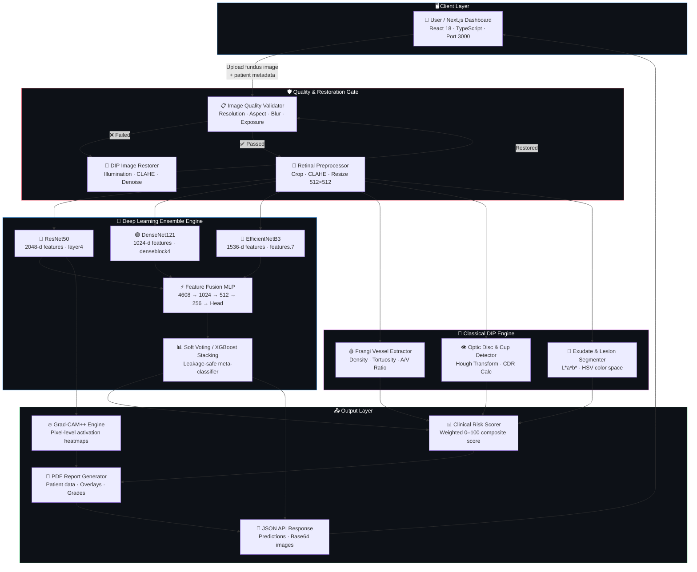
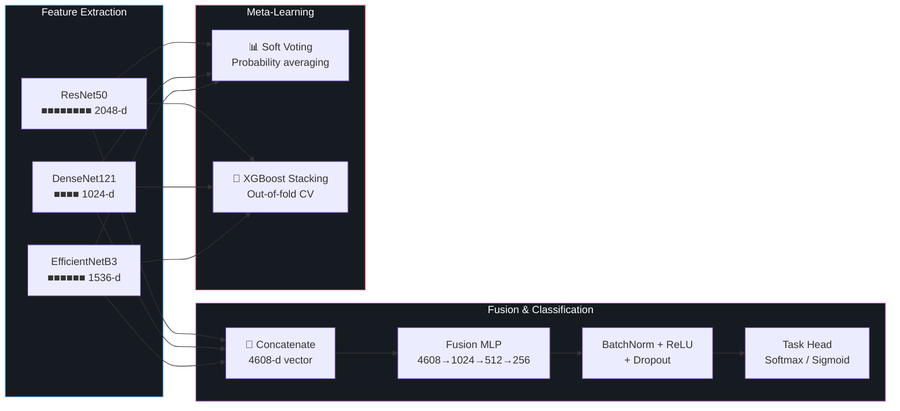
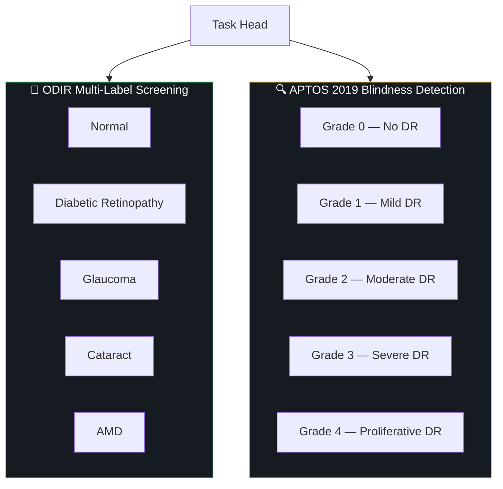
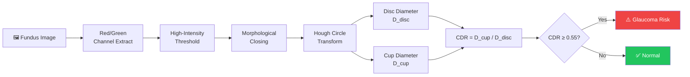
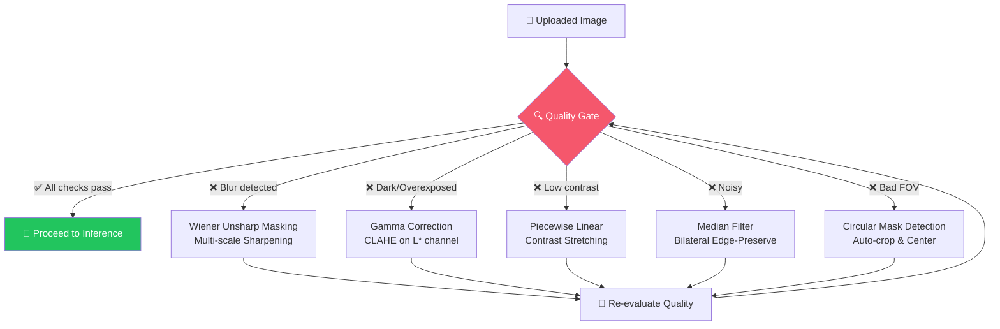
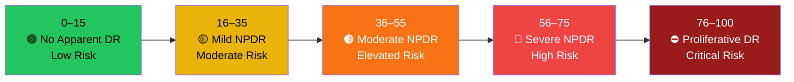
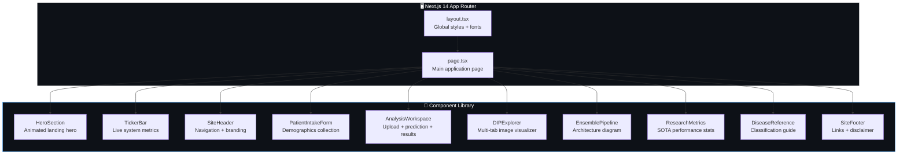
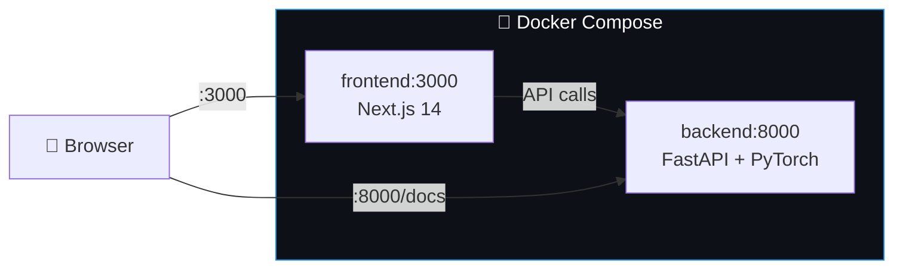

```mermaid
graph LR
    A["Input Tensor<br/>3×512×512"] --> B["Forward Pass<br/>Through CNN"]
    B --> C["Hook Target Layer<br/>Capture Activations A"]
    C --> D["Backpropagate<br/>Class Score"]
    D --> E["Capture Gradients<br/>∂y/∂A"]
    E --> F["Weight = mean(∂y/∂A)<br/>over spatial dims"]
    F --> G["CAM = ReLU(Σ wk · Ak)"]
    G --> H["Resize to 512×512<br/>Normalize [0,1]"]
    H --> I["Apply Jet Colormap<br/>α-blend on original"]

    style A fill:#161b22,stroke:#4facfe,color:#fff
    style I fill:#161b22,stroke:#f5576c,color:#fff
```

<div align="center">

<!-- ═══════════════════════════════════════════════════════════════════════
     ANIMATED SVG HERO BANNER
     ═══════════════════════════════════════════════════════════════════════ -->

<svg xmlns="http://www.w3.org/2000/svg" width="800" height="200" viewBox="0 0 800 200">
  <defs>
    <linearGradient id="bg" x1="0%" y1="0%" x2="100%" y2="100%">
      <stop offset="0%" style="stop-color:#0f0c29"/>
      <stop offset="50%" style="stop-color:#302b63"/>
      <stop offset="100%" style="stop-color:#24243e"/>
    </linearGradient>
    <linearGradient id="txt" x1="0%" y1="0%" x2="100%" y2="0%">
      <stop offset="0%" style="stop-color:#00f2fe"/>
      <stop offset="50%" style="stop-color:#4facfe"/>
      <stop offset="100%" style="stop-color:#00f2fe"/>
      <animate attributeName="x1" values="0%;100%;0%" dur="3s" repeatCount="indefinite"/>
      <animate attributeName="x2" values="100%;200%;100%" dur="3s" repeatCount="indefinite"/>
    </linearGradient>
    <linearGradient id="accent" x1="0%" y1="0%" x2="100%" y2="0%">
      <stop offset="0%" style="stop-color:#f093fb"/>
      <stop offset="100%" style="stop-color:#f5576c"/>
    </linearGradient>
    <filter id="glow">
      <feGaussianBlur stdDeviation="3" result="coloredBlur"/>
      <feMerge><feMergeNode in="coloredBlur"/><feMergeNode in="SourceGraphic"/></feMerge>
    </filter>
  </defs>
  <rect width="800" height="200" fill="url(#bg)" rx="16"/>
  <!-- Animated scanning line -->
  <rect width="800" height="2" fill="url(#txt)" opacity="0.3" y="0">
    <animate attributeName="y" values="0;200;0" dur="4s" repeatCount="indefinite"/>
  </rect>
  <!-- Animated eye icon -->
  <g transform="translate(400,65)" filter="url(#glow)">
    <circle r="28" fill="none" stroke="url(#txt)" stroke-width="2.5">
      <animate attributeName="r" values="28;32;28" dur="2s" repeatCount="indefinite"/>
    </circle>
    <circle r="12" fill="url(#txt)" opacity="0.9">
      <animate attributeName="r" values="12;14;12" dur="2s" repeatCount="indefinite"/>
    </circle>
    <circle r="5" fill="#0f0c29"/>
    <circle r="2" fill="white" cx="-3" cy="-3" opacity="0.8"/>
  </g>
  <!-- Title -->
  <text x="400" y="130" text-anchor="middle" font-family="Segoe UI,Arial,sans-serif" font-size="36" font-weight="bold" fill="url(#txt)" filter="url(#glow)">RetinaGuard</text>
  <text x="400" y="160" text-anchor="middle" font-family="Segoe UI,Arial,sans-serif" font-size="13" fill="#a0a0cc" letter-spacing="3">ENSEMBLE  DL  ×  DIGITAL  IMAGE  PROCESSING  ×  RETINAL  SCREENING</text>
  <!-- Animated corner brackets -->
  <polyline points="20,50 20,20 50,20" fill="none" stroke="url(#accent)" stroke-width="2" opacity="0.6">
    <animate attributeName="opacity" values="0.6;1;0.6" dur="2s" repeatCount="indefinite"/>
  </polyline>
  <polyline points="780,50 780,20 750,20" fill="none" stroke="url(#accent)" stroke-width="2" opacity="0.6">
    <animate attributeName="opacity" values="0.6;1;0.6" dur="2s" repeatCount="indefinite" begin="1s"/>
  </polyline>
  <polyline points="20,150 20,180 50,180" fill="none" stroke="url(#accent)" stroke-width="2" opacity="0.6">
    <animate attributeName="opacity" values="0.6;1;0.6" dur="2s" repeatCount="indefinite" begin="0.5s"/>
  </polyline>
  <polyline points="780,150 780,180 750,180" fill="none" stroke="url(#accent)" stroke-width="2" opacity="0.6">
    <animate attributeName="opacity" values="0.6;1;0.6" dur="2s" repeatCount="indefinite" begin="1.5s"/>
  </polyline>
</svg>

<br/>

<!-- ═══════════════════════════════════════════════════════════════════════
     ANIMATED BADGE RIBBON
     ═══════════════════════════════════════════════════════════════════════ -->

[](https://python.org)
[](https://pytorch.org)
[](https://fastapi.tiangolo.com)
[](https://nextjs.org)
[](LICENSE)

<br/>

<svg xmlns="http://www.w3.org/2000/svg" width="700" height="36" viewBox="0 0 700 36">
  <defs>
    <linearGradient id="bar" x1="0%" y1="0%" x2="100%" y2="0%">
      <stop offset="0%" style="stop-color:#00f2fe"/>
      <stop offset="33%" style="stop-color:#4facfe"/>
      <stop offset="66%" style="stop-color:#f093fb"/>
      <stop offset="100%" style="stop-color:#f5576c"/>
    </linearGradient>
  </defs>
  <rect x="0" y="16" width="700" height="4" rx="2" fill="#1a1a2e"/>
  <rect x="0" y="16" width="0" height="4" rx="2" fill="url(#bar)">
    <animate attributeName="width" values="0;700;0" dur="5s" repeatCount="indefinite"/>
  </rect>
  <text x="10" y="12" font-family="monospace" font-size="10" fill="#4facfe">ResNet50</text>
  <text x="170" y="12" font-family="monospace" font-size="10" fill="#4facfe">DenseNet121</text>
  <text x="350" y="12" font-family="monospace" font-size="10" fill="#f093fb">EfficientNetB3</text>
  <text x="530" y="12" font-family="monospace" font-size="10" fill="#f5576c">Fusion MLP (4608-d)</text>
  <text x="10" y="32" font-family="monospace" font-size="10" fill="#555">2048-d</text>
  <text x="190" y="32" font-family="monospace" font-size="10" fill="#555">1024-d</text>
  <text x="370" y="32" font-family="monospace" font-size="10" fill="#555">1536-d</text>
  <text x="550" y="32" font-family="monospace" font-size="10" fill="#555">→ 1024 → 512 → 256 → Head</text>
</svg>

<br/>

> **⚠️ Non-Clinical Research & Educational Demonstration**
> This system is **not** FDA/CE-cleared. It is strictly an academic research and decision-support tool.
> All predictions must be validated by a certified ophthalmologist.

</div>

---

<!-- ═══════════════════════════════════════════════════════════════════════
     TABLE OF CONTENTS — ANIMATED DIVIDER
     ═══════════════════════════════════════════════════════════════════════ -->

<div align="center">
<svg xmlns="http://www.w3.org/2000/svg" width="600" height="24" viewBox="0 0 600 24">
  <line x1="0" y1="12" x2="600" y2="12" stroke="#302b63" stroke-width="1"/>
  <circle r="4" fill="#4facfe" cx="300" cy="12">
    <animate attributeName="cx" values="0;600;0" dur="6s" repeatCount="indefinite"/>
    <animate attributeName="fill" values="#4facfe;#f093fb;#f5576c;#4facfe" dur="6s" repeatCount="indefinite"/>
  </circle>
</svg>
</div>

## 📑 Table of Contents

| # | Section | What You'll Learn |
|:---:|:---|:---|
| 🧬 | [System Architecture](#-system-architecture) | Full data pipeline from upload → prediction → report |
| 🧠 | [Deep Learning Ensemble](#-deep-learning-ensemble-engine) | ResNet50 + DenseNet121 + EfficientNetB3 fusion |
| 🔬 | [Feature 1 — DIP Biomarkers](#-feature-1--classical-dip-biomarker-extraction) | Vessel density, CDR, exudates, tortuosity |
| 🛡️ | [Feature 2 — Quality Gate & Restoration](#%EF%B8%8F-feature-2--adaptive-quality-gate--image-restoration) | Blur detection, illumination correction, CLAHE |
| 📊 | [Feature 3 — Risk Engine & PDF Reports](#-feature-3--clinical-risk-engine--pdf-reports) | Weighted risk scoring, severity grading |
| 💻 | [Feature 4 — Interactive Dashboard](#-feature-4--interactive-nextjs-dashboard--dip-explorer) | Multi-tab visualizer, animated gauges |
| 🔮 | [Grad-CAM++ Explainability](#-grad-cam-explainability-engine) | Visual attention maps for clinical trust |
| 🔌 | [API Reference](#-api-reference) | All REST endpoints documented |
| 🚀 | [Quick Start](#-quick-start) | Clone → Install → Run in 5 steps |
| 🐳 | [Docker Deployment](#-docker-deployment) | One-command production deployment |
| 📁 | [Project Structure](#-project-structure) | Full directory tree |

---

## 🧬 System Architecture

<div align="center">

<!-- Animated pipeline indicator -->
<svg xmlns="http://www.w3.org/2000/svg" width="760" height="50" viewBox="0 0 760 50">
  <defs>
    <linearGradient id="pipe" x1="0%" y1="0%" x2="100%" y2="0%">
      <stop offset="0%" style="stop-color:#4facfe"/>
      <stop offset="100%" style="stop-color:#f5576c"/>
    </linearGradient>
  </defs>
  <rect x="20" y="22" width="720" height="6" rx="3" fill="#1a1a2e"/>
  <rect x="20" y="22" width="0" height="6" rx="3" fill="url(#pipe)">
    <animate attributeName="width" values="0;720" dur="3s" fill="freeze"/>
  </rect>
  <g font-family="Segoe UI,Arial,sans-serif" font-size="11" fill="#ccc">
    <text x="30" y="16">Upload</text>
    <text x="160" y="16">Quality Gate</text>
    <text x="300" y="16">DIP Engine</text>
    <text x="430" y="16">DL Ensemble</text>
    <text x="560" y="16">Risk Score</text>
    <text x="680" y="16">Report</text>
  </g>
  <g fill="#4facfe">
    <circle cx="50" cy="25" r="6"><animate attributeName="fill" values="#1a1a2e;#4facfe" dur="0.5s" begin="0s" fill="freeze"/></circle>
    <circle cx="190" cy="25" r="6"><animate attributeName="fill" values="#1a1a2e;#4facfe" dur="0.5s" begin="0.5s" fill="freeze"/></circle>
    <circle cx="330" cy="25" r="6"><animate attributeName="fill" values="#1a1a2e;#f093fb" dur="0.5s" begin="1s" fill="freeze"/></circle>
    <circle cx="460" cy="25" r="6"><animate attributeName="fill" values="#1a1a2e;#f093fb" dur="0.5s" begin="1.5s" fill="freeze"/></circle>
    <circle cx="590" cy="25" r="6"><animate attributeName="fill" values="#1a1a2e;#f5576c" dur="0.5s" begin="2s" fill="freeze"/></circle>
    <circle cx="710" cy="25" r="6"><animate attributeName="fill" values="#1a1a2e;#f5576c" dur="0.5s" begin="2.5s" fill="freeze"/></circle>
  </g>
</svg>

</div>



---

## 🧠 Deep Learning Ensemble Engine

<div align="center">

<!-- Animated model comparison bars -->
<svg xmlns="http://www.w3.org/2000/svg" width="700" height="220" viewBox="0 0 700 220">
  <defs>
    <linearGradient id="r50" x1="0%" y1="0%" x2="100%" y2="0%">
      <stop offset="0%" style="stop-color:#ef4444"/><stop offset="100%" style="stop-color:#f97316"/>
    </linearGradient>
    <linearGradient id="d121" x1="0%" y1="0%" x2="100%" y2="0%">
      <stop offset="0%" style="stop-color:#22c55e"/><stop offset="100%" style="stop-color:#4ade80"/>
    </linearGradient>
    <linearGradient id="eb3" x1="0%" y1="0%" x2="100%" y2="0%">
      <stop offset="0%" style="stop-color:#3b82f6"/><stop offset="100%" style="stop-color:#60a5fa"/>
    </linearGradient>
    <linearGradient id="fuse" x1="0%" y1="0%" x2="100%" y2="0%">
      <stop offset="0%" style="stop-color:#a855f7"/><stop offset="100%" style="stop-color:#f093fb"/>
    </linearGradient>
  </defs>
  <rect width="700" height="220" rx="12" fill="#0d1117"/>
  <text x="350" y="30" text-anchor="middle" font-family="Segoe UI,sans-serif" font-size="14" fill="#8b949e" font-weight="bold">FEATURE DIMENSION COMPARISON</text>
  <!-- ResNet50 -->
  <text x="20" y="72" font-family="monospace" font-size="12" fill="#f97316">ResNet50</text>
  <rect x="140" y="58" width="0" height="22" rx="4" fill="url(#r50)">
    <animate attributeName="width" values="0;380" dur="1.5s" fill="freeze"/>
  </rect>
  <text x="530" y="73" font-family="monospace" font-size="12" fill="#f97316" opacity="0">2048-d</text>
  <!-- DenseNet121 -->
  <text x="20" y="112" font-family="monospace" font-size="12" fill="#4ade80">DenseNet121</text>
  <rect x="140" y="98" width="0" height="22" rx="4" fill="url(#d121)">
    <animate attributeName="width" values="0;190" dur="1.5s" begin="0.3s" fill="freeze"/>
  </rect>
  <text x="340" y="113" font-family="monospace" font-size="12" fill="#4ade80" opacity="0">1024-d</text>
  <!-- EfficientNetB3 -->
  <text x="20" y="152" font-family="monospace" font-size="12" fill="#60a5fa">EfficientNetB3</text>
  <rect x="140" y="138" width="0" height="22" rx="4" fill="url(#eb3)">
    <animate attributeName="width" values="0;285" dur="1.5s" begin="0.6s" fill="freeze"/>
  </rect>
  <text x="435" y="153" font-family="monospace" font-size="12" fill="#60a5fa" opacity="0">1536-d</text>
  <!-- Fusion -->
  <text x="20" y="192" font-family="monospace" font-size="12" fill="#f093fb" font-weight="bold">Fusion MLP</text>
  <rect x="140" y="178" width="0" height="22" rx="4" fill="url(#fuse)">
    <animate attributeName="width" values="0;540" dur="2s" begin="1s" fill="freeze"/>
  </rect>
  <text x="690" y="193" font-family="monospace" font-size="12" fill="#f093fb" opacity="0" text-anchor="end">4608-d</text>
</svg>

</div>

### How the Ensemble Works



<details>
<summary><strong>📐 Architecture Specifications Table</strong></summary>

| Property | ResNet50 | DenseNet121 | EfficientNetB3 | Fusion MLP |
|:---|:---:|:---:|:---:|:---:|
| **Feature Dim** | 2048 | 1024 | 1536 | 4608 |
| **Grad-CAM Layer** | `layer4` | `denseblock4` | `features.7` | — |
| **ImageNet Pretrained** | ✅ | ✅ | ✅ | — |
| **Input Resolution** | 512×512 | 512×512 | 512×512 | — |
| **Primary Strength** | Residual depth | Feature reuse | Multi-scale efficiency | Unified representation |
| **MLP Layers** | — | — | — | 4608→1024→512→256→Head |
| **Regularization** | — | — | — | BatchNorm + Dropout(0.3/0.2) |

</details>

### Supported Diagnostic Tasks



| Task | Classes | Output Head | Loss Function |
|:---|:---:|:---|:---|
| **ODIR** | 5 | Sigmoid (multi-label) | Binary Cross-Entropy |
| **APTOS** | 5 | Softmax (single-label) | Categorical Cross-Entropy |

---

## 🔬 Feature 1 — Classical DIP Biomarker Extraction

<div align="center">

<!-- Animated DIP pipeline -->
<svg xmlns="http://www.w3.org/2000/svg" width="740" height="100" viewBox="0 0 740 100">
  <rect width="740" height="100" rx="12" fill="#0d1117"/>
  <!-- Nodes -->
  <g font-family="Segoe UI,sans-serif" font-size="10" text-anchor="middle">
    <rect x="10" y="30" width="120" height="40" rx="8" fill="#161b22" stroke="#22c55e" stroke-width="1.5"/>
    <text x="70" y="48" fill="#22c55e" font-size="9">Green Channel</text>
    <text x="70" y="62" fill="#555" font-size="8">CLAHE</text>

    <rect x="155" y="30" width="120" height="40" rx="8" fill="#161b22" stroke="#4facfe" stroke-width="1.5"/>
    <text x="215" y="48" fill="#4facfe" font-size="9">Frangi Filter</text>
    <text x="215" y="62" fill="#555" font-size="8">Vessel Density</text>

    <rect x="300" y="30" width="120" height="40" rx="8" fill="#161b22" stroke="#f093fb" stroke-width="1.5"/>
    <text x="360" y="48" fill="#f093fb" font-size="9">Hough Transform</text>
    <text x="360" y="62" fill="#555" font-size="8">Disc · Cup · CDR</text>

    <rect x="445" y="30" width="120" height="40" rx="8" fill="#161b22" stroke="#eab308" stroke-width="1.5"/>
    <text x="505" y="48" fill="#eab308" font-size="9">L*a*b* / HSV</text>
    <text x="505" y="62" fill="#555" font-size="8">Exudate Detection</text>

    <rect x="590" y="30" width="140" height="40" rx="8" fill="#161b22" stroke="#f5576c" stroke-width="1.5"/>
    <text x="660" y="48" fill="#f5576c" font-size="9">📊 Biomarker Result</text>
    <text x="660" y="62" fill="#555" font-size="8">JSON + Overlays</text>
  </g>
  <!-- Animated arrows -->
  <g stroke="#4facfe" stroke-width="1.5" fill="none">
    <line x1="130" y1="50" x2="155" y2="50" opacity="0"><animate attributeName="opacity" values="0;1" dur="0.3s" begin="0.5s" fill="freeze"/></line>
    <line x1="275" y1="50" x2="300" y2="50" opacity="0"><animate attributeName="opacity" values="0;1" dur="0.3s" begin="1s" fill="freeze"/></line>
    <line x1="420" y1="50" x2="445" y2="50" opacity="0"><animate attributeName="opacity" values="0;1" dur="0.3s" begin="1.5s" fill="freeze"/></line>
    <line x1="565" y1="50" x2="590" y2="50" opacity="0"><animate attributeName="opacity" values="0;1" dur="0.3s" begin="2s" fill="freeze"/></line>
  </g>
  <!-- Animated data pulse -->
  <circle r="3" fill="#4facfe">
    <animate attributeName="cx" values="130;155;275;300;420;445;565;590" dur="3s" repeatCount="indefinite"/>
    <animate attributeName="cy" values="50;50;50;50;50;50;50;50" dur="3s" repeatCount="indefinite"/>
  </circle>
</svg>

</div>

> **Module:** `ml/dip_features.py` — All processing runs on **CPU only** (NumPy + SciPy + Pillow, no GPU required)

<details>
<summary><strong>🩸 Vascular Tree Segmentation (Frangi Vesselness Filter)</strong></summary>

The Frangi filter operates on the Hessian matrix eigenvalues at multiple scales to highlight tubular (vessel-like) structures:

```
Vesselness(s) = 0                                  if λ₂ > 0
              = exp(-R²_B / 2β²) · (1 - exp(-S² / 2c²))   otherwise

Where:
  R_B = |λ₁| / |λ₂|     (blob-vs-line discriminator)
  S   = √(λ₁² + λ₂²)    (second-order structureness)
  β, c = sensitivity parameters
```

**Pipeline:**
1. Extract green channel (maximum vessel-background contrast)
2. Apply CLAHE for uniform illumination
3. Run multi-scale Hessian filter (`σ = [1, 2, 3, 4]`)
4. Threshold & binarize vessel mask
5. Compute **Vessel Density Index** = vessel pixels / total retinal area

</details>

<details>
<summary><strong>👁️ Optic Disc & Cup Segmentation → Cup-to-Disc Ratio (CDR)</strong></summary>



</details>

<details>
<summary><strong>💛 Exudate & Lesion Detection (Color-Space Analysis)</strong></summary>

| Color Space | Channel | Target | Detection Method |
|:---|:---|:---|:---|
| **CIE L\*a\*b\*** | L* (lightness) + b* (blue-yellow) | Hard exudates | High L* + High b* threshold |
| **HSV** | H (hue) + S (saturation) | Yellow deposits | Hue range filtering |
| **Green channel** | Intensity | Hemorrhages | Dark-spot morphological extraction |

**Outputs:** `exudate_candidate_count`, `exudate_area_ratio`, base64 overlay masks

</details>

<details>
<summary><strong>🌊 Vessel Tortuosity & Artery-to-Vein (A/V) Ratio</strong></summary>

```
Tortuosity Index = Arc Length along vessel centerline
                   ─────────────────────────────────
                   Chord Length (straight-line distance)

A/V Ratio = Mean Artery Diameter / Mean Vein Diameter
```

- **Tortuosity > 1.3** → flags potential hypertensive retinopathy
- **A/V Ratio < 0.67** → arteriolar narrowing indicator

</details>

---

## 🛡️ Feature 2 — Adaptive Quality Gate & Image Restoration

<div align="center">

<!-- Animated quality gate -->
<svg xmlns="http://www.w3.org/2000/svg" width="600" height="140" viewBox="0 0 600 140">
  <rect width="600" height="140" rx="12" fill="#0d1117"/>
  <text x="300" y="24" text-anchor="middle" font-family="Segoe UI,sans-serif" font-size="12" fill="#8b949e" font-weight="bold">QUALITY GATE THRESHOLDS</text>

  <!-- Resolution bar -->
  <text x="20" y="52" font-family="monospace" font-size="10" fill="#ccc">Resolution</text>
  <rect x="120" y="40" width="440" height="16" rx="4" fill="#161b22"/>
  <rect x="120" y="40" width="0" height="16" rx="4" fill="#22c55e">
    <animate attributeName="width" values="0;440" dur="1s" fill="freeze"/>
  </rect>
  <text x="570" y="52" font-family="monospace" font-size="10" fill="#888">≥ 100×100</text>

  <!-- Blur bar -->
  <text x="20" y="78" font-family="monospace" font-size="10" fill="#ccc">Blur Index</text>
  <rect x="120" y="66" width="440" height="16" rx="4" fill="#161b22"/>
  <rect x="120" y="66" width="0" height="16" rx="4" fill="#eab308">
    <animate attributeName="width" values="0;330" dur="1s" begin="0.3s" fill="freeze"/>
  </rect>
  <text x="570" y="78" font-family="monospace" font-size="10" fill="#888">Var(∇²I) ≥ 15</text>

  <!-- Exposure bar -->
  <text x="20" y="104" font-family="monospace" font-size="10" fill="#ccc">Exposure</text>
  <rect x="120" y="92" width="440" height="16" rx="4" fill="#161b22"/>
  <rect x="120" y="92" width="0" height="16" rx="4" fill="#f5576c">
    <animate attributeName="width" values="0;390" dur="1s" begin="0.6s" fill="freeze"/>
  </rect>
  <text x="570" y="104" font-family="monospace" font-size="10" fill="#888">10 ≤ μ ≤ 245</text>

  <!-- FOV bar -->
  <text x="20" y="130" font-family="monospace" font-size="10" fill="#ccc">FOV Coverage</text>
  <rect x="120" y="118" width="440" height="16" rx="4" fill="#161b22"/>
  <rect x="120" y="118" width="0" height="16" rx="4" fill="#4facfe">
    <animate attributeName="width" values="0;280" dur="1s" begin="0.9s" fill="freeze"/>
  </rect>
  <text x="570" y="130" font-family="monospace" font-size="10" fill="#888">≥ 25% frame</text>
</svg>

</div>



<details>
<summary><strong>📖 Restoration Pipeline Deep Dive (Gonzalez & Woods, 4th Ed.)</strong></summary>

| Step | Defect | Algorithm | Reference |
|:---:|:---|:---|:---|
| 1 | **Blur** | Laplacian variance scoring → Wiener-inspired unsharp masking | §5.8 Inverse/Wiener |
| 2 | **Dark/Bright** | Power-law (gamma) correction on underexposed; highlight recovery on overexposed | §3.2 Power-law transform |
| 3 | **Low Contrast** | CLAHE on L\* in CIE LAB space; green-channel vessel-aware CLAHE | §3.3 Histogram processing |
| 4 | **Noise** | Median filter (salt-and-pepper); bilateral filter (edge-preserving smooth) | §5.3 Spatial filtering |
| 5 | **Bad FOV** | Intensity threshold + morphological circular mask → auto bounding-box crop | §9.1 Morphological ops |

</details>

---

## 📊 Feature 3 — Clinical Risk Engine & PDF Reports

<div align="center">

<!-- Animated risk gauge -->
<svg xmlns="http://www.w3.org/2000/svg" width="400" height="220" viewBox="0 0 400 220">
  <defs>
    <linearGradient id="riskGrad" x1="0%" y1="0%" x2="100%" y2="0%">
      <stop offset="0%" style="stop-color:#22c55e"/>
      <stop offset="25%" style="stop-color:#eab308"/>
      <stop offset="50%" style="stop-color:#f97316"/>
      <stop offset="75%" style="stop-color:#ef4444"/>
      <stop offset="100%" style="stop-color:#991b1b"/>
    </linearGradient>
  </defs>
  <rect width="400" height="220" rx="12" fill="#0d1117"/>
  <text x="200" y="28" text-anchor="middle" font-family="Segoe UI,sans-serif" font-size="14" fill="#8b949e" font-weight="bold">CLINICAL RISK SCORE GAUGE</text>
  
  <!-- Gauge arc background -->
  <path d="M 60 170 A 140 140 0 0 1 340 170" fill="none" stroke="#161b22" stroke-width="20" stroke-linecap="round"/>
  <!-- Gauge arc fill (animated) -->
  <path d="M 60 170 A 140 140 0 0 1 340 170" fill="none" stroke="url(#riskGrad)" stroke-width="20" stroke-linecap="round" stroke-dasharray="440" stroke-dashoffset="440">
    <animate attributeName="stroke-dashoffset" values="440;0" dur="2s" fill="freeze"/>
  </path>
  
  <!-- Needle -->
  <g transform="translate(200,170)">
    <line x1="0" y1="0" x2="0" y2="-110" stroke="#fff" stroke-width="2" stroke-linecap="round" transform="rotate(-90)">
      <animateTransform attributeName="transform" type="rotate" values="-90;45" dur="2.5s" fill="freeze"/>
    </line>
    <circle r="6" fill="#fff"/>
  </g>
  
  <!-- Labels -->
  <text x="50" y="195" font-family="monospace" font-size="9" fill="#22c55e">0</text>
  <text x="110" y="85" font-family="monospace" font-size="9" fill="#eab308">25</text>
  <text x="195" y="58" font-family="monospace" font-size="9" fill="#f97316">50</text>
  <text x="280" y="85" font-family="monospace" font-size="9" fill="#ef4444">75</text>
  <text x="340" y="195" font-family="monospace" font-size="9" fill="#991b1b">100</text>
  
  <text x="200" y="210" text-anchor="middle" font-family="Segoe UI,sans-serif" font-size="11" fill="#ccc">Weighted composite: DIP biomarkers + ML confidence</text>
</svg>

</div>

### Risk Formula

```
RiskScore = w₁ · VDI_risk + w₂ · Lesion_risk + w₃ · Exudate_risk
          + w₄ · ML_confidence_risk + w₅ · Anatomy_risk

where each sub-risk ∈ [0.0, 1.0], final score ∈ [0, 100]
```

### Severity Grading Scale (ICDR / ETDRS Inspired)



<details>
<summary><strong>📄 PDF Report Contents</strong></summary>

The auto-generated clinical PDF contains:
- **Patient Demographics** — Name, age, gender, blood group, diabetic/hypertension status
- **Disease Predictions** — Multi-class probability breakdown with calibrated confidence
- **DIP Biomarker Panel** — CDR, vessel density %, exudate count, tortuosity index
- **Visual Gallery** — Original image · Preprocessed · DIP overlay · Grad-CAM++ heatmap
- **Risk Score & Grade** — Composite score with severity label and clinical recommendations
- **Disclaimer** — Non-clinical research notice

</details>

---

## 💻 Feature 4 — Interactive Next.js Dashboard & DIP Explorer

<div align="center">

<!-- Animated UI component showcase -->
<svg xmlns="http://www.w3.org/2000/svg" width="720" height="160" viewBox="0 0 720 160">
  <rect width="720" height="160" rx="12" fill="#0d1117"/>

  <!-- Tab bar animation -->
  <g transform="translate(20,20)">
    <rect width="130" height="30" rx="6" fill="#4facfe" opacity="0.2">
      <animate attributeName="opacity" values="0.2;0.8;0.2" dur="4s" repeatCount="indefinite"/>
    </rect>
    <text x="65" y="20" text-anchor="middle" font-family="Segoe UI,sans-serif" font-size="10" fill="#4facfe">Original</text>

    <rect x="140" width="130" height="30" rx="6" fill="#f093fb" opacity="0.2">
      <animate attributeName="opacity" values="0.2;0.8;0.2" dur="4s" begin="1s" repeatCount="indefinite"/>
    </rect>
    <text x="205" y="20" text-anchor="middle" font-family="Segoe UI,sans-serif" font-size="10" fill="#f093fb">Restored</text>

    <rect x="280" width="130" height="30" rx="6" fill="#22c55e" opacity="0.2">
      <animate attributeName="opacity" values="0.2;0.8;0.2" dur="4s" begin="2s" repeatCount="indefinite"/>
    </rect>
    <text x="345" y="20" text-anchor="middle" font-family="Segoe UI,sans-serif" font-size="10" fill="#22c55e">Vessels</text>

    <rect x="420" width="130" height="30" rx="6" fill="#eab308" opacity="0.2">
      <animate attributeName="opacity" values="0.2;0.8;0.2" dur="4s" begin="3s" repeatCount="indefinite"/>
    </rect>
    <text x="485" y="20" text-anchor="middle" font-family="Segoe UI,sans-serif" font-size="10" fill="#eab308">Optic Disc</text>

    <rect x="560" width="130" height="30" rx="6" fill="#f5576c" opacity="0.2">
      <animate attributeName="opacity" values="0.2;0.8;0.2" dur="4s" begin="4s" repeatCount="indefinite"/>
    </rect>
    <text x="625" y="20" text-anchor="middle" font-family="Segoe UI,sans-serif" font-size="10" fill="#f5576c">Grad-CAM</text>
  </g>

  <!-- Animated metric gauges -->
  <g transform="translate(90,110)">
    <circle r="25" fill="none" stroke="#161b22" stroke-width="4"/>
    <circle r="25" fill="none" stroke="#4facfe" stroke-width="4" stroke-dasharray="157" stroke-dashoffset="157" transform="rotate(-90)">
      <animate attributeName="stroke-dashoffset" values="157;40" dur="2s" fill="freeze"/>
    </circle>
    <text x="0" y="5" text-anchor="middle" font-family="monospace" font-size="9" fill="#4facfe">CDR</text>
  </g>
  <g transform="translate(230,110)">
    <circle r="25" fill="none" stroke="#161b22" stroke-width="4"/>
    <circle r="25" fill="none" stroke="#22c55e" stroke-width="4" stroke-dasharray="157" stroke-dashoffset="157" transform="rotate(-90)">
      <animate attributeName="stroke-dashoffset" values="157;60" dur="2s" begin="0.5s" fill="freeze"/>
    </circle>
    <text x="0" y="5" text-anchor="middle" font-family="monospace" font-size="9" fill="#22c55e">VDI</text>
  </g>
  <g transform="translate(370,110)">
    <circle r="25" fill="none" stroke="#161b22" stroke-width="4"/>
    <circle r="25" fill="none" stroke="#eab308" stroke-width="4" stroke-dasharray="157" stroke-dashoffset="157" transform="rotate(-90)">
      <animate attributeName="stroke-dashoffset" values="157;90" dur="2s" begin="1s" fill="freeze"/>
    </circle>
    <text x="0" y="5" text-anchor="middle" font-family="monospace" font-size="9" fill="#eab308">Blur</text>
  </g>
  <g transform="translate(510,110)">
    <circle r="25" fill="none" stroke="#161b22" stroke-width="4"/>
    <circle r="25" fill="none" stroke="#f5576c" stroke-width="4" stroke-dasharray="157" stroke-dashoffset="157" transform="rotate(-90)">
      <animate attributeName="stroke-dashoffset" values="157;30" dur="2s" begin="1.5s" fill="freeze"/>
    </circle>
    <text x="0" y="5" text-anchor="middle" font-family="monospace" font-size="9" fill="#f5576c">Risk</text>
  </g>
  <g transform="translate(650,110)">
    <circle r="25" fill="none" stroke="#161b22" stroke-width="4"/>
    <circle r="25" fill="none" stroke="#f093fb" stroke-width="4" stroke-dasharray="157" stroke-dashoffset="157" transform="rotate(-90)">
      <animate attributeName="stroke-dashoffset" values="157;50" dur="2s" begin="2s" fill="freeze"/>
    </circle>
    <text x="0" y="5" text-anchor="middle" font-family="monospace" font-size="9" fill="#f093fb">Conf</text>
  </g>
</svg>

</div>

### Frontend Components



| Component | File | Purpose |
|:---|:---|:---|
| **DIPExplorer** | `DIPExplorer.tsx` | Multi-tab visualizer with animated circular metric gauges |
| **AnalysisWorkspace** | `AnalysisWorkspace.tsx` | Image upload, prediction trigger, result display |
| **PatientIntakeForm** | `PatientIntakeForm.tsx` | Clinical demographics form with validation |
| **HeroSection** | `HeroSection.tsx` | Animated landing section with call-to-action |
| **EnsemblePipeline** | `EnsemblePipeline.tsx` | Interactive model architecture diagram |
| **ResearchMetrics** | `ResearchMetrics.tsx` | SOTA accuracy and performance counters |

---

## 🔮 Grad-CAM++ Explainability Engine

<div align="center">

<!-- Animated heatmap simulation -->
<svg xmlns="http://www.w3.org/2000/svg" width="500" height="120" viewBox="0 0 500 120">
  <defs>
    <radialGradient id="heat1" cx="40%" cy="40%" r="50%">
      <stop offset="0%" style="stop-color:#ff0000;stop-opacity:0.8"/>
      <stop offset="50%" style="stop-color:#ffff00;stop-opacity:0.4"/>
      <stop offset="100%" style="stop-color:#0000ff;stop-opacity:0"/>
    </radialGradient>
    <radialGradient id="heat2" cx="60%" cy="55%" r="40%">
      <stop offset="0%" style="stop-color:#ff4500;stop-opacity:0.7"/>
      <stop offset="60%" style="stop-color:#ffd700;stop-opacity:0.3"/>
      <stop offset="100%" style="stop-color:#000080;stop-opacity:0"/>
    </radialGradient>
  </defs>
  <rect width="500" height="120" rx="12" fill="#0d1117"/>
  
  <!-- Fundus placeholder -->
  <rect x="20" y="10" width="100" height="100" rx="50" fill="#1a0a00" stroke="#333" stroke-width="1"/>
  <circle cx="70" cy="60" r="40" fill="#2a1505"/>
  <text x="70" y="64" text-anchor="middle" font-family="monospace" font-size="8" fill="#555">Fundus</text>
  
  <!-- Arrow -->
  <text x="145" y="64" font-family="monospace" font-size="20" fill="#4facfe">→</text>
  
  <!-- Heatmap overlay -->
  <rect x="170" y="10" width="100" height="100" rx="50" fill="#1a0a00" stroke="#333" stroke-width="1"/>
  <circle cx="220" cy="60" r="40" fill="url(#heat1)">
    <animate attributeName="opacity" values="0.5;1;0.5" dur="3s" repeatCount="indefinite"/>
  </circle>
  <circle cx="230" cy="55" r="25" fill="url(#heat2)">
    <animate attributeName="opacity" values="0.3;0.8;0.3" dur="3s" begin="1s" repeatCount="indefinite"/>
  </circle>
  <text x="220" y="64" text-anchor="middle" font-family="monospace" font-size="8" fill="#fff">Grad-CAM</text>
  
  <!-- Description -->
  <text x="300" y="35" font-family="Segoe UI,sans-serif" font-size="11" fill="#ccc">🔴 High activation — disease focus</text>
  <text x="300" y="55" font-family="Segoe UI,sans-serif" font-size="11" fill="#ccc">🟡 Moderate attention region</text>
  <text x="300" y="75" font-family="Segoe UI,sans-serif" font-size="11" fill="#ccc">🔵 Low activation — normal tissue</text>
  <text x="300" y="100" font-family="monospace" font-size="9" fill="#555">Jet colormap · α=0.45 blending</text>
</svg>

</div>



---

## 🔌 API Reference

<div align="center">

<!-- Animated API status indicator -->
<svg xmlns="http://www.w3.org/2000/svg" width="300" height="40" viewBox="0 0 300 40">
  <rect width="300" height="40" rx="8" fill="#0d1117" stroke="#22c55e" stroke-width="1"/>
  <circle cx="22" cy="20" r="6" fill="#22c55e">
    <animate attributeName="opacity" values="1;0.3;1" dur="2s" repeatCount="indefinite"/>
  </circle>
  <text x="40" y="24" font-family="monospace" font-size="12" fill="#22c55e">● API Status: Operational</text>
</svg>

</div>

| Method | Endpoint | Description | Tags |
|:---:|:---|:---|:---|
| `GET` | `/health` | System health, device info, supported tasks | System |
| `GET` | `/metadata` | Dataset schema, labels, model configurations | System |
| `POST` | `/predict` | Disease prediction with DIP biomarkers | Inference |
| `POST` | `/generate-heatmap` | Grad-CAM++ activation heatmap | Explainability |
| `POST` | `/generate-report` | Full HTML clinical report | Reporting |
| `POST` | `/dip-analysis` | Classical DIP biomarker extraction only | DIP Biomarkers |
| `POST` | `/restore` | Image quality assessment & DIP restoration | Image Restoration |
| `POST` | `/risk-score` | Composite clinical risk score (0–100) | Clinical Risk |

<details>
<summary><strong>📘 POST /predict — Full Request & Response Schema</strong></summary>

**Request** (`multipart/form-data`):
| Field | Type | Required | Default |
|:---|:---|:---:|:---|
| `file` | Image file | ✅ | — |
| `task` | `"odir"` \| `"aptos"` | ❌ | `"odir"` |
| `patient_name` | string | ❌ | — |
| `patient_age` | string | ❌ | — |
| `gender` | string | ❌ | — |
| `blood_group` | string | ❌ | — |
| `diabetic_status` | string | ❌ | — |
| `hypertension` | string | ❌ | — |
| `symptoms` | string | ❌ | — |

**Response** (`PredictionResponse`):
```json
{
  "request_id": "uuid",
  "task": "odir",
  "top_prediction": "Diabetic Retinopathy",
  "calibrated_confidence": 0.87,
  "class_probabilities": { ... },
  "quality_gate": { "passed": true, ... },
  "patient_info": { ... },
  "dip_biomarkers": {
    "vessel_density_index": 0.142,
    "microaneurysm_candidate_count": 3,
    "exudate_candidate_count": 7,
    "optic_disc_found": true,
    ...
  }
}
```

</details>

---

## 🚀 Quick Start

<div align="center">

<!-- Animated step counter -->
<svg xmlns="http://www.w3.org/2000/svg" width="700" height="50" viewBox="0 0 700 50">
  <rect width="700" height="50" rx="8" fill="#0d1117"/>
  <line x1="70" y1="25" x2="630" y2="25" stroke="#161b22" stroke-width="3"/>
  <line x1="70" y1="25" x2="70" y2="25" stroke="#4facfe" stroke-width="3">
    <animate attributeName="x2" values="70;630" dur="3s" fill="freeze"/>
  </line>
  <g font-family="Segoe UI,sans-serif" font-size="9" text-anchor="middle" fill="#ccc">
    <circle cx="70" cy="25" r="12" fill="#0d1117" stroke="#4facfe" stroke-width="2"/>
    <text x="70" y="29" fill="#4facfe" font-weight="bold">1</text>
    <text x="70" y="48" font-size="8">Clone</text>

    <circle cx="210" cy="25" r="12" fill="#0d1117" stroke="#4facfe" stroke-width="2"><animate attributeName="stroke" values="#161b22;#4facfe" dur="0.1s" begin="0.6s" fill="freeze"/></circle>
    <text x="210" y="29" fill="#4facfe" font-weight="bold">2</text>
    <text x="210" y="48" font-size="8">Install</text>

    <circle cx="350" cy="25" r="12" fill="#0d1117" stroke="#4facfe" stroke-width="2"><animate attributeName="stroke" values="#161b22;#4facfe" dur="0.1s" begin="1.2s" fill="freeze"/></circle>
    <text x="350" y="29" fill="#4facfe" font-weight="bold">3</text>
    <text x="350" y="48" font-size="8">Test</text>

    <circle cx="490" cy="25" r="12" fill="#0d1117" stroke="#f093fb" stroke-width="2"><animate attributeName="stroke" values="#161b22;#f093fb" dur="0.1s" begin="1.8s" fill="freeze"/></circle>
    <text x="490" y="29" fill="#f093fb" font-weight="bold">4</text>
    <text x="490" y="48" font-size="8">Backend</text>

    <circle cx="630" cy="25" r="12" fill="#0d1117" stroke="#22c55e" stroke-width="2"><animate attributeName="stroke" values="#161b22;#22c55e" dur="0.1s" begin="2.4s" fill="freeze"/></circle>
    <text x="630" y="29" fill="#22c55e" font-weight="bold">5</text>
    <text x="630" y="48" font-size="8">Frontend</text>
  </g>
</svg>

</div>

### Prerequisites

| Requirement | Version |
|:---|:---|
| Python | 3.10+ |
| Node.js | 18+ |
| npm | 9+ |
| Git | Latest |

### Step 1 — Clone & Switch Branch

```bash
git clone https://github.com/Jawahar08/RetinaGuard.git
cd RetinaGuard
git checkout shriram
```

### Step 2 — Install Python Dependencies

```bash
pip install -r requirements.txt
```

### Step 3 — Generate Fixtures & Smoke Test

```bash
python scripts/generate_fixtures.py     # Create synthetic retinal images
python scripts/smoke_test.py            # Validate full CPU pipeline
python -m pytest tests/                 # Run automated test suite
```

### Step 4 — Launch FastAPI Backend

```bash
python -m uvicorn backend.app.main:app --host 127.0.0.1 --port 8000
```

> 📡 **Swagger API Docs:** http://localhost:8000/docs
> 📖 **ReDoc:** http://localhost:8000/redoc

### Step 5 — Launch Next.js Frontend

```bash
cd frontend
npm install
npm run dev
```

> 🖥️ **Dashboard:** http://localhost:3000

---

## 🐳 Docker Deployment

```bash
docker-compose up --build
```



| Service | Port | Build Context | Health Check |
|:---|:---:|:---|:---|
| `backend` | 8000 | `./` with `backend/Dockerfile` | `curl http://localhost:8000/health` |
| `frontend` | 3000 | `./frontend` | — |

---

## 📁 Project Structure

```
RetinaGuard/
├── 📂 backend/
│   └── app/
│       └── main.py              # FastAPI application (8 endpoints)
├── 📂 frontend/
│   ├── src/
│   │   ├── app/                 # Next.js 14 App Router
│   │   │   ├── layout.tsx       # Root layout + global styles
│   │   │   └── page.tsx         # Main application page
│   │   └── components/
│   │       ├── AnalysisWorkspace.tsx   # Upload + prediction UI
│   │       ├── DIPExplorer.tsx         # Multi-tab DIP visualizer
│   │       ├── PatientIntakeForm.tsx   # Clinical demographics form
│   │       ├── HeroSection.tsx        # Animated landing hero
│   │       ├── EnsemblePipeline.tsx    # Architecture diagram
│   │       ├── ResearchMetrics.tsx     # SOTA performance stats
│   │       ├── DiseaseReference.tsx    # Classification guide
│   │       ├── SiteHeader.tsx         # Navigation header
│   │       ├── SiteFooter.tsx         # Footer + disclaimer
│   │       └── TickerBar.tsx          # Live metrics ticker
│   └── package.json
├── 📂 ml/
│   ├── models.py                # ResNet50 · DenseNet121 · EfficientNetB3 · Fusion · Smoke
│   ├── inference.py             # RetinalInferenceService prediction engine
│   ├── gradcam.py               # Grad-CAM++ explainability engine
│   ├── dip_features.py          # Feature 1: DIP biomarker extraction (492 lines)
│   ├── image_restoration.py     # Feature 2: Quality gate + restoration (410 lines)
│   ├── quality_gate.py          # Quality validation module
│   ├── risk_score.py            # Feature 3: Clinical risk scorer (294 lines)
│   ├── pdf_report.py            # PDF/HTML report generator
│   ├── preprocessing.py         # Retinal image preprocessor (CLAHE + resize)
│   ├── schemas.py               # Pydantic response models
│   ├── training.py              # Training loop & data loaders
│   ├── dataset_adapters.py      # ODIR / APTOS dataset adapters
│   ├── data_validation.py       # Dataset integrity checks
│   └── onnx_exporter.py         # ONNX model export utility
├── 📂 configs/                  # Dataset & model configuration YAML
├── 📂 scripts/
│   ├── generate_fixtures.py     # Synthetic retinal test image generator
│   └── smoke_test.py            # CPU end-to-end validation
├── 📂 tests/                    # PyTest test suite
├── 📂 docs/                     # Extended documentation
├── 📂 reports/                  # Evaluation & SOTA reports
├── docker-compose.yml           # Multi-container deployment
├── requirements.txt             # Python dependencies
└── README.md                    # ← You are here
```

---

<div align="center">

<!-- Animated footer divider -->
<svg xmlns="http://www.w3.org/2000/svg" width="600" height="60" viewBox="0 0 600 60">
  <defs>
    <linearGradient id="footerGrad" x1="0%" y1="0%" x2="100%" y2="0%">
      <stop offset="0%" style="stop-color:#4facfe"/>
      <stop offset="50%" style="stop-color:#f093fb"/>
      <stop offset="100%" style="stop-color:#f5576c"/>
    </linearGradient>
  </defs>
  <rect x="50" y="28" width="500" height="2" fill="url(#footerGrad)" rx="1" opacity="0.6"/>
  <!-- Animated pulse dot -->
  <circle r="5" fill="#f093fb" cy="29">
    <animate attributeName="cx" values="50;550;50" dur="8s" repeatCount="indefinite"/>
    <animate attributeName="fill" values="#4facfe;#f093fb;#f5576c;#4facfe" dur="8s" repeatCount="indefinite"/>
  </circle>
  <text x="300" y="54" text-anchor="middle" font-family="Segoe UI,sans-serif" font-size="11" fill="#555">
    Built with 🔬 PyTorch · FastAPI · Next.js · Classical DIP · Grad-CAM++
  </text>
</svg>

<br/>

**Made with ❤️ for ophthalmic research**

<sub>RetinaGuard © 2026 — Research & Educational Use Only</sub>

</div>
