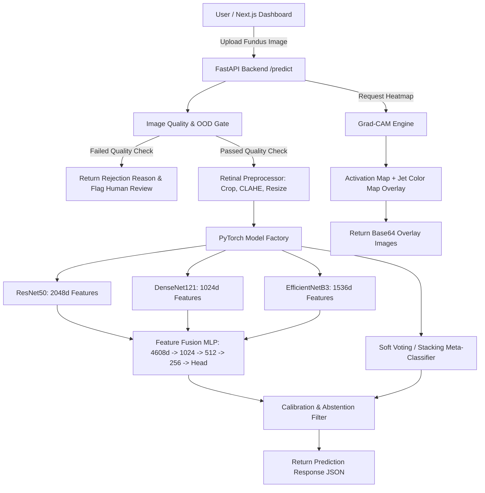

# Enhanced Ensemble Deep Learning System for Retinal Image Disease Screening

An end-to-end, reproducible, production-shaped deep learning system for retinal fundus-image disease screening research. Incorporates multi-model transfer learning ensembles (ResNet50, DenseNet121, EfficientNetB3), 4608-dimensional feature fusion, leakage-safe stacking, Grad-CAM explainability, an automated image-quality/out-of-distribution (OOD) gate, a FastAPI inference backend, and a modern Next.js demonstration dashboard.

> [!IMPORTANT]
> **Non-Clinical Research & Educational System Disclaimer**: This application is strictly an educational and research screening-support demonstration. It is not clinically validated, nor is it intended for standalone diagnosis or treatment decisions. All predictions must be evaluated by a certified medical professional.

---

## 🏛 System Architecture



---

## 🚀 Quick Start — CPU Smoke Test

The system includes a zero-dependency CPU smoke test path using synthetic retinal fixtures so you can verify the entire setup without downloading large external datasets or needing a GPU.

### 1. Install Python Dependencies
```bash
pip install -r requirements.txt
```

### 2. Run Synthetic Fixture Generator
```bash
python scripts/generate_fixtures.py
```

### 3. Run CPU End-to-End Smoke Test
```bash
python scripts/smoke_test.py
```

### 4. Run PyTest Test Suite
```bash
python -m pytest tests/
```

### 5. Launch FastAPI Backend Service
```bash
python -m uvicorn backend.app.main:app --host 127.0.0.1 --port 8000
```
Open API Docs: `http://localhost:8000/docs`

### 6. Launch Next.js Dashboard
```bash
cd frontend
npm install
npm run dev
```
Open UI: `http://localhost:3000`

---

## 📊 Supported Tasks & Datasets

1. **ODIR Multi-Label Disease Screening**:
   - **Classes**: Normal, Diabetic Retinopathy, Glaucoma, Cataract, AMD
   - **Head**: Sigmoid multi-label output, Binary Cross-Entropy loss.

2. **APTOS 2019 Blindness Detection**:
   - **Classes**: 0 - No DR, 1 - Mild DR, 2 - Moderate DR, 3 - Severe DR, 4 - Proliferative DR
   - **Head**: 5-class Softmax output, Categorical Cross-Entropy loss.

---

## 🔬 Model Ensemble Architectures

- **ResNet50**: ImageNet pretrained, extracting 2048-dimensional pooled features. Target layer: `layer4`.
- **DenseNet121**: ImageNet pretrained, extracting 1024-dimensional pooled features. Target layer: `features.denseblock4`.
- **EfficientNetB3**: ImageNet pretrained, extracting 1536-dimensional pooled features. Target layer: `features.7`.
- **Feature Fusion**: Concatenates features into a **4608-dimensional vector** passed through a custom MLP (`4608 -> 1024 -> 512 -> 256 -> Task Head`) with BatchNorm and Dropout.
- **Soft Voting**: Averages aligned probability distributions across base models.
- **Stacking**: Out-of-fold cross-validation predictions fit to an XGBoost meta-classifier to prevent data leakage.

---

## 🛡 Image Quality & OOD Gate

Before disease inference, every image is evaluated against strict physical quality parameters:
- **Resolution**: Minimum 100x100 pixels.
- **Aspect Ratio**: Rejects extreme non-standard aspect ratios (>2.5).
- **Blur Score**: Laplacian variance thresholding (>15.0).
- **Exposure**: Rejects underexposed (<10.0 mean brightness) or overexposed (>245.0) images.
- **Field of View (FOV)**: Ensures retinal disk covers at least 25% of the frame.

---

## 🔌 API Endpoints

- `GET /health`: System health and supported task listing.
- `GET /metadata`: JSON schema definitions for labels, preprocessing, and model configurations.
- `POST /predict`: Multipart upload returning task, quality gate results, calibrated confidence, disease probabilities, and human-review/abstention status.
- `POST /generate-heatmap`: Grad-CAM activation heatmap generation returning Base64 image strings.

---

## 🐳 Docker Deployment

Run end-to-end with Docker Compose:
```bash
docker-compose up --build
```
