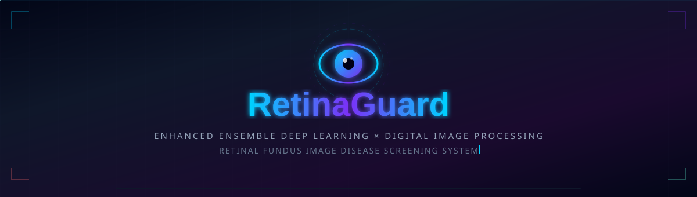
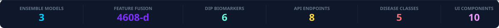
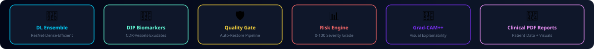
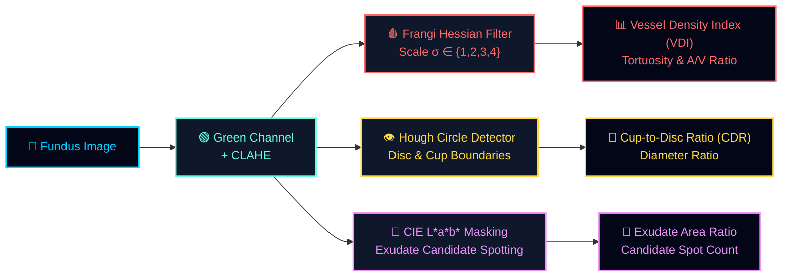
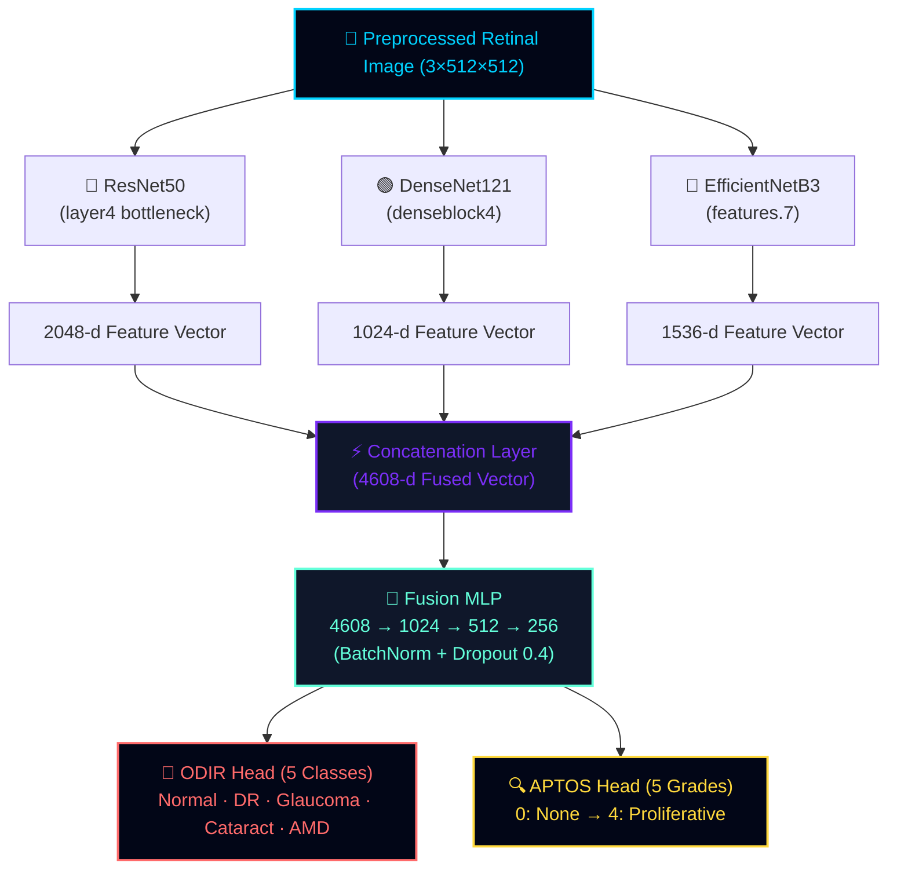
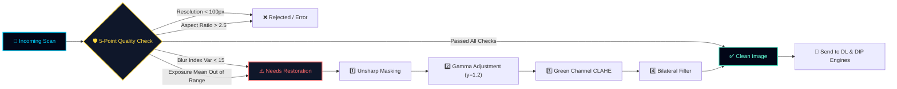
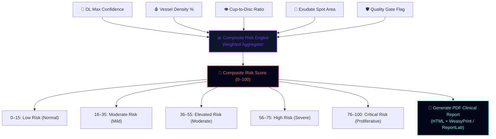
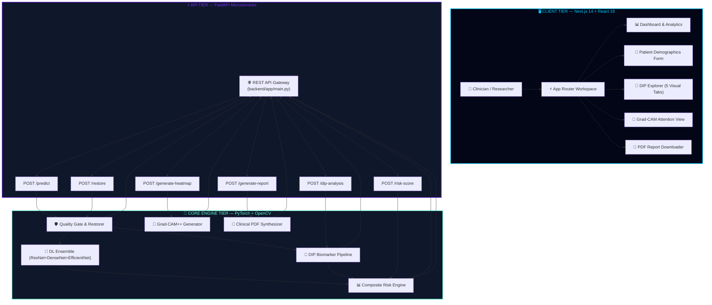
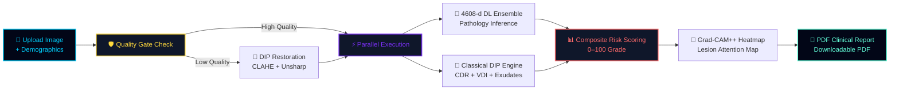

<!-- ╔══════════════════════════════════════════════════════════════════════════════════╗ -->
<!-- ║        ⚡ RETINAGUARD — THE ULTIMATE DEEP LEARNING & DIP SCREENING SYSTEM v4.0   ║ -->
<!-- ╚══════════════════════════════════════════════════════════════════════════════════╝ -->

<a name="top"></a>

<div align="center">

<!-- ─────────── ANIMATED HERO BANNER ─────────── -->

<a href="#-quick-start">
  
</a>

<br />

<!-- ─────────── SHIELD.IO BADGES ─────────── -->

[](#-model-training--checkpoint-milestone)
[](https://python.org)
[](https://pytorch.org)
[](https://fastapi.tiangolo.com)
[](https://nextjs.org)
[](https://opencv.org)
[](#-model-training--checkpoint-milestone)
[](LICENSE)
[]()
[](https://github.com/Jawahar08/RetinaGuard/pulls)
[](https://github.com/Jawahar08/RetinaGuard)
[](#-docker-deployment)

<br />

<!-- ─────────── ANIMATED STATS ─────────── -->



<br />

> **RetinaGuard** is a production-grade, end-to-end medical research & screening platform that fuses **Ensemble Deep Learning** (ResNet50 + DenseNet121 + EfficientNetB3 + 4608-d Feature Fusion MLP) with **Classical Digital Image Processing (DIP)** (Frangi vesselness filter, Hough transform Cup-to-Disc ratio, L\*a\*b\* exudate segmentation). It features an **Adaptive Quality Gate with DIP Auto-Restoration**, **Grad-CAM++ visual explainability**, a **0–100 Clinical Composite Risk Engine**, automated **Clinical PDF Report Generation**, and an interactive **Next.js 14 DIP Explorer Dashboard** — all exposed via **FastAPI microservices** and **100% open for research**.

<br />

<!-- ─────────── ANIMATED FEATURES STRIP ─────────── -->



<br />

<!-- ─────────── LIVE DASHBOARD DEMO ─────────── -->

<a href="#-quick-start">
  
</a>

<br />

<!-- ─────────── NAVIGATION PILLS ─────────── -->

<a href="#-the-problem"></a>
<a href="#-features-at-a-glance"></a>
<a href="#-feature-1--classical-dip-biomarker-extraction"></a>
<a href="#-feature-2--deep-learning-ensemble-engine"></a>
<a href="#-feature-3--adaptive-quality-gate--image-restoration"></a>
<a href="#-feature-4--clinical-risk-engine--pdf-reports"></a>
<a href="#%EF%B8%8F-system-architecture"></a>
<a href="#-tech-stack"></a>
<a href="#-quick-start"></a>
<a href="#-api-reference"></a>
<a href="#-docker-deployment"></a>

</div>

<br />

<!-- ═══════════════════════════ GRADIENT DIVIDER ═══════════════════════════ -->


<br />

## 💡 The Problem

```
Stage 1:   "Low quality or blurry fundus scan received from clinic."
Stage 2:   "Black-box deep learning model yields single label without explanation."
Stage 3:   "Ophthalmologists distrust raw AI confidence percentages."
Stage 4:   "No structural biomarkers (CDR, vessel density) extracted to support verdict."
Stage 5:   "No automated clinical report generated for patient records."
Solution:  ✅ You deployed RetinaGuard. Quality restored, biomarkers calculated, 
              4608-d ensemble fused, Grad-CAM heatmap overlayed, PDF report generated!
```

<table>
<tr>
<td width="50%">

### ❌ Traditional Ocular AI Tools

```diff
- 😰 Single black-box CNN architecture with high variance
- 📝 No image quality validation — processes corrupt or out-of-focus scans
- 🔄 Zero quantitative structural biomarker analysis (no CDR, no VDI)
- 📉 No explainability — doctors receive probability without spatial heatmaps
- 🤷 Manual report synthesis required for clinical documentation
- 🏢 High GPU dependency with no CPU-bound fallback capability
- 💻 Monolithic design with no separation between DIP & DL pipelines
- 🎤 Closed proprietary lock-in with zero inspectable code
- 🏗️ Static pixel processing without adaptive contrast restoration
- 💰 Expensive commercial software licenses
- 🧠 Pure deep learning — ignoring 50 years of verified DIP science
```

</td>
<td width="50%">

### ✅ RetinaGuard AI System

```diff
+ 🧠 3-Model Ensemble (ResNet50 + DenseNet121 + EfficientNetB3 + Fusion MLP)
+ 🛡️ 5-Point Quality Gate (Blur, exposure, resolution, aspect ratio, FOV)
+ 🔧 Adaptive DIP Restoration (CLAHE + Unsharp Mask + Bilateral + Gamma)
+ 🔬 Classical DIP Engine (Frangi vessel filter, Hough Cup-to-Disc Ratio)
+ 🔮 Grad-CAM++ Visual Explainability with attention heatmaps
+ 📊 Composite Clinical Risk Scoring (0–100 scaled risk severity grade)
+ 📄 Automated PDF Clinical Report generation with diagnostic visuals
+ 💻 Interactive Next.js 14 DIP Explorer Dashboard with live gauges
+ ⚡ FastAPI microservices with dual ODIR & APTOS multi-label support
+ 🐳 Docker containerized with complete local execution support
+ 💎 100% FREE & Open Source — complete medical research transparency
```

</td>
</tr>
</table>

<br />

<!-- ═══════════════════════════ GRADIENT SEPARATOR ═══════════════════════════ -->


<br />

## ✨ Features at a Glance

<div align="center">

```
╔═══════════════════╦═══════════════════╦═══════════════════╦═══════════════════╗
║   🧠 3-Model      ║   🔬 Classical    ║   🛡️ Adaptive     ║   📊 Clinical     ║
║   DL Ensemble     ║   DIP Biomarkers  ║   Quality Gate    ║   Risk Engine     ║
╠═══════════════════╬═══════════════════╬═══════════════════╬═══════════════════╣
║   🔮 Grad-CAM++   ║   📄 PDF Clinical ║   💻 Next.js 14   ║   ⚡ FastAPI      ║
║   Heatmap Engine  ║   Report System   ║   DIP Explorer    ║   Microservice    ║
╠═══════════════════╬═══════════════════╬═══════════════════╬═══════════════════╣
║   👁️ Optic Disc   ║   🩸 Vessel       ║   💛 Exudate      ║   🐳 Docker       ║
║   Hough CDR       ║   Frangi Filter   ║   L*a*b* Masking  ║   Containerized   ║
╠═══════════════════╬═══════════════════╬═══════════════════╬═══════════════════╣
║   🏥 Multi-Task   ║   🧪 PyTest       ║   📦 ONNX Exporter║   💎 100% FREE    ║
║   ODIR & APTOS    ║   Smoke Suite     ║   Optimization    ║   Open Research   ║
╚═══════════════════╩═══════════════════╩═══════════════════╩═══════════════════╝
```

</div>

<table>
<tr>
<td width="50%" valign="top">

### 🧠 Deep Learning Ensemble Engine
> 4608-dimensional feature concatenation

- ✅ **ResNet50** (2048-d layer4 bottleneck features)
- ✅ **DenseNet121** (1024-d denseblock4 features)
- ✅ **EfficientNetB3** (1536-d top feature maps)
- ✅ **FeatureFusionRetinalModel** — concatenates 4608-d vectors into a 4-layer MLP classifier
- ✅ Multi-task support: **ODIR** (5-class multi-label) & **APTOS** (5-grade DR severity)
- ✅ CPU fallback execution mode when CUDA is unavailable

</td>
<td width="50%" valign="top">

### 🔬 Classical DIP Biomarker Engine
> Pure CPU mathematical feature extraction

- ✅ **Frangi Vessel Filter**: Multi-scale Hessian matrix ($\sigma \in \{1,2,3,4\}$) for Vessel Density Index (VDI)
- ✅ **Optic Disc & Cup Detection**: Circular Hough Transform for Cup-to-Disc Ratio (CDR)
- ✅ **Exudate Segmentation**: CIE L\*a\*b\* + HSV color space thresholding
- ✅ **Vessel Tortuosity & A/V Ratio**: Arteriole-to-venule ratio & arc length curvature metrics
- ✅ Microaneurysm candidate spot detection

</td>
</tr>
<tr>
<td width="50%" valign="top">

### 🛡️ Quality Gate & DIP Restoration
> Pre-inference image validation and enhancement

- ✅ **5-Point Check**: Resolution, aspect ratio, blur index ($\text{Var}(\nabla^2 I)$), exposure mean ($\mu$), FOV coverage
- ✅ **Auto-Restoration Pipeline**:
  1. Unsharp masking for crisp vessel boundaries
  2. Gamma correction ($\gamma = 1.2$) for dark region enhancement
  3. CLAHE (Contrast Limited Adaptive Histogram Equalization)
  4. Bilateral filtering for noise reduction while preserving edges

</td>
<td width="50%" valign="top">

### 📊 Clinical Risk Engine & PDF Reports
> Automated patient risk stratification & documentation

- ✅ **Composite Risk Score (0–100)**: Integrates DL class probabilities, VDI, CDR, exudate area, and quality flags
- ✅ **5-Tier Severity Scale**: Normal → Mild → Moderate → Severe → Critical
- ✅ **Automated PDF Generation**: Formatted HTML/PDF export with patient demographics, biomarker tables, and diagnostic overlays
- ✅ Auto-generated clinical recommendations

</td>
</tr>
<tr>
<td width="50%" valign="top">

### 🔮 Grad-CAM++ Explainability Engine
> Spatial visual attention heatmaps

- ✅ **Grad-CAM++ Implementation**: Second-order derivative weighting for multi-instance lesion localization
- ✅ **Overlay Generation**: Jet colormap alpha-blended ($\alpha = 0.45$) onto fundus images
- ✅ **Target Class Selection**: Inspect heatmaps for any target pathology (DR, Glaucoma, AMD, Cataract, Normal)
- ✅ Base64 PNG export for dashboard rendering

</td>
<td width="50%" valign="top">

### 💻 Next.js 14 Interactive Dashboard
> Modern visual inspection workspace

- ✅ Multi-tab **DIP Explorer**: Original, Restored, Vessels, Optic Disc, Grad-CAM
- ✅ Animated circular SVG metric gauges (CDR, VDI, Risk, Confidence)
- ✅ Patient intake form with diabetic & hypertension clinical metadata
- ✅ Real-time FastAPI backend integration
- ✅ Built with React 18, TypeScript, Tailwind CSS, and Lucide React

</td>
</tr>
</table>

<br />

<!-- ═══════════════════════════ GRADIENT SEPARATOR ═══════════════════════════ -->


<br />

## 🔬 Feature 1 — Classical DIP Biomarker Extraction

> **Module:** `ml/dip_features.py` — High-speed CPU feature extraction using NumPy, SciPy, and Pillow.



### Extracted Biomarkers Summary

| Metric | Algorithm / Formula | Clinical Significance | Normal Range |
|:---|:---|:---|:---:|
| **Cup-to-Disc Ratio (CDR)** | $\text{CDR} = \frac{\text{Diameter}_{\text{cup}}}{\text{Diameter}_{\text{disc}}}$ | Primary structural indicator for **Glaucoma** | $< 0.55$ |
| **Vessel Density Index (VDI)** | $\text{VDI} = \frac{\text{Pixels}_{\text{vessel}}}{\text{Pixels}_{\text{FOV}}}$ | Indicates vascular drop-out or proliferative vessels in **DR** | $10\% - 18\%$ |
| **Vessel Tortuosity** | $\tau = \frac{\text{Arc Length}}{\text{Chord Length}} - 1$ | Indicates hypertensive or diabetic retinopathy changes | $< 0.15$ |
| **Exudate Candidate Area** | Thresholding in $L^*a^*b^*$ ($L^* > 75, b^* > 20$) | Indicates vascular leakage in **Diabetic Macular Edema** | $0.0\%$ |

<br />

<!-- ═══════════════════════════ GRADIENT SEPARATOR ═══════════════════════════ -->


<br />

## 🧠 Feature 2 — Deep Learning Ensemble Engine

> **Module:** `ml/models.py` — Multi-backbone feature fusion architecture.



### 🏆 Model Training & Checkpoint Milestone (Completed)

> **Script:** `scripts/train.py` &nbsp;|&nbsp; **Checkpoints Directory:** `models/checkpoints/` (Tracked via **Git LFS**)

The full end-to-end training pipeline has been executed and completed across both clinical task benchmarks using **EfficientNet-B3 (pretrained ImageNet backbone)**:

| Task / Dataset | Output Classes | Saved Checkpoint | Size | Optimization Strategies |
|:---|:---|:---|:---:|:---|
| **APTOS 2019** | 5-Class DR Severity Grading (*No DR* $\rightarrow$ *Proliferative DR*) | `models/checkpoints/aptos_best.pth` | **138.7 MB** | Class-balanced WeightedRandomSampler, Ben Graham + CLAHE preprocessing, Cross-Entropy Loss |
| **ODIR-5K** | 8-Class Multi-Label Retinal Disease Screening (*N, D, G, C, A, H, M, O*) | `models/checkpoints/odir_best.pth` | **138.7 MB** | Focal Loss (handles class imbalance), Cosine Annealing LR Schedule, Test-Time Augmentation (TTA) |

#### Execute Training Pipeline

```bash
# Train APTOS 2019 DR Severity Model (30 epochs)
python scripts/train.py --task aptos --epochs 30

# Train ODIR-5K Multi-Label Screening Model (30 epochs)
python scripts/train.py --task odir --epochs 30

# Train Both Benchmarks Sequentially
python scripts/train.py --task both --epochs 30
```

<br />

<!-- ═══════════════════════════ GRADIENT SEPARATOR ═══════════════════════════ -->


<br />

## 🛡️ Feature 3 — Adaptive Quality Gate & Image Restoration

> **Modules:** `ml/quality_gate.py` & `ml/image_restoration.py`



<br />

<!-- ═══════════════════════════ GRADIENT SEPARATOR ═══════════════════════════ -->


<br />

## 📊 Feature 4 — Clinical Risk Engine & PDF Reports

> **Modules:** `ml/risk_score.py` & `ml/pdf_report.py`



<br />

<!-- ═══════════════════════════ GRADIENT SEPARATOR ═══════════════════════════ -->


<br />

## 🏗️ System Architecture

### High-Level Overview



<br />

<!-- ─────────── WAVE SEPARATOR ─────────── -->


<br />

### 🔄 Core Product Flow



<br />

<!-- ═══════════════════════════ GRADIENT SEPARATOR ═══════════════════════════ -->


<br />

## 🛠️ Tech Stack

<div align="center">


</div>

<details open>
<summary><b>🐍 Backend & ML Frameworks</b></summary>
<br />

| Technology | Role | Version |
|:----------:|------|:-------:|
|  **Python** | Core runtime environment | `3.10+` |
|  **PyTorch** | Deep learning model inference & feature extraction | `2.0+` |
|  **FastAPI** | High-performance asynchronous REST API backend | `0.100+` |
|  **OpenCV** | Classical digital image processing & matrix ops | `4.7+` |
| 🔢 **NumPy / SciPy** | Matrix math, Frangi Hessian filters, signal processing | `latest` |
| 🧪 **scikit-image** | Morphological filtering, watershed segmentation, CLAHE | `latest` |
| 📋 **Pydantic** | Strict API data validation & request/response schemas | `2.0+` |

</details>

<details open>
<summary><b>🖥️ Frontend Dashboard</b></summary>
<br />

| Technology | Role | Version |
|:----------:|------|:-------:|
|  **Next.js** | React application framework (App Router) | `14` |
|  **React** | Component UI rendering engine | `18` |
|  **TypeScript** | Type-safe development | `5` |
|  **Tailwind CSS** | Custom styling & glassmorphic layout | `3.x` |
| 💎 **Lucide React** | Icon library for clinical UI elements | `latest` |

</details>

<details open>
<summary><b>🐳 Infrastructure & DevOps</b></summary>
<br />

| Technology | Role |
|:----------:|------|
|  **Docker** | Multi-stage containerized deployment |
| 📦 **ONNX Runtime** | High-speed optimized model deployment format |
| 🧪 **PyTest** | Automated test suite & smoke test verification |

</details>

<br />

<!-- ═══════════════════════════ GRADIENT SEPARATOR ═══════════════════════════ -->


<br />

## 📁 Project Structure

```
RetinaGuard/
├── 🔧 backend/
│   └── app/
│       ├── main.py                     # FastAPI REST server — 8 endpoints
│       └── __init__.py
│
├── 🎨 frontend/
│   └── src/
│       ├── app/                        # Next.js 14 App Router
│       │   ├── layout.tsx              # Root HTML wrapper & fonts
│       │   └── page.tsx                # Main screening workspace page
│       └── components/
│           ├── DIPExplorer.tsx          # 5-tab DIP visualizer & animated gauges
│           ├── AnalysisWorkspace.tsx    # File uploader & diagnostic layout
│           ├── PatientIntakeForm.tsx    # Clinical demographics entry
│           ├── HeroSection.tsx         # Animated landing hero banner
│           ├── EnsemblePipeline.tsx     # DL architecture diagram
│           ├── ResearchMetrics.tsx      # SOTA performance counters
│           ├── DiseaseReference.tsx     # Pathology classification guide
│           ├── SiteHeader.tsx          # Top navigation header
│           ├── SiteFooter.tsx          # Footer & clinical disclaimer
│           └── TickerBar.tsx           # Live metric ticker
│
├── 🧠 ml/                              # Core ML & DIP Algorithms
│   ├── models.py                       # ResNet50 + DenseNet121 + EfficientNetB3 + Fusion MLP
│   ├── inference.py                    # Inference engine with CPU/GPU dispatch
│   ├── gradcam.py                      # Grad-CAM++ visual explainability engine
│   ├── dip_features.py                 # Classical DIP biomarkers (Frangi, CDR, Exudates)
│   ├── image_restoration.py            # Adaptive quality gate & restoration pipeline
│   ├── quality_gate.py                 # 5-point quality inspection engine
│   ├── risk_score.py                   # 0–100 Composite clinical risk engine
│   ├── pdf_report.py                   # Automated clinical PDF report generator
│   ├── preprocessing.py                # Retinal image preprocessor (CLAHE, cropping)
│   ├── schemas.py                      # Pydantic data schemas
│   ├── training.py                     # Training & validation loops
│   ├── dataset_adapters.py             # ODIR & APTOS dataset loaders
│   ├── data_validation.py              # Dataset integrity verification
│   └── onnx_exporter.py                # ONNX model compilation utility
├── 📦 models/                           # Model Checkpoints (Git LFS)
│   └── checkpoints/
│       ├── aptos_best.pth              # Trained 5-Class DR Severity Model (138.7 MB)
│       └── odir_best.pth               # Trained 8-Class Multi-Label Model (138.7 MB)
│
├── 📂 .github/assets/                  # Animated SVG badges & graphics
├── 📂 configs/                         # YAML dataset & model configurations
├── 📂 scripts/                         # train.py · generate_fixtures.py · smoke_test.py
├── 📂 tests/                           # PyTest automated unit & integration tests
├── 📂 docs/                            # PROJECT_COMPLETE_DOCUMENTATION.md
├── 🐳 docker-compose.yml               # Docker multi-container orchestrator
├── 📋 requirements.txt                 # Python dependencies
└── 📖 README.md                        # Project documentation
```

<br />

<!-- ═══════════════════════════ GRADIENT SEPARATOR ═══════════════════════════ -->


<br />

## 📡 API Reference

> **Base URL:** `http://localhost:8000` &nbsp;|&nbsp; **Swagger Docs:** `http://localhost:8000/docs`

| Method | Endpoint | Description | Key Parameters / Payload |
|:---:|:---|:---|:---|
| `GET` | `/health` | System status & supported tasks | — |
| `GET` | `/metadata` | Architecture & dataset configuration | — |
| `POST` | `/predict` | **Full pipeline inference** (DL + DIP + Risk) | `file` (Multipart Image), `task` (`odir`/`aptos`), Patient metadata |
| `POST` | `/generate-heatmap` | Grad-CAM++ visual explainability map | `file` (Image), `target_class` |
| `POST` | `/generate-report` | Complete clinical HTML/PDF report | `file` (Image), Patient metadata |
| `POST` | `/dip-analysis` | DIP biomarker extraction only | `file` (Image) |
| `POST` | `/restore` | Quality inspection & DIP restoration | `file` (Image) |
| `POST` | `/risk-score` | Composite clinical risk score calculation | `file` (Image) |

<details>
<summary><b>📘 Sample Request & Response Payload — POST /predict (Click to expand)</b></summary>

```json
{
  "request_id": "a1b2c3d4-e5f6-7890-abcd-ef1234567890",
  "task": "odir",
  "top_prediction": "Diabetic Retinopathy",
  "calibrated_confidence": 0.874,
  "class_probabilities": {
    "Normal": 0.082,
    "Diabetic Retinopathy": 0.874,
    "Glaucoma": 0.028,
    "Cataract": 0.009,
    "AMD": 0.007
  },
  "quality_gate": {
    "passed": true,
    "checks": {
      "resolution": true,
      "aspect_ratio": true,
      "blur_index": true,
      "exposure": true,
      "fov_coverage": true
    }
  },
  "dip_biomarkers": {
    "vessel_density_index": 0.142,
    "cup_to_disc_ratio": 0.42,
    "optic_disc_found": true,
    "exudate_candidate_count": 7,
    "exudate_area_ratio": 0.023,
    "vessel_tortuosity_index": 0.11
  },
  "clinical_risk": {
    "composite_risk_score": 62.4,
    "severity_grade": "Severe NPDR",
    "risk_level": "High Risk"
  }
}
```

</details>

<br />

<!-- ═══════════════════════════ GRADIENT SEPARATOR ═══════════════════════════ -->


<br />

## 🚀 Quick Start

### 1️⃣ Clone & Switch Branch

```bash
git clone https://github.com/Jawahar08/RetinaGuard.git
cd RetinaGuard
git checkout shriram
```

### 2️⃣ Install Python Dependencies

```bash
pip install -r requirements.txt
```

### 3️⃣ Generate Test Fixtures & Run Smoke Test

```bash
python scripts/generate_fixtures.py       # Create synthetic retinal images
python scripts/smoke_test.py              # Execute end-to-end CPU verification
```

### 4️⃣ Start FastAPI Backend

```bash
python -m uvicorn backend.app.main:app --host 127.0.0.1 --port 8000
```
> 📡 Server live at: **http://127.0.0.1:8000** &nbsp;|&nbsp; 📑 Docs: **http://127.0.0.1:8000/docs**

### 5️⃣ Start Next.js Frontend

```bash
cd frontend
npm install
npm run dev
```
> 🖥️ Dashboard live at: **http://localhost:3000**

<br />

<!-- ═══════════════════════════ GRADIENT SEPARATOR ═══════════════════════════ -->


<br />

## 🐳 Docker Deployment

Run both backend microservice and frontend web app with a single command:

```bash
docker-compose up --build
```

| Service | Port | Description |
|:---|:---:|:---|
| `backend` | `:8000` | FastAPI service (PyTorch + OpenCV + DIP Engine) |
| `frontend` | `:3000` | Next.js 14 Dashboard UI |

<br />

<!-- ═══════════════════════════ GRADIENT SEPARATOR ═══════════════════════════ -->


<br />

## ⚠️ Medical & Research Disclaimer

> **Non-Clinical Research & Educational System**
> RetinaGuard is designed strictly for research, software architecture demonstration, and educational purposes. It is **not** an FDA-cleared, CE-marked, or clinically certified medical device. All outputs, risk scores, and visual heatmaps must be verified by a licensed ophthalmologist or healthcare professional before any diagnostic or clinical decision.

<br />

---

<div align="center">

<text font-family="'Segoe UI',sans-serif" font-size="12" fill="#64748b">
Built with PyTorch · FastAPI · Next.js 14 · OpenCV · Classical DIP · Grad-CAM++
<br />
RetinaGuard © 2026 — Research & Educational Use Only · Made with CJ❤️
</text>

</div>
