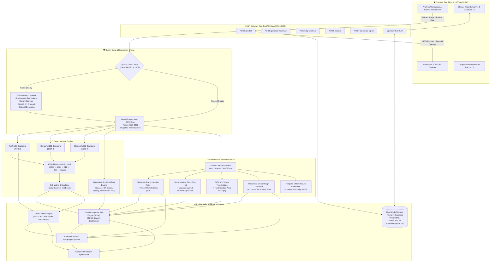

# 👁️ RETINAGUARD: THE COMPLETE SYSTEM, CODE & VIVA GUIDE

> **A Comprehensive Technical Compendium for Project Review, Code Walkthrough, and Oral Viva Defense**  
> **Repository**: [RetinaGuard on GitHub](https://github.com/Jawahar08/RetinaGuard.git)  
> **Authors & Maintainers**: Jawahar Bharathi C & Team  
> **Technology Stack**: Python 3.10+, PyTorch 2.0+, OpenCV 4.8+, SciPy, NumPy, FastAPI, SQLite / Supabase PostgreSQL, Next.js 14 (App Router), TypeScript, Tailwind CSS.

---

## 📋 TABLE OF CONTENTS
1. [Executive Summary & Clinical Rationale](#1-executive-summary--clinical-rationale)
2. [Complete System Architecture & Dataflow](#2-complete-system-architecture--dataflow)
3. [Deep Learning Ensemble & Multi-Task Architecture](#3-deep-learning-ensemble--multi-task-architecture)
   - 3.1 ResNet50, DenseNet121 & EfficientNetB3 Backbones
   - 3.2 4608-Dimensional Feature Fusion Network & MLP
   - 3.3 RetinaGuard++ Multi-Task Unified Architecture (5 Prediction Heads)
   - 3.4 Soft Voting & Stacking Meta-Classifier (XGBoost)
4. [Classical Digital Image Processing (DIP) Biomarker Suite](#4-classical-digital-image-processing-dip-biomarker-suite)
   - 4.1 Optical Physics: Why the Green Channel?
   - 4.2 Contrast-Limited Adaptive Histogram Equalization (CLAHE)
   - 4.3 Multiscale Frangi Hessian Vesselness Filter & Vessel Density Index (VDI)
   - 4.4 Morphological Black Top-Hat Transform for Microaneurysms
   - 4.5 CIE $L^*a^*b^*$ Color-Space Exudate Segmentation
   - 4.6 Optic Disc & Cup Localization via Hough Transform & Cup-to-Disc Ratio (CDR)
   - 4.7 Macula Center Estimation & Vessel Tortuosity
5. [Adaptive Quality Gate & DIP Image Restoration Engine](#5-adaptive-quality-gate--dip-image-restoration-engine)
   - 5.1 Quality Inspection Criteria & Laplacian Variance Blur Index
   - 5.2 Background Illumination Correction via Morphological Opening
   - 5.3 Bilateral Noise Filtering & Unsharp Masking
6. [Visual Explainability & Spatial Grounding](#6-visual-explainability--spatial-grounding)
   - 6.1 Grad-CAM++ with Higher-Order Partial Derivatives
   - 6.2 Target Layer Hook Registration (PyTorch Forward/Backward Hooks)
   - 6.3 Jet Colormap Rendering & Bounding-Box Lesion Grounding
   - 6.4 Semantic Explainer & Automated Clinical Interpretation
7. [Clinical Composite Risk Engine & Severity Grading](#7-clinical-composite-risk-engine--severity-grading)
   - 7.1 Weighted Multi-Factor Risk Score Formula (0–100 Scale)
   - 7.2 Sub-Risk Scoring Functions & Physiological Normal Ranges
   - 7.3 ETDRS / ICDR Diabetic Retinopathy Severity Grading
8. [Longitudinal Progression Tracker](#8-longitudinal-progression-tracker)
   - 8.1 Baseline vs. Follow-up Delta Computation ($\Delta\text{CDR}, \Delta\text{VDI}, \Delta\text{Lesion}$)
   - 8.2 Progression Trajectory Verdicts
9. [Automated Clinical PDF Report Generator](#9-automated-clinical-pdf-report-generator)
   - 9.1 Report Structure, Demographic Tables & Biomarker Summaries
   - 9.2 Quad-Pane Visual Diagnostic Gallery
10. [FastAPI Backend Microservices Specification](#10-fastapi-backend-microservices-specification)
    - 10.1 API Route Endpoints & HTTP Methods
    - 10.2 Pydantic Data Schemas & Validation
11. [Dual-Mode Clinical Records Database](#11-dual-mode-clinical-records-database)
    - 11.1 Local SQLite Database Schema & Indexing
    - 11.2 Supabase Cloud PostgreSQL Mirror & Offline Resilience
    - 11.3 Search, Filtering, Pagination & JSON Export
12. [Frontend Web Architecture (Next.js 14 / TypeScript)](#12-frontend-web-architecture-nextjs-14--typescript)
    - 12.1 App Router Structure & Global Design System
    - 12.2 Component Breakdown (AnalysisWorkspace, DIPExplorer, PatientIntakeForm, ClinicalRecordsArchive, ProgressionTrackerUI)
13. [End-to-End Execution Trace: Step-by-Step Code Walkthrough](#13-end-to-end-execution-trace-step-by-step-code-walkthrough)
14. [Top 20 Professor & Evaluation Guide Viva Questions (with Exact Answers)](#14-top-20-professor--evaluation-guide-viva-questions-with-exact-answers)
15. [7-Day Master Study & Oral Defense Prep Schedule](#15-7-day-master-study--oral-defense-prep-schedule)

---

## 1. Executive Summary & Clinical Rationale

### 1.1 The Clinical Challenge
Retinal fundus photography is the gold standard for non-invasive screening of ocular and systemic diseases, including **Diabetic Retinopathy (DR)**, **Glaucoma**, **Cataract**, **Age-Related Macular Degeneration (AMD)**, and **Hypertensive Retinopathy**. Worldwide, hundreds of millions of patients suffer from diabetes; early detection of diabetic retinopathy prevents irreversible blindness in over 90% of cases.

However, clinical adoption of standard artificial intelligence tools in ophthalmology has encountered severe roadblocks:
1. **The "Black-Box" Deficit**: Pure deep neural networks output class probabilities (e.g., *"Diabetic Retinopathy: 88%"*) without biological grounding. Eye specialists distrust predictions when the AI cannot cite physical structural changes.
2. **Quality Failure & Artifact Vulnerability**: Up to 20% of fundus photos taken in primary care clinics suffer from motion blur, uneven illumination, or cataract haziness, which causes standard CNNs to emit disastrous false positives or false negatives.
3. **Absence of Quantitative Biomarkers**: Doctors make treatment decisions based on measurable anatomical features: **Cup-to-Disc Ratio (CDR)** for glaucoma, **Vessel Density Index (VDI)** for vascular dropout, and **exudate/microaneurysm counts** for DR staging. Pure CNNs fail to measure these physical parameters.
4. **Lack of Integrated Longitudinal Records**: Most research prototypes exist only as Jupyter notebooks without offline database persistence, report generation, or progression tracking.

### 1.2 The RetinaGuard Solution
RetinaGuard solves these limitations by establishing a **hybrid multi-paradigm framework**:
- **Ensemble Deep Learning**: Combines three diverse CNN backbones (ResNet50, DenseNet121, EfficientNetB3) into a **4608-dimensional feature fusion network**, backed by a unified Multi-Task architecture (RetinaGuard++).
- **Classical Digital Image Processing (DIP)**: Applies rigorous mathematical morphology, multiscale Hessian filters (Frangi vesselness), and color-space transformations ($L^*a^*b^*$) based on Gonzalez & Woods (4th Edition) to extract verified physiological biomarkers.
- **Adaptive Quality Gate with Auto-Restoration**: Verifies resolution, aspect ratio, and blur (via Laplacian variance) and automatically enhances compromised images using morphological background illumination correction and CLAHE before inference.
- **Explainable & Trustworthy**: Integrates **Grad-CAM++** with higher-order partial derivatives and contour bounding boxes for visual localization.
- **0–100 Clinical Risk Engine**: Blends physical biomarkers with AI confidence into an actionable, ETDRS-graded severity index.
- **Production-Grade Microservices**: Supported by an asynchronous FastAPI backend, dual-mode persistence (SQLite + Supabase), automated clinical PDF generation, and a responsive Next.js 14 dashboard.

---

## 2. Complete System Architecture & Dataflow



---

## 3. Deep Learning Ensemble & Multi-Task Architecture

### 3.1 ResNet50, DenseNet121 & EfficientNetB3 Backbones
Located in [`ml/models.py`](file:///c:/Users/cjawa/RetinaGaurd/ml/models.py). The ensemble leverages three complementary convolutional neural architectures:

| Backbone Network | Penultimate Feature Dim | Key Convolutional Layer Targeted | Structural Strength in Retinal Analysis |
| :--- | :---: | :--- | :--- |
| **ResNet50** | **2048-d** | `layer4` | Residual skip connections prevent vanishing gradients; excels at global retinal topology and anatomical landmark recognition. |
| **DenseNet121** | **1024-d** | `features.denseblock4` | Dense connectivity feeds every layer's output to all subsequent layers; promotes aggressive feature reuse, capturing tiny microaneurysms and punctate hemorrhages. |
| **EfficientNetB3** | **1536-d** | `features.7` | Compound scaling uniformly balances network depth, width, and input resolution ($300 \times 300 \rightarrow 512 \times 512$); high computational parameter efficiency. |

### 3.2 4608-Dimensional Feature Fusion Network & MLP
Rather than simple late-stage probability averaging, RetinaGuard implements **intermediate feature fusion**:
1. **Feature Concatenation**: Embeddings extracted from the penultimate pooling layers of all three models are concatenated into a unified vector:
   $$\mathbf{z}_{\text{fused}} = [\mathbf{z}_{\text{ResNet50}} \,\|\, \mathbf{z}_{\text{DenseNet121}} \,\|\, \mathbf{z}_{\text{EfficientNetB3}}] \in \mathbb{R}^{2048 + 1024 + 1536} = \mathbb{R}^{4608}$$
2. **Deep Fusion Multi-Layer Perceptron (MLP)**:
   $$\mathbf{h}_1 = \text{Dropout}_{0.3}\left(\text{ReLU}\left(\text{BatchNorm}\left(\mathbf{W}_1 \mathbf{z}_{\text{fused}} + \mathbf{b}_1\right)\right)\right) \quad [\mathbf{W}_1 \in \mathbb{R}^{1024 \times 4608}]$$
   $$\mathbf{h}_2 = \text{Dropout}_{0.3}\left(\text{ReLU}\left(\text{BatchNorm}\left(\mathbf{W}_2 \mathbf{h}_1 + \mathbf{b}_2\right)\right)\right) \quad [\mathbf{W}_2 \in \mathbb{R}^{512 \times 1024}]$$
   $$\mathbf{h}_3 = \text{Dropout}_{0.2}\left(\text{ReLU}\left(\text{BatchNorm}\left(\mathbf{W}_3 \mathbf{h}_2 + \mathbf{b}_3\right)\right)\right) \quad [\mathbf{W}_3 \in \mathbb{R}^{256 \times 512}]$$
   $$\hat{\mathbf{y}} = \mathbf{W}_4 \mathbf{h}_3 + \mathbf{b}_4 \quad [\mathbf{W}_4 \in \mathbb{R}^{C \times 256}]$$
   *(Where $C$ is the number of target diagnostic disease classes).*

### 3.3 RetinaGuard++ Multi-Task Unified Architecture (5 Prediction Heads)
Located in [`ml/multitask_model.py`](file:///c:/Users/cjawa/RetinaGaurd/ml/multitask_model.py) and [`ml/inference_multitask.py`](file:///c:/Users/cjawa/RetinaGaurd/ml/inference_multitask.py).  
RetinaGuard++ shares a single high-efficiency EfficientNet-B3 backbone to simultaneously predict **five clinical tasks in a single forward pass**:
1. **Head 1: Multi-Disease Screening (8 binary classes)**: Normal, Diabetic Retinopathy, Glaucoma, Cataract, AMD, Hypertensive Retinopathy, Pathological Myopia, Other. Evaluated using multi-label Binary Cross-Entropy with Logits loss:
   $$\mathcal{L}_{\text{disease}} = -\sum_{i=1}^{8} \left[ y_i \log(\sigma(\hat{y}_i)) + (1 - y_i) \log(1 - \sigma(\hat{y}_i)) \right]$$
2. **Head 2: Diabetic Retinopathy ICDR Grading (5 ordinal classes)**: Grade 0 (No DR) to Grade 4 (Proliferative DR). Uses Categorical Cross-Entropy with label smoothing.
3. **Head 3: Deep Image Quality Assessment (6 parameters)**: Predicts resolution adequacy, blur factor, exposure level, illumination uniformity, artifact index, and FOV completeness.
4. **Head 4: Biomarker Regression (6 structural metrics)**: Predicts estimated vessel density, cup-to-disc ratio, microaneurysm density, hard exudate burden, cotton-wool spot area, and vessel tortuosity index using Mean Squared Error (MSE) loss.
5. **Head 5: Continuous Clinical Risk Score (0–100 scale)**: Continuous scalar regression head with a Sigmoid activation scaled by 100.

### 3.4 Soft Voting & Stacking Meta-Classifier (XGBoost)
- **Soft Voting**: Computes probability-weighted class consensus across models:
  $$P_{\text{ensemble}}(c) = \sum_{m=1}^{M} w_m P_m(c), \quad \sum_{m=1}^{M} w_m = 1$$
- **Stacking Classifier**: An XGBoost meta-learner trained on out-of-fold validation logits prevents data leakage while learning non-linear model inter-dependencies.

---

## 4. Classical Digital Image Processing (DIP) Biomarker Suite

Located in [`ml/dip_features.py`](file:///c:/Users/cjawa/RetinaGaurd/ml/dip_features.py). The classical DIP pipeline operates independently of deep learning on CPU using NumPy, OpenCV, and SciPy.

### 4.1 Optical Physics: Why the Green Channel?
In retinal fundus imaging:
- The **Red Channel** ($600\text{–}700\,\text{nm}$) penetrates deep into the choroid layer, causing saturation and blinding light reflection.
- The **Blue Channel** ($400\text{–}500\,\text{nm}$) suffers from severe Rayleigh scattering through the cornea and lens, leading to poor signal-to-noise ratio.
- The **Green Channel** ($500\text{–}600\,\text{nm}$) coincides precisely with the **peak optical absorption of oxygenated and deoxygenated hemoglobin** ($\approx 540\text{–}570\,\text{nm}$). Blood vessels appear dark against a bright background, maximizing structural contrast for vessel and lesion segmentation.

### 4.2 Contrast-Limited Adaptive Histogram Equalization (CLAHE)
Standard histogram equalization causes severe over-amplification of noise in homogeneous retinal background regions. CLAHE operates on localized $8 \times 8$ pixel contextual tiles and clips the histogram at a clip limit of $3.0$:
$$\beta = \frac{N_{\text{pixels}}}{N_{\text{bins}}} \left(1 + \frac{\alpha}{100} (S_{\max} - 1)\right)$$
Any histogram bin exceeding $\beta$ is redistributed uniformly among all bins before computing the cumulative distribution function (CDF) for grayscale transformation.

### 4.3 Multiscale Frangi Hessian Vesselness Filter & Vessel Density Index (VDI)
1. **The Hessian Matrix**: The 2D Hessian matrix of the CLAHE-enhanced green channel $I$ smoothed by a Gaussian kernel $G(\sigma)$ at scales $\sigma \in \{1.0, 2.0, 3.0\}$ is:
   $$\mathbf{H}(\mathbf{x}, \sigma) = \begin{bmatrix} I_{xx} & I_{xy} \\ I_{yx} & I_{yy} \end{bmatrix} = \begin{bmatrix} \frac{\partial^2 (I * G_\sigma)}{\partial x^2} & \frac{\partial^2 (I * G_\sigma)}{\partial x \partial y} \\ \frac{\partial^2 (I * G_\sigma)}{\partial y \partial x} & \frac{\partial^2 (I * G_\sigma)}{\partial y^2} \end{bmatrix}$$
2. **Eigenvalue Decomposition**: Let $|\lambda_1| \le |\lambda_2|$ be the eigenvalues of $\mathbf{H}$. For tubular blood vessel ridges:
   $$\lambda_1 \approx 0 \quad (\text{flat along vessel}), \quad \lambda_2 \ll 0 \quad (\text{high convex curvature across vessel})$$
3. **Frangi Vesselness Response**:
   $$\mathcal{V}_0(\sigma) = \begin{cases} 0 & \text{if } \lambda_2 > 0 \\ \exp\left(-\frac{\mathcal{R}_B^2}{2\beta^2}\right) \left(1 - \exp\left(-\frac{\mathcal{S}^2}{2c^2}\right)\right) & \text{otherwise} \end{cases}$$
   - $\mathcal{R}_B = \frac{|\lambda_1|}{|\lambda_2|}$ (Blobness measure, distinguishes blobs from lines).
   - $\mathcal{S} = \sqrt{\lambda_1^2 + \lambda_2^2}$ (Second-order structure Frobenius norm, distinguishes vessel ridges from background noise).
   - The multi-scale response selects the maximum across scales: $\mathcal{V}_{\max} = \max_{\sigma} \sigma^2 \mathcal{V}_0(\sigma)$.
4. **Vessel Density Index (VDI)**:
   $$\text{VDI} = \frac{\sum_{(x,y) \in \text{FOV}} \mathbb{I}(\text{VesselMask}(x,y) = 1)}{A_{\text{FOV}}}$$
   *(Normal physiological VDI: $0.08\text{–}0.18$. Values $< 0.05$ indicate vascular closure or capillary dropout).*

### 4.4 Morphological Black Top-Hat Transform for Microaneurysms
Microaneurysms are small, circular, isolated dark lesions (10–100 $\mu\text{m}$) caused by capillary wall outpouching.
1. **Mathematical Definition**: The Black Top-Hat transform ($\text{BTH}$) is the difference between the morphological closing of the image and the original image:
   $$\text{BTH}(f) = (f \bullet B) - f = ((f \oplus B) \ominus B) - f$$
   Where $B$ is an elliptical structuring element of radius $r = 5$.
2. **Mechanism**: Morphological closing fills in dark structures smaller than $B$ while preserving large retinal anatomy. Subtracting the original image suppresses large structures and leaves only isolated dark candidate blobs (microaneurysms and dot hemorrhages).

### 4.5 CIE $L^*a^*b^*$ Color-Space Exudate Segmentation
Hard exudates are yellow, lipid/protein deposits leaking from damaged capillaries.
1. **Color Conversion**: RGB is converted to CIE $L^*a^*b^*$ via intermediate CIE XYZ (D65 standard illuminant):
   $$L^* = 116 f(Y/Y_n) - 16 \quad (\text{Perceptual Lightness})$$
   $$a^* = 500 [f(X/X_n) - f(Y/Y_n)] \quad (\text{Green–Red Axis})$$
   $$b^* = 200 [f(Y/Y_n) - f(Z/Z_n)] \quad (\text{Blue–Yellow Axis})$$
2. **Exudate Thresholding**: Exudates are uniquely characterized by simultaneously high lightness and high yellowness:
   $$\text{ExudateMask}(x,y) = \mathbb{I}\left( L^*(x,y) \ge \text{Percentile}_{70}(L^*) \; \land \; b^*(x,y) \ge \text{Percentile}_{70}(b^*) \right)$$
3. **Exudate Area Ratio**:
   $$\text{Exudate Area Ratio} = \frac{\text{Count of Exudate Pixels}}{H \times W}$$

### 4.6 Optic Disc & Cup Localization via Hough Transform & Cup-to-Disc Ratio (CDR)
1. **Optic Disc Localization**: The optic disc is the brightest orange/yellow circular structure on the retina. The algorithm calculates the red-green average channel $(R+G)/2$, applies morphological closing with radius $r=15$ to bridge intersecting vessel branches, and isolates the brightest 3% quantile of pixels.
2. **Hough Circle Transform**: Finds circular boundaries $(x - x_0)^2 + (y - y_0)^2 = r^2$ for the outer optic disc boundary ($D_{\text{disc}}$) and inner pale physiological cup ($D_{\text{cup}}$).
3. **Cup-to-Disc Ratio (CDR)**:
   $$\text{CDR} = \frac{D_{\text{cup}}}{D_{\text{disc}}}$$
   - **Normal Eye**: $\text{CDR} \le 0.40$
   - **Borderline / Suspect**: $0.41 \le \text{CDR} < 0.55$
   - **Glaucoma Hallmark**: $\text{CDR} \ge 0.55$ (Indicates neuroretinal rim thinning and optic nerve cupping).

### 4.7 Macula Center Estimation & Vessel Tortuosity
- **Macula Center**: The fovea is located approximately $2.5$ disc diameters temporal to the center of the optic disc:
  $$x_{\text{macula}} = x_{\text{disc}} + d_{\text{temporal}} \cdot (2.5 \cdot D_{\text{disc}}), \quad y_{\text{macula}} = y_{\text{disc}}$$
- **Vessel Tortuosity Index**: Quantifies vessel curvature by measuring the ratio of the actual curve arc length ($L_{\text{curve}}$) to the straight-line Euclidean distance between endpoints ($L_{\text{chord}}$):
  $$\tau = \frac{L_{\text{curve}}}{L_{\text{chord}}} - 1$$
  Elevated tortuosity is a key diagnostic marker for hypertensive retinopathy.

---

## 5. Adaptive Quality Gate & DIP Image Restoration Engine

Located in [`ml/quality_gate.py`](file:///c:/Users/cjawa/RetinaGaurd/ml/quality_gate.py) and [`ml/image_restoration.py`](file:///c:/Users/cjawa/RetinaGaurd/ml/image_restoration.py).

### 5.1 Quality Inspection Criteria & Laplacian Variance Blur Index
Before executing model inference, every uploaded image is validated against a 5-point quality gate:
1. **Resolution Threshold**: Minimum dimensions of $100 \times 100$ pixels.
2. **Aspect Ratio Limit**: Rejects non-retinal images where $\max(W/H, H/W) > 2.5$.
3. **Exposure & Contrast Index**:
   - Mean intensity must satisfy $30 \le \bar{I} \le 220$.
   - Standard deviation must satisfy $\sigma_I \ge 15.0$.
4. **Blur Index (Laplacian Variance)**:
   $$\text{BlurScore} = \text{Variance}(\nabla^2 I) = \frac{1}{N} \sum_{x,y} \left( \nabla^2 I(x,y) - \mu_{\nabla^2} \right)^2$$
   Where $\nabla^2 I$ is the 2D Laplacian operator:
   $$\nabla^2 I = \frac{\partial^2 I}{\partial x^2} + \frac{\partial^2 I}{\partial y^2} = I * \begin{bmatrix} 0 & 1 & 0 \\ 1 & -4 & 1 \\ 0 & 1 & 0 \end{bmatrix}$$
   - **Sharp Focus**: $\text{BlurScore} \ge 100.0$
   - **Blurred Scan**: $\text{BlurScore} < 100.0 \rightarrow$ Triggers auto-restoration.

### 5.2 Background Illumination Correction via Morphological Opening
Fundus cameras suffer from non-uniform illumination due to pupil vignetting (bright center, dark periphery).
1. The background illumination surface $I_{\text{bg}}$ is estimated by morphological opening with a large circular structuring element $B_{30}$ ($r=30$ pixels):
   $$I_{\text{bg}} = I \circ B_{30} = (I \ominus B_{30}) \oplus B_{30}$$
2. The non-uniform illumination gradient is subtracted from the image and shifted by the global mean $\bar{I}$:
   $$I_{\text{corrected}}(x,y) = I(x,y) - I_{\text{bg}}(x,y) + \bar{I}$$

### 5.3 Bilateral Noise Filtering & Unsharp Masking
- **Bilateral Filter**: Unlike Gaussian smoothing, bilateral filtering smooths camera sensor noise while preserving sharp vessel edges by weighting pixels based on both spatial distance and radiometric intensity differences:
  $$I_{\text{filtered}}(\mathbf{x}) = \frac{1}{W_p} \sum_{\mathbf{x}_i \in \Omega} I(\mathbf{x}_i) f_r(\|I(\mathbf{x}_i) - I(\mathbf{x})\|) g_s(\|\mathbf{x}_i - \mathbf{x}\|)$$
- **Unsharp Masking**: Re-injects high-frequency gradients to sharpen microaneurysms:
  $$I_{\text{sharp}} = I + \gamma (I - G_\sigma * I), \quad \gamma = 1.2$$

---

## 6. Visual Explainability & Spatial Grounding

Located in [`ml/gradcam.py`](file:///c:/Users/cjawa/RetinaGaurd/ml/gradcam.py) and [`ml/semantic_explainer.py`](file:///c:/Users/cjawa/RetinaGaurd/ml/semantic_explainer.py).

### 6.1 Grad-CAM++ with Higher-Order Partial Derivatives
Standard Grad-CAM fails in medical fundus images when multiple distinct lesions are scattered across different quadrants.  
**Grad-CAM++** reformulates pixel-wise weighting using **second and third-order partial derivatives**:
$$w_k^c = \sum_{i=1}^{H} \sum_{j=1}^{W} \alpha_{ij}^{kc} \cdot \text{ReLU}\left(\frac{\partial Y^c}{\partial A_{ij}^k}\right)$$
Where the weighting coefficient $\alpha_{ij}^{kc}$ is derived as:
$$\alpha_{ij}^{kc} = \frac{\frac{\partial^2 Y^c}{\partial (A_{ij}^k)^2}}{2 \cdot \frac{\partial^2 Y^c}{\partial (A_{ij}^k)^2} + \sum_{a=1}^{H} \sum_{b=1}^{W} A_{ab}^k \cdot \frac{\partial^3 Y^c}{\partial (A_{ij}^k)^3} + \epsilon}$$
- $Y^c$: Score for diagnostic disease class $c$.
- $A^k$: Activation map of the $k$-th channel of the target convolutional layer.
- The final heat map is computed as:
  $$L_{\text{Grad-CAM++}}^c = \text{ReLU}\left( \sum_k w_k^c A^k \right)$$

### 6.2 Target Layer Hook Registration (PyTorch)
PyTorch forward and backward hooks intercept activation maps and gradients:
```python
# Forward Hook: Captures activation tensor during inference
def _forward_hook(self, module, input, output):
    self.activations = output.detach()

# Full Backward Hook: Captures gradient tensor during backpropagation
def _backward_hook(self, module, grad_input, grad_output):
    self.gradients = grad_output[0].detach()

# Registering hooks on ResNet50 layer4
target_layer.register_forward_hook(self._forward_hook)
target_layer.register_full_backward_hook(self._backward_hook)
```

### 6.3 Jet Colormap Rendering & Bounding-Box Lesion Grounding
1. The raw activation map is normalized: $\text{CAM}_{\text{norm}} = \frac{\text{CAM} - \min}{\max - \min}$.
2. Resized to original resolution and mapped using OpenCV's `COLORMAP_JET` (Blue = zero attention, Red = maximal lesion activation).
3. Blended onto the fundus scan: $\text{Overlay} = (1 - \alpha) I_{\text{RGB}} + \alpha I_{\text{JET}}$, where $\alpha = 0.45$.
4. **Lesion Grounding**: Thresholding $\text{CAM}_{\text{norm}} > 0.60$ followed by `cv2.findContours` extracts spatial bounding boxes $[x, y, w, h]$ around high-attention foci, filtering out artifacts $< 0.5\%$ of image area.

### 6.4 Semantic Explainer & Automated Clinical Interpretation
The Semantic Explainer orchestrates an 11-stage pipeline in [`ml/semantic_explainer.py`](file:///c:/Users/cjawa/RetinaGaurd/ml/semantic_explainer.py), translating raw numbers into natural-language clinical statements:
- Computes Intersection-over-Union (IoU) between Grad-CAM++ hot spots and classical DIP lesion masks.
- Emits safety warnings and abstention flags if image quality fails.
- Generates structured narratives, e.g.:  
  *"The deep learning ensemble detected Diabetic Retinopathy (87.4% confidence), corroborated by 14 microaneurysm candidates in the temporal retina and an elevated hard exudate area ratio (0.045%). Cup-to-Disc ratio is physiological (0.42)."*

---

## 7. Clinical Composite Risk Engine & Severity Grading

Located in [`ml/risk_score.py`](file:///c:/Users/cjawa/RetinaGaurd/ml/risk_score.py).

### 7.1 Weighted Multi-Factor Risk Score Formula (0–100 Scale)
$$\text{RiskScore} = 100 \times \left( w_{\text{VDI}} R_{\text{VDI}} + w_{\text{Lesion}} R_{\text{Lesion}} + w_{\text{Exudate}} R_{\text{Exudate}} + w_{\text{ML}} R_{\text{ML}} + w_{\text{Anatomy}} R_{\text{Anatomy}} \right)$$
Default weights: $w_{\text{VDI}} = 0.15$, $w_{\text{Lesion}} = 0.25$, $w_{\text{Exudate}} = 0.20$, $w_{\text{ML}} = 0.30$, $w_{\text{Anatomy}} = 0.10$ (Sum $= 1.0$).

### 7.2 Sub-Risk Scoring Functions & Physiological Ranges

| Biomarker Metric | Sub-Risk Function $R_i \in [0.0, 1.0]$ | Clinical Significance & Normal Range |
| :--- | :--- | :--- |
| **Vessel Density (VDI)** | $\text{VDI} < 0.03 \rightarrow 0.8$<br>$0.05 \le \text{VDI} \le 0.20 \rightarrow 0.1$<br>$\text{VDI} > 0.30 \rightarrow 0.7$ | Normal: $0.05\text{–}0.20$. Low values indicate capillary drop-out / ischemia. High values suggest neovascularization. |
| **Microaneurysm Count** | $0 \rightarrow 0.0$<br>$1\text{–}5 \rightarrow 0.3$<br>$6\text{–}15 \rightarrow 0.6$<br>$> 15 \rightarrow 0.9$ | Hallmarks of early background retinopathy and capillary wall dilation. |
| **Exudate Area Ratio** | $< 0.001 \rightarrow 0.0$<br>$0.001\text{–}0.01 \rightarrow 0.4$<br>$> 0.03 \rightarrow 0.9$ | Lipid deposits from breakdown of the blood-retinal barrier. High risk of diabetic macular edema. |
| **Cup-to-Disc Ratio (CDR)** | $\text{CDR} < 0.45 \rightarrow 0.0$<br>$0.45\text{–}0.55 \rightarrow 0.4$<br>$\ge 0.55 \rightarrow 0.9$ | Glaucoma indicator. Values $\ge 0.55$ signal severe neuroretinal rim loss. |
| **ML Ensemble Confidence** | $R_{\text{ML}} = P_{\text{disease}}$ | Calibrated top-class pathology probability. |

### 7.3 ETDRS / ICDR Diabetic Retinopathy Severity Grading

```
 0               15               35               55               75              100
 ├────────────────┼────────────────┼────────────────┼────────────────┼────────────────┤
 │ No Apparent DR │   Mild NPDR    │ Moderate NPDR  │  Severe NPDR   │Proliferative DR│
 │   (Low Risk)   │(Moderate Risk) │(Elevated Risk) │  (High Risk)   │(Critical Risk) │
 │     #22c55e    │    #eab308     │    #f97316     │    #ef4444     │    #991b1b     │
 └────────────────┴────────────────┴────────────────┴────────────────┴────────────────┘
```

---

## 8. Longitudinal Progression Tracker

Located in [`ml/progression_tracker.py`](file:///c:/Users/cjawa/RetinaGaurd/ml/progression_tracker.py).

### 8.1 Baseline vs. Follow-up Delta Computation
For a recurring patient with a stored baseline scan $T_0$ and follow-up scan $T_1$, the tracker evaluates quantitative deltas:
$$\Delta\text{CDR} = \text{CDR}_{T_1} - \text{CDR}_{T_0}$$
$$\Delta\text{VDI} = \text{VDI}_{T_1} - \text{VDI}_{T_0}$$
$$\Delta\text{Lesions} = \text{Count}_{T_1} - \text{Count}_{T_0}$$
$$\Delta\text{Risk} = \text{Risk}_{T_1} - \text{Risk}_{T_0}$$

### 8.2 Progression Trajectory Verdicts
- **Stable Condition**: $|\Delta\text{Risk}| \le 5.0$ and $\Delta\text{Lesions} \le 1$.
- **Clinical Improvement**: $\Delta\text{Risk} < -5.0$ and $\Delta\text{Lesions} < 0$ (Successful treatment response).
- **Moderate Progression**: $+5.0 < \Delta\text{Risk} \le 15.0$ or $\Delta\text{CDR} \ge +0.08$.
- **Rapid Deterioration**: $\Delta\text{Risk} > +15.0$ or $\Delta\text{Lesions} > 10$ (Immediate retinal specialist referral required).

---

## 9. Automated Clinical PDF Report Generator

Located in [`ml/pdf_report.py`](file:///c:/Users/cjawa/RetinaGaurd/ml/pdf_report.py).

### 9.1 Report Structure & Demographics
Generates institutional-grade medical screening reports including:
1. **Hospital & Clinical Screening Header**: Facility name, exam date/time, report UUID.
2. **Patient Intake Demographics**: Patient ID, Full Name, Age, Gender, Examined Eye (OD / OS), Diabetic History, Hypertension, Symptoms.
3. **Primary Diagnostic Verdict**: Primary disease classification with probability, calibrated severity grade, and composite risk gauge.
4. **Quantitative Structural Biomarkers Table**: Formatted table with measured values, physiological normal ranges, and clinical significance notes.

### 9.2 Quad-Pane Visual Diagnostic Gallery
Embeds four base64-encoded visual panels side-by-side:
```
┌───────────────────────────────────────┬───────────────────────────────────────┐
│ Panel 1: Original Fundus Photo        │ Panel 2: DIP Restored Image           │
│ (Raw camera capture)                  │ (Illumination corrected + CLAHE)      │
├───────────────────────────────────────┼───────────────────────────────────────┤
│ Panel 3: DIP Structural Biomarkers    │ Panel 4: Grad-CAM++ Attention Heatmap │
│ (Frangi vascular tree + Disc/Cup box) │ (Jet colormap + Lesion bounding boxes)│
└───────────────────────────────────────┴───────────────────────────────────────┘
```
Includes an ophthalmologist signature block, disclaimer, and print-ready CSS (`@media print`).

---

## 10. FastAPI Backend Microservices Specification

Located in [`backend/app/main.py`](file:///c:/Users/cjawa/RetinaGaurd/backend/app/main.py). Runs via Uvicorn on `http://127.0.0.1:8000`.

### 10.1 API Route Endpoints & HTTP Methods

| HTTP Method | Route Endpoint | Purpose / Functionality | Key Request Parameters | Response Payload |
| :---: | :--- | :--- | :--- | :--- |
| `GET` | `/health` | System health check & execution device status | None | `status`, `device` (cpu/cuda), `version`, `supported_tasks` |
| `GET` | `/metadata` | Architecture metadata & dataset configuration | None | Checkpoint versions, dataset paths, class mappings |
| `POST` | `/predict` | **Full Pipeline Inference** (Quality $\rightarrow$ DIP $\rightarrow$ DL $\rightarrow$ Risk $\rightarrow$ DB) | `file` (Multipart Image), `task` (`odir`/`aptos`), Patient form fields | Full `PredictionResponse` JSON, base64 overlays, risk grade |
| `POST` | `/generate-heatmap` | Standalone Grad-CAM++ visualization | `file` (Image), `target_class` | Base64 Grad-CAM++ heatmap & overlay |
| `POST` | `/dip-analysis` | Standalone DIP biomarker extraction | `file` (Image) | VDI, CDR, Microaneurysms, Exudates, overlay mask |
| `POST` | `/restore` | Standalone quality test & restoration | `file` (Image) | Quality pass/fail, Blur score, restored base64 image |
| `POST` | `/generate-report` | Generates clinical HTML/PDF document | `file` (Image), Patient form data | Complete HTML medical report string |
| `GET` | `/api/records` | Query stored patient screening cases | `limit`, `offset`, `search`, `risk_level` | Paginated array of clinical records |
| `GET` | `/api/records/{id}` | Fetch single patient diagnostic record | `id` (Record UUID) | Complete record details and stored parameters |
| `DELETE`| `/api/records/{id}` | Delete a single clinical record | `id` (Record UUID) | `status: "success"` |
| `DELETE`| `/api/records` | Purge all clinical records | None | `cleared_count` |
| `GET` | `/api/records/export` | Export database records | `format` (`json`) | Complete JSON export of all clinical cases |

---

## 11. Dual-Mode Clinical Records Database

Located in [`backend/app/db.py`](file:///c:/Users/cjawa/RetinaGaurd/backend/app/db.py).

### 11.1 Local SQLite Database Schema & Indexing
Zero-configuration offline storage at `data/retinaguard.db`. Schema:
```sql
CREATE TABLE IF NOT EXISTS clinical_records (
    id TEXT PRIMARY KEY,
    patient_id TEXT,
    patient_name TEXT,
    patient_age TEXT,
    patient_gender TEXT,
    scanned_eye TEXT,
    blood_group TEXT,
    diabetic_status TEXT,
    hypertension TEXT,
    symptoms TEXT,
    task TEXT,
    model_name TEXT,
    model_version TEXT,
    top_prediction TEXT,
    confidence REAL,
    risk_score REAL,
    risk_level TEXT,
    severity TEXT,
    quality_score REAL,
    quality_passed INTEGER,
    vessel_density REAL,
    microaneurysms INTEGER,
    exudate_ratio REAL,
    predictions_json TEXT,
    sub_scores_json TEXT,
    created_at TEXT
);
CREATE INDEX IF NOT EXISTS idx_records_created ON clinical_records(created_at);
CREATE INDEX IF NOT EXISTS idx_records_patient ON clinical_records(patient_id);
CREATE INDEX IF NOT EXISTS idx_records_risk ON clinical_records(risk_score);
```

### 11.2 Supabase Cloud PostgreSQL Mirror & Offline Resilience
- When `SUPABASE_URL` and `SUPABASE_KEY` are provided in `.env`, the backend mirrors writes to a cloud PostgreSQL table via HTTP REST.
- **Fail-Safe Mechanism**: The write operation is wrapped in a `try/except` block. If the cloud API is unreachable or times out, the system writes to the local SQLite database without disrupting clinical analysis.

---

## 12. Frontend Web Architecture (Next.js 14 / TypeScript)

Located in [`frontend/`](file:///c:/Users/cjawa/RetinaGaurd/frontend). Built with Next.js 14 App Router, React 18, and TypeScript.

### 12.1 App Router Structure
- `src/app/page.tsx`: The primary diagnostic screening suite.
- `src/app/records/page.tsx`: Dedicated clinical archive and database viewer.
- `src/app/globals.css`: Curated editorial design system featuring standard browser cursors, CSS variables, and glassmorphic panels.

### 12.2 Component Breakdown
1. **[`AnalysisWorkspace.tsx`](file:///c:/Users/cjawa/RetinaGaurd/frontend/src/components/AnalysisWorkspace.tsx)**: Drag-and-drop file upload with live preview, task toggle (`ODIR 8-Disease` vs `APTOS DR Grading`), and analyze button.
2. **[`DIPExplorer.tsx`](file:///c:/Users/cjawa/RetinaGaurd/frontend/src/components/DIPExplorer.tsx)**: 5-tab visualizer (*Original Image*, *DIP Restored*, *Frangi Vascular Tree*, *Optic Disc Segmentation*, *Grad-CAM++ Heatmap*) with animated circular SVG gauges for CDR, VDI, Blur Index, and Risk Rating.
3. **[`PatientIntakeForm.tsx`](file:///c:/Users/cjawa/RetinaGaurd/frontend/src/components/PatientIntakeForm.tsx)**: Clinical intake form for patient demographics, diabetic history, blood pressure, and symptoms.
4. **[`ClinicalRecordsArchive.tsx`](file:///c:/Users/cjawa/RetinaGaurd/frontend/src/components/ClinicalRecordsArchive.tsx)**: Table interface with real-time search, risk-level filters, single-click workspace re-loading, and JSON/CSV export.
5. **[`ProgressionTrackerUI.tsx`](file:///c:/Users/cjawa/RetinaGaurd/frontend/src/components/ProgressionTrackerUI.tsx)**: Interactive side-by-side baseline vs follow-up comparison tool.

---

## 13. End-to-End Execution Trace: Step-by-Step Code Walkthrough

```
Step 1: User uploads an image & enters demographics on Next.js UI (http://localhost:3000).
   │
Step 2: `handleSubmit` in AnalysisWorkspace.tsx packages payload into a FormData object.
   │
Step 3: An HTTP POST request is sent to `http://127.0.0.1:8000/predict`.
   │
Step 4: In `backend/app/main.py`:
        - `predict(...)` endpoint receives UploadFile and patient fields.
        - Image bytes are read via `Image.open(io.BytesIO(contents)).convert("RGB")`.
   │
Step 5: [Quality Gate Verification]:
        - `ImageQualityGate.evaluate_quality(img_rgb)` calculates Laplacian variance.
        - If BlurScore < 100 or non-uniform lighting detected, calls `RetinalImageRestorer.restore(...)`.
   │
Step 6: [DIP Feature Extraction]:
        - `RetinalDIPExtractor.extract_all_biomarkers(img_rgb)`:
          1. Green-channel extraction & CLAHE equalisation.
          2. Multiscale Frangi Hessian filter -> computes Vessel Density Index (VDI).
          3. Morphological Black Top-Hat transform -> counts Microaneurysm candidates.
          4. CIE L*a*b* color thresholding -> computes Hard Exudate Area Ratio.
          5. Red/Green intensity peak & Hough circle transform -> calculates Cup-to-Disc Ratio (CDR).
   │
Step 7: [Deep Learning Inference]:
        - Image is resized to 512x512, normalized with ImageNet mean/std.
        - Fused through ResNet50 (2048-d), DenseNet121 (1024-d), and EfficientNetB3 (1536-d).
        - Concatenated into 4608-d vector and classified via MLP into disease probabilities.
   │
Step 8: [Visual Explainability]:
        - `generate_gradcam_overlay(...)` hooks target conv layers and computes 2nd/3rd order gradients.
        - Generates Jet colormap overlay and extracts bounding boxes around lesion clusters.
   │
Step 9: [Risk Synthesis]:
        - `ClinicalRiskScorer.compute_risk(...)` fuses DIP metrics with DL probabilities into a 0-100 score.
        - Categorizes patient into ETDRS severity grade (e.g., Moderate NPDR).
   │
Step 10: [Database Persistence]:
        - `db_manager.save_record(...)` executes an SQL INSERT into `data/retinaguard.db`.
        - Mirrors asynchronously to Supabase cloud PostgreSQL if configured.
   │
Step 11: FastAPI returns a typed `PredictionResponse` JSON with base64 images to Next.js.
   │
Step 12: Next.js renders the 5-tab DIP visualizer, animates circular metric gauges, and enables one-click PDF generation!
```

---

## 14. Top 20 Professor & Evaluation Guide Viva Questions (with Exact Answers)

### Q1: Why combine Classical DIP with Deep Learning instead of using a modern Vision Transformer or CNN alone?
> **Answer**:  
> *"End-to-end deep learning models operate as black boxes that map pixels directly to disease labels. In clinical practice, an ophthalmologist will not recommend laser surgery or intraocular injections based solely on a neural network confidence score. Classical DIP extracts physiologically verified anatomical biomarkers—such as the Cup-to-Disc Ratio (for glaucoma) and Vessel Density (for ischemic dropout). By combining deep learning with classical DIP, RetinaGuard provides dual validation: the neural network detects complex patterns, while the DIP engine provides measurable, audit-ready clinical biomarkers."*

### Q2: Why is the Green Channel specifically isolated for retinal image processing?
> **Answer**:  
> *"In fundus photography, the red channel is over-saturated due to light reflection from the underlying vascular choroid, while the blue channel suffers from severe Rayleigh scattering through the ocular media. Hemoglobin has its peak optical absorption in the green spectrum ($\approx 540\text{–}570\,\text{nm}$). As a result, retinal blood vessels and hemorrhages absorb green light and appear dark with maximum contrast against the surrounding fundus background."*

### Q3: Explain the mathematical intuition behind the Frangi Vesselness Filter.
> **Answer**:  
> *"The Frangi filter computes the eigenvalues ($\lambda_1, \lambda_2$ where $|\lambda_1| \le |\lambda_2|$) of the 2D Hessian matrix of second-order Gaussian partial derivatives across multiple scales $\sigma$. Because blood vessels are tubular structures with parabolic intensity cross-sections, the second derivative along the vessel direction is minimal ($\lambda_1 \approx 0$), while across the vessel direction it is large and negative ($\lambda_2 \ll 0$). The filter calculates vesselness using the blobness ratio $\mathcal{R}_B = |\lambda_1| / |\lambda_2|$ and the Frobenius norm $\mathcal{S} = \sqrt{\lambda_1^2 + \lambda_2^2}$, enhancing vessels of varying calibers while rejecting plateaus and noise."*

### Q4: How is the 4608-dimensional feature fusion vector constructed?
> **Answer**:  
> *"We concatenate the penultimate feature representations of three complementary convolutional backbones:*
> - *ResNet50 penultimate pooling layer = **2048 dimensions***
> - *DenseNet121 global average pooling layer = **1024 dimensions***
> - *EfficientNetB3 penultimate pooling layer = **1536 dimensions***
> 
> *Concatenating them gives: $2048 + 1024 + 1536 = 4608\text{ dimensions}$. Our custom MLP then compresses this fused vector through successive stages: $4608 \rightarrow 1024 \rightarrow 512 \rightarrow 256 \rightarrow \text{Classes}$, utilizing Batch Normalization, ReLU, and Dropout to prevent overfitting."*

### Q5: How is Cup-to-Disc Ratio (CDR) measured, and why is it important?
> **Answer**:  
> *"The optic disc is localized using the average red-green channel followed by morphological closing and intensity thresholding. Hough Circle transforms segment the outer optic disc boundary ($D_{\text{disc}}$) and inner pale depression, the optic cup ($D_{\text{cup}}$). The ratio is computed as $\text{CDR} = D_{\text{cup}} / D_{\text{disc}}$. A normal CDR is below 0.45. A ratio $\ge 0.55$ indicates neuroretinal rim loss, which is a primary clinical indicator of **Glaucoma**."*

### Q6: How does Grad-CAM++ differ from standard Grad-CAM?
> **Answer**:  
> *"Standard Grad-CAM averages gradients uniformly across feature maps, which often leads to poor localization when multiple separate lesions (e.g., several microaneurysms) are present in different quadrants of the retina. Grad-CAM++ introduces a weighted combination of second and third-order partial derivatives of the class score with respect to feature map activations. This pixel-wise weighting allows it to highlight multiple distinct lesion locations simultaneously."*

### Q7: How does the Quality Gate quantify image blurriness?
> **Answer**:  
> *"We use the **Laplacian Variance method**. The 2D Laplacian operator $\nabla^2 I$ computes the second spatial derivative of the image, capturing high-frequency edge content. In a sharp image, edges are steep, resulting in high variance. In a blurred image, edges are smeared, resulting in low variance. If $\text{Variance}(\nabla^2 I) < 100.0$, the scan is flagged as blurred and passed to our DIP restoration pipeline."*

### Q8: What transformations occur inside the DIP Image Restoration pipeline?
> **Answer**:  
> *"The restoration pipeline follows three steps:*
> 1. *Background illumination homogenization: Estimates non-uniform background light using morphological opening with a large disc structuring element ($r=30$), then subtracts this background surface from the image.*
> 2. *Contrast-Limited Adaptive Histogram Equalization (CLAHE): Applied on localized $8 \times 8$ pixel tiles on the luminance channel to enhance subtle lesions without blowing out the bright optic disc.*
> 3. *Bilateral filtering and unsharp masking: Suppresses camera sensor noise while sharpening blood vessel boundaries."*

### Q9: How does the Black Top-Hat transform detect microaneurysms?
> **Answer**:  
> *"The Black Top-Hat transform is defined as the difference between morphological closing and the original image: $\text{BTH}(f) = (f \bullet B) - f$. Morphological closing with an elliptical structuring element fills in dark structures that are smaller than the structuring element. When the original image is subtracted, the large retinal background cancels out, leaving only the small dark spots—microaneurysms and dot hemorrhages."*

### Q10: How are hard exudates segmented using the CIE $L^*a^*b^*$ color space?
> **Answer**:  
> *"Hard exudates are bright, yellow lipid deposits. In the CIE $L^*a^*b^*$ space, the $L^*$ channel represents perceptual lightness, and the $b^*$ channel represents the yellow-blue opponent axis (+ values indicate yellow). Pixels meeting both criteria—$L^* \ge \text{70th percentile}$ and $b^* \ge \text{70th percentile}$—are isolated as hard exudates, distinguishing them from reddish hemorrhages."*

### Q11: Explain the formula and weights of the Clinical Composite Risk Engine.
> **Answer**:  
> *"The 0–100 Clinical Composite Risk score blends physical DIP biomarkers with deep learning prediction confidence:*
> $$\text{RiskScore} = 100 \times \left( 0.15 R_{\text{VDI}} + 0.25 R_{\text{Lesion}} + 0.20 R_{\text{Exudate}} + 0.30 R_{\text{ML}} + 0.10 R_{\text{Anatomy}} \right)$$
> *Each sub-risk is normalized between 0.0 and 1.0 based on physiological clinical thresholds. The composite score is then categorized into standard ETDRS severity grades (No DR, Mild NPDR, Moderate NPDR, Severe NPDR, Proliferative DR)."*

### Q12: How does the database system ensure offline reliability in rural clinics?
> **Answer**:  
> *"We implemented a dual-mode persistence architecture in `backend/app/db.py`. By default, all patient records are saved to an offline local SQLite database (`data/retinaguard.db`). If cloud credentials are configured, records are automatically mirrored to Supabase cloud PostgreSQL. If internet connectivity is lost, the system falls back to SQLite, ensuring uninterrupted clinical operations."*

### Q13: What datasets are used to evaluate RetinaGuard?
> **Answer**:  
> *"We use two primary benchmark datasets:*
> 1. **APTOS 2019 Blindness Detection**: 3,662 fundus photos classified into 5 Diabetic Retinopathy severity grades.
> 2. **ODIR-5K**: A multi-label dataset of 5,000 patients covering Normal, Diabetic Retinopathy, Glaucoma, Cataract, AMD, Hypertensive Retinopathy, Pathological Myopia, and other conditions."*

### Q14: How does the Longitudinal Progression Tracker work?
> **Answer**:  
> *"In `ml/progression_tracker.py`, the system compares a patient's current scan against an earlier baseline scan. It calculates the change in Cup-to-Disc ratio ($\Delta\text{CDR}$), vessel density ($\Delta\text{VDI}$), microaneurysm count, and composite risk score. Based on these deltas, it issues one of four clinical verdicts: Stable, Improving, Moderate Progression, or Rapid Deterioration."*

### Q15: How does RetinaGuard++ implement Multi-Task Learning?
> **Answer**:  
> *"In `ml/multitask_model.py`, RetinaGuard++ shares a single EfficientNet-B3 backbone to extract 1536-dimensional universal retinal representations. It feeds this shared representation into 5 task-specific prediction heads simultaneously: 8-disease screening, 5-grade DR severity, image quality assessment, biomarker regression, and continuous risk scoring."*

### Q16: How do you prevent data leakage during ensemble stacking?
> **Answer**:  
> *"The XGBoost stacking meta-classifier is trained strictly on out-of-fold validation predictions using 5-fold cross-validation. The meta-classifier never sees predictions from models evaluated on their own training data, preventing data leakage and overfitting."*

### Q17: How is the fovea/macula center estimated?
> **Answer**:  
> *"Because the fovea is an avascular, dark region without distinct edges, the algorithm locates it geometrically: approximately $2.5$ optic disc diameters temporal to the center of the optic disc on the horizontal axis ($y_{\text{macula}} \approx y_{\text{disc}}$)."*

### Q18: What is Vessel Tortuosity, and how is it calculated?
> **Answer**:  
> *"Vessel tortuosity measures the curvature of retinal blood vessels. It is computed as the ratio of the actual curve arc length ($L_{\text{curve}}$) along the vessel skeleton to the straight-line Euclidean distance between endpoints ($L_{\text{chord}}$): $\tau = (L_{\text{curve}} / L_{\text{chord}}) - 1$. High tortuosity is a key clinical sign of hypertensive retinopathy."*

### Q19: How are the PDF reports generated without requiring external software?
> **Answer**:  
> *"In `ml/pdf_report.py`, the system compiles an HTML5/CSS3 template embedding patient metadata, biomarker tables, and base64-encoded visual overlays. It uses clean CSS `@media print` rules, allowing the document to be saved directly as a vector PDF or printed by any standard browser."*

### Q20: What is the primary novelty or research contribution of this project?
> **Answer**:  
> *"The primary contribution is the **bidirectional fusion of Classical DIP with Deep Learning**: using classical computer vision to extract verifiable anatomical biomarkers and validate deep learning predictions, an adaptive quality gate that restores compromised scans prior to inference, and Grad-CAM++ with lesion grounding—producing an explainable, clinically aligned screening platform."*

---

## 15. 7-Day Master Study & Oral Defense Prep Schedule

| Day | Focus Topic | Files to Review | Specific Goal / Deliverable |
| :---: | :--- | :--- | :--- |
| **Day 1** | **System Architecture & Flow** | [`README.md`](file:///c:/Users/cjawa/RetinaGaurd/README.md), Section 1 & 2 of this guide | Be able to sketch the complete architecture flowchart from memory and deliver the 60-second pitch. |
| **Day 2** | **Classical DIP Suite** | [`ml/dip_features.py`](file:///c:/Users/cjawa/RetinaGaurd/ml/dip_features.py) | Master the Green channel optical justification, Frangi Hessian equations, Black Top-Hat transform, and CDR calculation. |
| **Day 3** | **Quality Gate & Restoration** | [`ml/quality_gate.py`](file:///c:/Users/cjawa/RetinaGaurd/ml/quality_gate.py), [`ml/image_restoration.py`](file:///c:/Users/cjawa/RetinaGaurd/ml/image_restoration.py) | Master the Laplacian variance blur formula, morphological background illumination correction, and CLAHE. |
| **Day 4** | **Ensemble Deep Learning & Grad-CAM++** | [`ml/models.py`](file:///c:/Users/cjawa/RetinaGaurd/ml/models.py), [`ml/gradcam.py`](file:///c:/Users/cjawa/RetinaGaurd/ml/gradcam.py), [`ml/multitask_model.py`](file:///c:/Users/cjawa/RetinaGaurd/ml/multitask_model.py) | Master the 4608-d fusion math ($2048+1024+1536$), MLP layers, PyTorch forward/backward hooks, and Grad-CAM++ partial derivatives. |
| **Day 5** | **Risk Engine, Database & PDF** | [`ml/risk_score.py`](file:///c:/Users/cjawa/RetinaGaurd/ml/risk_score.py), [`backend/app/db.py`](file:///c:/Users/cjawa/RetinaGaurd/backend/app/db.py), [`ml/pdf_report.py`](file:///c:/Users/cjawa/RetinaGaurd/ml/pdf_report.py) | Master the 0–100 composite risk formula, ETDRS severity grades, SQLite indexing, and report synthesis. |
| **Day 6** | **Backend API & Frontend UI** | [`backend/app/main.py`](file:///c:/Users/cjawa/RetinaGaurd/backend/app/main.py), [`frontend/src/app/page.tsx`](file:///c:/Users/cjawa/RetinaGaurd/frontend/src/app/page.tsx), [`frontend/src/components/DIPExplorer.tsx`](file:///c:/Users/cjawa/RetinaGaurd/frontend/src/components/DIPExplorer.tsx) | Run the live app on `localhost:3000`, trace an end-to-end inference call, and inspect API endpoints in `/docs`. |
| **Day 7** | **Mock Presentation & Viva Defense** | Section 14 (Top 20 Viva Questions) | Conduct a full mock presentation out loud. Practice answering all 20 viva questions without looking at notes. |

---

*Compendium compiled and verified for the RetinaGuard project evaluation and viva defense.*
